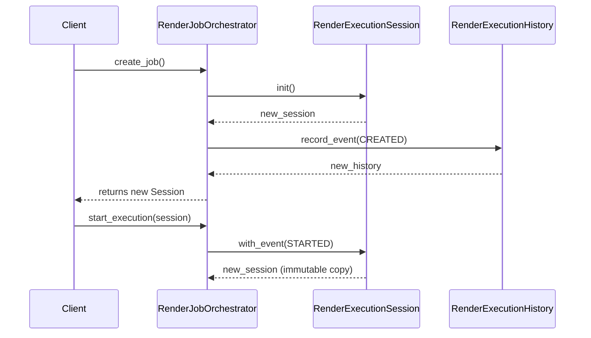

# Render Orchestration Architecture Walkthrough

## The Goal
The Render Orchestration subsystem is designed to manage the lifecycle of rendering jobs without tightly coupling the application to specific infrastructure, rendering libraries, or deployment strategies (e.g., local vs cloud).

## 1. Subsystem Layering & Dependency Inversion

```mermaid
graph TD
    subgraph Domain ["Domain Layer (Core)"]
        A[RenderPlan]
        B[RenderJob & Enums]
    end

    subgraph AppLayer ["Application Layer (Orchestration)"]
        C[RenderJobOrchestrator]
        D[RenderExecutionSession]
        E[RenderExecutionMetrics]
        F[RenderExecutionHistory]
        I[RenderExecutionService]
        
        C --> D
        D --> F
        D --> E
        
        C -.-> |delegates execution to| I
    end

    subgraph Interfaces ["Interfaces / Contracts"]
        G[IRenderBackend]
        H[IRenderExecutionService]
    end

    subgraph Infrastructure ["Infrastructure Layer (Plugins)"]
        J[MoviePyRenderingBackend]
        K[FFmpegRenderingBackend]
    end

    I -.-> |calls| G
    J -.-|> |implements| G
    K -.-|> |implements| G
```

### Key Takeaway
The application orchestrator only knows about `IRenderBackend`. All concrete implementations exist as plugins in the infrastructure layer. 

## 2. Stateless Orchestration & Immutable Evolution
`RenderJobOrchestrator` maintains no internal state. It takes actions, updates an immutable session, and returns the new session instance. This guarantees safety across concurrent execution pipelines.



## 3. Observer Isolation
To extract metrics, update dashboards, or export to Prometheus, we use Observers.
`IRenderProgressObserver` and `IRenderTelemetryObserver` receive immutable data (`RenderProgress` and `RenderExecutionEvent`). By design, they cannot alter the rendering pipeline, enforcing isolation.

## 4. Telemetry and Metrics Derivation
Instead of manually calculating running times in mutable fields, the application derives `RenderExecutionMetrics` from `RenderExecutionHistory`. This ensures deterministic metric calculation from an append-only event log.

```python
# Metrics are calculated purely from the immutable event log.
class RenderExecutionMetrics:
    @classmethod
    def from_history(cls, history: RenderExecutionHistory) -> 'RenderExecutionMetrics':
        # calculates duration by analyzing STARTED and COMPLETED events
        pass
```

## 5. Certification Note
This architecture has been certified in Sprint 5.5.6. It acts strictly on behavioral boundaries and is verified to function seamlessly with a Dummy backend, proving independence from physical file IO constraints.
