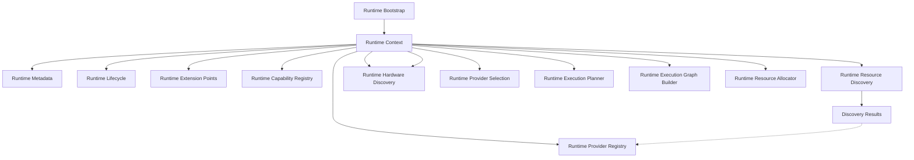

# Adaptive AI Runtime Architecture

## Overview
The Adaptive AI Runtime is a first-class subsystem designed to orchestrate AI computation independently of providers and hardware. It decouples the core domain and application layers from the rapidly changing AI toolchain ecosystem.

## Responsibilities
- Abstract AI capabilities from concrete providers.
- Route execution requests to the optimal provider/hardware combination.
- Discover and manage local/remote capabilities dynamically.
- Enforce execution policies, optimizations, and telemetry independently of the application logic.

## Boundaries
- **Upper Boundary (Application Layer)**: Exposes abstract AI interfaces. The Application layer requests "Reasoning" or "Transcription" without knowing how it runs.
- **Lower Boundary (Infrastructure/Hardware)**: Integrates with specific Provider SDKs (Ollama, Gemini) and discovers hardware constraints (CUDA, VRAM).

## Runtime Dependency Direction

The explicit dependency direction introduced by Runtime Context and Capability Registry:

```text
Application
↓
Runtime Bootstrap
↓
Runtime Context
↓
Runtime Capability Registry
↓
Runtime Resource Discovery
↓
Runtime Provider Registry
↓
Runtime Hardware Discovery
↓
Hardware Registrations
↓
Runtime Provider Selection
↓
Runtime Scheduler
↓
Runtime Execution Planner
↓
Runtime Execution Graph Builder
↓
Runtime Resource Allocator
↓
Future Execution Context
↓
Future Runtime Orchestrator
↓
Future Runtime Optimization
```

This dependency direction must remain stable. The Runtime must NEVER depend upward on specific Domain features (e.g., Campaign Intelligence).

## Runtime Terminology
- **Capability**: A generalized AI function (e.g., "Text Generation", "Transcription").
- **Capability Identity**: A permanent architectural identifier (e.g., `vision.analysis`) describing WHAT the Runtime understands, strictly divorced from HOW it executes.
- **Provider**: A concrete implementation capable of providing a Capability (e.g., Ollama, Gemini).
- **Resource**: Underlying hardware or network constraint (e.g., GPU VRAM).
- **Planner**: Determines *how* to satisfy a requested Capability.
- **Scheduler**: Determines *when* and *where* to execute the plan.
- **Registry**: The catalog of available Capabilities and Providers.

## Runtime Core Composition

The Runtime is structured around a stable `core` package, which defines the foundational architectural framework. 
The canonical representation of the Runtime instance is the **Runtime Context**. 
Every future Runtime subsystem should communicate through the `RuntimeContext` rather than directly referencing `RuntimeBootstrap`, `RuntimeLifecycleCoordinator`, or Extension Points.

### Ownership Model



### Runtime Context Stability
The `RuntimeContext` is designed as a stable composition object. After construction:
- Lifecycle reference remains stable.
- Metadata reference remains stable.
- Extension Point collection remains stable.
- Capability Registry remains stable as the single source of truth for architectural capabilities.

Future Runtime modules should consume these references rather than replacing them.

### Runtime Metadata
The `RuntimeMetadata` object is descriptive only. It exists to describe the Runtime instance (e.g., Runtime Version, Runtime Identifier, Build Profile).
**RuntimeMetadata must NOT become:**
- Runtime Configuration
- Provider Configuration
- Hardware Configuration
- Runtime Settings
These concepts belong to future Runtime configuration modules.

### Extension Point Responsibilities
Extension Points:
- Expose Runtime integration surfaces.
- Define Runtime extensibility.
- Support the Open/Closed Principle.

Extension Points **should NOT**:
- Execute Runtime logic.
- Discover capabilities.
- Discover hardware.
- Manage lifecycle.
- Schedule execution.
- Instantiate providers.
These responsibilities belong to future Runtime components.

### Hardware Discovery Architectural Boundary
Runtime Hardware Discovery is the final **Runtime Knowledge** layer. It exists solely to provide the Runtime with architectural knowledge of available compute resources. 

Its responsibility is limited to:
- discovering hardware
- registering hardware
- exposing immutable hardware definitions
- enumerating discovered hardware
- looking up registered hardware

Runtime Hardware Discovery intentionally performs **no runtime decision making**.
It MUST NOT match providers to hardware, evaluate provider compatibility, allocate/reserve hardware, benchmark hardware, monitor utilization, schedule execution, execute workloads, or optimize runtime behavior.

### Future Runtime Responsibility Separation
The boundary between **Runtime Knowledge** and **Runtime Decision Making** is strictly enforced. Decision-making begins only in Provider Selection.

- **Runtime Hardware Discovery** → What hardware exists? (Knowledge)
- **Runtime Provider Selection** → Which provider is eligible? (Architectural Decision)
- **Runtime Scheduler** → Where and when should work execute? (Operational Decision)
- **Runtime Execution Planner** → How should execution be structured? (Execution Planning)
- **Runtime Execution Graph Builder** → Which work depends on which? (Execution Coordination)
- **Runtime Resource Allocator** → What logical computational resources are required? (Resource Coordination)
- **Future Runtime Execution Context** → What execution environment is required? (Execution Context)
- **Future Runtime Orchestrator** → How should execution be coordinated? (Orchestration)
- **Future Runtime Execution Engine** → Execute the workload. (Execution)
- **Future Runtime Optimization** → Improve future runtime behavior. (Optimization)

### Runtime Lifecycle
The Runtime coordinates operations through explicit lifecycle states:
`UNINITIALIZED -> BOOTSTRAPPING -> INITIALIZED -> SHUTTING_DOWN -> SHUTDOWN`

## Runtime Technical Debt Register

To prevent architectural overlap and provide a clear roadmap, execution and provider features are intentionally deferred:

**Completed**
- Runtime Identity
- Runtime Framework
- Runtime Composition
- Capability Registry
- Resource Discovery
- Provider Registry
- Hardware Discovery
- Provider Selection
- Runtime Scheduler
- Runtime Execution Planner
- Runtime Execution Graph Foundation
- Runtime Resource Allocation

**Deferred to Next Batch**
- Runtime Execution Context

**Deferred to Later Sprint**
- Runtime Execution Context
- Runtime Orchestrator
- Runtime Execution Engine
- Runtime Optimization
- Runtime Monitoring
- Runtime Metrics
- Benchmarking

## Runtime Sprint Evolution (Milestone 6)

The Runtime is being built progressively:

**Sprint 6.1**
↓
Foundation (Boundaries, Context & Composition)
↓
**Sprint 6.2**
↓
Capability Registry
↓
**Sprint 6.3**
↓
Resource Discovery
↓
**Sprint 6.4**
↓
Planning & Policy
↓
**Sprint 6.5**
↓
Scheduling & Execution
↓
**Sprint 6.6**
↓
Provider Ecosystem
↓
**Sprint 6.7**
↓
Adaptive Optimization
↓
**Sprint 6.8**
↓
Certification
