# Adaptive AI Runtime Architecture

## Overview
The Adaptive AI Runtime is a first-class subsystem designed to orchestrate AI computation independently of providers and hardware. It decouples the core domain and application layers from the rapidly changing AI toolchain ecosystem.

## Responsibilities
- Abstract AI capabilities from concrete providers.
- Route execution requests to the optimal provider/hardware combination.
- Discover and manage local/remote capabilities dynamically.
- Enforce execution policies, optimizations, and telemetry independently of the application logic.

## Boundaries
- **Upper Boundary (Application Layer)**: Exposes abstract AI interfaces. The Application layer requests "Reasoning" or "Transcription" without knowing how it runs.
- **Lower Boundary (Infrastructure/Hardware)**: Integrates with specific Provider SDKs (Ollama, Gemini) and discovers hardware constraints (CUDA, VRAM).

## Runtime Decision Pipeline (Planning)

The initial phase of Runtime decision making follows a strict pipeline to transform accumulated knowledge into future execution intent:

```text
RuntimeKnowledge
↓
RuntimePlanningStrategy
↓
PlanningStrategy
↓
RuntimePlanning
↓
PlanningDecision
↓
RuntimePolicy
↓
PolicyDecision
↓
RuntimeConstraintEngine
↓
ConstraintDecision
↓
RuntimeBudgetPlanner
↓
BudgetDecision
↓
RuntimeRouting
↓
RoutingDecision
```

This pipeline is strictly certified to guarantee:
- **Immutable strategy definition**: The planning philosophy is immutable.
- **Deterministic strategy generation**: The generator produces a deterministic strategy.
- **Immutable policy definition**: The policy architecture provides strict, unchanging governance.
- **Deterministic policy evaluation**: Policy constraints evaluate predictably based solely on the PlanningDecision.
- **Immutable budget definition**: The runtime budget is strictly defined as an immutable artifact.
- **Deterministic budget evaluation**: The budget architecture evaluates predictably based solely on the ConstraintDecision.
- **Immutable routing definition**: The runtime routing is strictly defined as an immutable artifact.
- **Deterministic routing evaluation**: The routing architecture evaluates predictably based solely on the BudgetDecision.
- **Append-only evolution**: Decisions do not overwrite past states.
- **No RuntimeKnowledge mutation**: The input knowledge is consumed, never modified or embedded.
- **No PlanningStrategy mutation**: Strategy is consumed, never modified.
- **No PlanningDecision mutation**: The output of planning is strictly consumed, never altered.
- **No PolicyDecision mutation**: The governance approval is immutable and final.
- **No ConstraintDecision mutation**: The architectural constraints are immutable and strictly consumed.
- **No BudgetDecision mutation**: The architectural budget is immutable and strictly consumed.
- **No RoutingDecision mutation**: The architectural routing is immutable and strictly consumed.
- **No skipped layers**: `RuntimeKnowledge` must pass through the full pipeline to become actionable governance, budget, and routing.
- **No reverse dependencies**: Planning strictly follows Learning and Strategy, Policy strictly follows Planning, Constraint strictly follows Policy, Budget strictly follows Constraint, Routing strictly follows Budget.

### Planning Strategy Layer
The `RuntimePlanningStrategy` subsystem provides exactly one architectural answer: "Which planning philosophy should guide RuntimePlanning?"
It produces a reusable, immutable `PlanningStrategy` artifact containing assumptions and preferences.

### Runtime Policy Layer
The `RuntimePolicy` subsystem evaluates the output of `RuntimePlanning`.
It provides exactly one architectural answer: "Is this PlanningDecision permitted?"
It produces an immutable `PolicyDecision` artifact representing the architectural governance approval. It explicitly rejects responsibility leakage into Constraint Engine, Budget Planning, Routing, Scheduler, Execution, Provider Selection, or Hardware Selection.

**PolicyDecision Reusability:**
`PolicyDecision` is explicitly certified as a reusable architectural artifact. Future Runtime subsystems—including `RuntimeConstraintEngine`, `RuntimeBudgetPlanner`, `RuntimeRouting`, and `RuntimeScheduler`—may freely consume a `PolicyDecision` without modifying it. The artifact remains strictly immutable across all downstream consumption.

### Runtime Constraint Layer
The `RuntimeConstraintEngine` subsystem evaluates the output of `RuntimePolicy`.
It provides exactly one architectural answer: "What architectural constraints apply?"
It produces an immutable `ConstraintDecision` artifact representing the architectural execution boundaries. It explicitly rejects responsibility leakage into Budget Planning, Routing, Scheduler, Execution, Provider Selection, or Hardware Selection.

**ConstraintDecision Reusability:**
`ConstraintDecision` is explicitly certified as a reusable architectural artifact. Future Runtime subsystems—including `RuntimeBudgetPlanner`, `RuntimeRouting`, and `RuntimeScheduler`—may freely consume a `ConstraintDecision` without modifying it. The artifact remains strictly immutable across all downstream consumption.

### Runtime Budget Layer
The `RuntimeBudgetPlanner` subsystem evaluates the output of `RuntimeConstraintEngine`.
It provides exactly one architectural answer: "What execution budget is available?"
It produces an immutable `BudgetDecision` artifact representing the architectural execution budget. It explicitly rejects responsibility leakage into Routing, Scheduler, Execution, Provider Selection, or Hardware Selection.

**BudgetDecision Reusability:**
`BudgetDecision` is explicitly certified as a reusable architectural artifact. Future Runtime subsystems—including `RuntimeRouting` and `RuntimeScheduler`—may freely consume a `BudgetDecision` without modifying it. The artifact remains strictly immutable across all downstream consumption.

### Runtime Routing Layer
The `RuntimeRouting` subsystem evaluates the output of `RuntimeBudgetPlanner`.
It provides exactly one architectural answer: "Where should this workload execute?"
It produces an immutable `RoutingDecision` artifact representing the architectural execution route, including primary and fallback route identifiers. It explicitly rejects responsibility leakage into RuntimeScheduler, RuntimeExecution, Provider Selection, Hardware Selection, Retry Execution, or Optimization.

**RoutingDecision Reusability:**
`RoutingDecision` is explicitly certified as a reusable architectural artifact. Future Runtime subsystems—including `RuntimeScheduler` and `RuntimeExecution`—may freely consume a `RoutingDecision` without modifying it. The artifact remains strictly immutable across all downstream consumption.

**Fallback Contract:**
`RoutingDecision` establishes only the architectural fallback contract.
Allowed elements are strictly limited to `primary_route_identifier` and `fallback_route_identifier`.
It explicitly rejects the implementation of retry execution, failover implementation, recovery logic, or scheduling fallback. Actual fallback behavior belongs entirely to future RuntimeExecution.

## Runtime Dependency Direction

The explicit dependency direction introduced by Runtime Context and Capability Registry:

```text
Application
↓
Runtime Bootstrap
↓
Runtime Context
↓
Runtime Capability Registry
↓
Runtime Resource Discovery
↓
Runtime Provider Registry
↓
Runtime Hardware Discovery
↓
Hardware Registrations
↓
Runtime Provider Selection
↓
Runtime Scheduler
↓
Runtime Execution Planner
↓
Runtime Execution Graph Builder
↓
Runtime Resource Allocator
↓
Runtime Execution Context Factory
↓
Runtime Orchestrator
↓
Runtime Execution Engine
↓
Adaptive Runtime
↓
Runtime Monitoring
↓
Runtime Telemetry
↓
Runtime Metrics
↓
Runtime Health
↓
Runtime Diagnostics
↓
Runtime Optimization
↓
Runtime Learning
↓
RuntimePlanning Strategy
↓
Runtime Planning
↓
Runtime Policy
↓
Runtime Constraint Engine
↓
Runtime Budget Planner
↓
Runtime Routing
```

This dependency direction must remain stable. The Runtime must NEVER depend upward on specific Domain features (e.g., Campaign Intelligence).

## Runtime Terminology
- **Capability**: A generalized AI function (e.g., "Text Generation", "Transcription").
- **Capability Identity**: A permanent architectural identifier (e.g., `vision.analysis`) describing WHAT the Runtime understands, strictly divorced from HOW it executes.
- **Provider**: A concrete implementation capable of providing a Capability (e.g., Ollama, Gemini).
- **Resource**: Underlying hardware or network constraint (e.g., GPU VRAM).
- **Planner**: Determines *how* to satisfy a requested Capability.
- **Scheduler**: Determines *when* and *where* to execute the plan.
- **Registry**: The catalog of available Capabilities and Providers.

## Runtime Core Composition

The Runtime is structured around a stable `core` package, which defines the foundational architectural framework. 
The canonical representation of the Runtime instance is the **Runtime Context**. 
Every future Runtime subsystem should communicate through the `RuntimeContext` rather than directly referencing `RuntimeBootstrap`, `RuntimeLifecycleCoordinator`, or Extension Points.

### Ownership Model

```mermaid
flowchart TD
    Bootstrap[Runtime Bootstrap]
    
    Context[Runtime Context]
    Bootstrap --> Context
    
    Metadata[Runtime Metadata]
    Lifecycle[Runtime Lifecycle]
    Extensions[Runtime Extension Points]
    Registry[Runtime Capability Registry]
    
    Context --> Metadata
    Context --> Lifecycle
    Context --> Extensions
    Context --> Registry
    Context --> Discovery
    Context --> HardwareDiscovery
    
    Discovery[Runtime Resource Discovery]
    Results[Discovery Results]
    Discovery --> Results
    
    ProviderRegistry[Runtime Provider Registry]
    HardwareDiscovery[Runtime Hardware Discovery]
    ProviderSelection[Runtime Provider Selection]
    ExecutionPlanner[Runtime Execution Planner]
    ExecutionGraphBuilder[Runtime Execution Graph Builder]
    ResourceAllocator[Runtime Resource Allocator]
    ExecutionContextFactory[Runtime Execution Context Factory]
    
    Context --> ProviderRegistry
    Context --> HardwareDiscovery
    Context --> ProviderSelection
    Context --> ExecutionPlanner
    Context --> ExecutionGraphBuilder
    Context --> ResourceAllocator
    Context --> ExecutionContextFactory
    Context --> RuntimeMetrics
    Context --> RuntimeHealth
    Context --> RuntimeDiagnostics
    Context --> RuntimeOptimization
    Context --> RuntimeLearning
    Context --> RuntimePlanningStrategy
    Context --> RuntimePlanning
    Context --> RuntimePolicy
    Context --> RuntimeConstraintEngine
    Context --> RuntimeBudgetPlanner
    Context --> RuntimeRouting
    
    Results -.-> ProviderRegistry
```



### Runtime Context Stability
The `RuntimeContext` is designed as a stable composition object. After construction:
- Lifecycle reference remains stable.
- Metadata reference remains stable.
- Extension Point collection remains stable.
- Capability Registry remains stable as the single source of truth for architectural capabilities.

Future Runtime modules should consume these references rather than replacing them.

### Runtime Metadata
The `RuntimeMetadata` object is descriptive only. It exists to describe the Runtime instance (e.g., Runtime Version, Runtime Identifier, Build Profile).
**RuntimeMetadata must NOT become:**
- Runtime Configuration
- Provider Configuration
- Hardware Configuration
- Runtime Settings
These concepts belong to future Runtime configuration modules.

### Extension Point Responsibilities
Extension Points:
- Expose Runtime integration surfaces.
- Define Runtime extensibility.
- Support the Open/Closed Principle.

Extension Points **should NOT**:
- Execute Runtime logic.
- Discover capabilities.
- Discover hardware.
- Manage lifecycle.
- Schedule execution.
- Instantiate providers.
These responsibilities belong to future Runtime components.

### Hardware Discovery Architectural Boundary
Runtime Hardware Discovery is the final **Runtime Knowledge** layer. It exists solely to provide the Runtime with architectural knowledge of available compute resources. 

Its responsibility is limited to:
- discovering hardware
- registering hardware
- exposing immutable hardware definitions
- enumerating discovered hardware
- looking up registered hardware

Runtime Hardware Discovery intentionally performs **no runtime decision making**.
It MUST NOT match providers to hardware, evaluate provider compatibility, allocate/reserve hardware, benchmark hardware, monitor utilization, schedule execution, execute workloads, or optimize runtime behavior.

### Future Runtime Responsibility Separation
The boundary between **Runtime Knowledge** and **Runtime Decision Making** is strictly enforced. Decision-making begins only in Provider Selection.

- **Runtime Hardware Discovery** → What hardware exists? (Knowledge)
- **Runtime Provider Selection** → Which provider is eligible? (Architectural Decision)
- **Runtime Scheduler** → Where and when should work execute? (Operational Decision)
- **Runtime Execution Planner** → How should execution be structured? (Execution Planning)
- **Runtime Execution Graph Builder** → Which work depends on which? (Execution Coordination)
- **Runtime Resource Allocator** → What logical computational resources are required? (Resource Coordination)
- **Runtime Execution Context Factory** → What prepared execution environment exists? (Execution Preparation)
- **Runtime Orchestrator** → Which prepared stages are ready to coordinate? (Execution Coordination)
- **Runtime Execution Engine** → Execute exactly those prepared stages deterministically. (Execution)
- **Adaptive Runtime** → Dynamically evaluate execution and recommend future adaptations. (Adaptive)
- **Runtime Monitoring** → Produce immutable observations of completed execution and adaptation. (Observation)
- **Runtime Telemetry** → Capture Runtime signals. (Signal Capture)
- **Runtime Metrics** → What quantitative measurements should be calculated? (Quantitative Measurement)
- **Runtime Health** → What is the Runtime's operational condition? (Operational Evaluation)
- **Runtime Diagnostics** → Why did Runtime behavior occur? (Diagnostic Reasoning)
- **Runtime Optimization** → What improvements should Runtime pursue? (Optimization Decision)
- **Runtime Learning** → What Runtime knowledge should persist? (Knowledge Persistence Layer)
- **Runtime Planning Strategy** → Which planning philosophy should guide RuntimePlanning? (Strategy Layer)
- **Runtime Planning** → What should happen next? (Planning Layer)
- **Runtime Policy** → Is this PlanningDecision permitted? (Policy Layer)
- **Runtime Constraint Engine** → What architectural constraints apply? (Constraint Layer)
- **Runtime Budget Planner** → What execution budget is available? (Budget Layer)
- **Runtime Routing** → Where should this workload execute? (Routing Layer)

### Runtime Lifecycle
The Runtime coordinates operations through explicit lifecycle states:
`UNINITIALIZED -> BOOTSTRAPPING -> INITIALIZED -> SHUTTING_DOWN -> SHUTDOWN`

## Runtime Technical Debt Register

To prevent architectural overlap and provide a clear roadmap, execution and provider features are intentionally deferred:

**Completed**
- Runtime Identity
- Runtime Framework
- Runtime Composition
- Capability Registry
- Resource Discovery
- Provider Registry
- Hardware Discovery
- Provider Selection
- Runtime Scheduler
- Runtime Execution Planner
- Runtime Resource Allocation
- Runtime Execution Context
- Runtime Orchestrator
- Runtime Execution Engine
- Adaptive Runtime
- Runtime Monitoring
- Runtime Telemetry
- Runtime Metrics
- Runtime Health
- Runtime Diagnostics
- Runtime Optimization
- Runtime Learning
- Runtime Planning Strategy
- Runtime Planning

**Deferred to Next Milestone**
- Benchmarking

## Runtime Sprint Evolution (Milestone 6)

The Runtime is being built progressively:

**Sprint 6.1**
↓
Foundation (Boundaries, Context & Composition)
↓
**Sprint 6.2**
↓
Capability Registry
↓
**Sprint 6.3**
↓
Runtime Observation & Reasoning (Certified)
↓
**Sprint 6.4**
↓
Planning & Policy
↓
**Sprint 6.5**
↓
Advanced Scheduler & Execution
↓
**Sprint 6.6**
↓
Provider & Model Ecosystem
↓
**Sprint 6.7**
↓
Adaptive Runtime Intelligence
↓
**Sprint 6.8**
↓
Runtime Certification

### Sprint 6.4 Boundary Validation

Batch 6.4.6 establishes **only** the Runtime Routing architecture. The objective is to permanently freeze RuntimeRouting as the architectural Routing Layer.

The following remain explicitly out of scope for Batch 6.4.6:
- **Sprint 6.4.7**: Runtime Context Expansion
- **Sprint 6.4.8**: Planning Governance
- **Sprint 6.4.9**: Planning & Policy Certification

Runtime Routing will remain architecturally complete while intentionally minimal until these future sprints.
