# Adaptive AI Runtime Architecture

## Overview
The Adaptive AI Runtime is a first-class subsystem designed to orchestrate AI computation independently of providers and hardware. It decouples the core domain and application layers from the rapidly changing AI toolchain ecosystem.

## Responsibilities
- Abstract AI capabilities from concrete providers.
- Route execution requests to the optimal provider/hardware combination.
- Discover and manage local/remote capabilities dynamically.
- Enforce execution policies, optimizations, and telemetry independently of the application logic.

## Boundaries
- **Upper Boundary (Application Layer)**: Exposes abstract AI interfaces. The Application layer requests "Reasoning" or "Transcription" without knowing how it runs.
- **Lower Boundary (Infrastructure/Hardware)**: Integrates with specific Provider SDKs (Ollama, Gemini) and discovers hardware constraints (CUDA, VRAM).

## Runtime Planning Governance

This section forms the canonical architectural contract governing the Runtime Decision Pipeline. It defines declarative rules that must be structurally certified by architecture tests. 

### Runtime Invariants

Runtime Invariants are absolute architectural truths that govern the pipeline:
- **Planning Precedence**: Planning always precedes Policy.
- **Policy Precedence**: Policy always precedes Constraint.
- **Constraint Precedence**: Constraint always precedes Budget.
- **Budget Precedence**: Budget always precedes Routing.
- **Dependency Flow**: Dependency direction never reverses.
- **Decision Ownership**: Decision ownership never changes.
- **Passive Context**: `RuntimeContext` acts strictly as a passive Composition Root and Runtime Decision Environment. It never executes workloads, coordinates, orchestrates, schedules, optimizes, or routes.

### Pipeline Contracts

Pipeline Contracts define the specific inputs, outputs, and forbidden behaviors of each decision subsystem:

- **RuntimePlanning**
  - Consumes: `RuntimeKnowledge`
  - Produces: `PlanningDecision`
  - Must never: Execute, Schedule, or Retry.

- **RuntimePolicy**
  - Consumes: `PlanningDecision`
  - Produces: `PolicyDecision`
  - Must never: Modify `PlanningDecision`.

- **RuntimeConstraintEngine**
  - Consumes: `PolicyDecision`
  - Produces: `ConstraintDecision`
  - Must never: Modify `PolicyDecision`.

- **RuntimeBudgetPlanner**
  - Consumes: `ConstraintDecision`
  - Produces: `BudgetDecision`
  - Must never: Modify `ConstraintDecision`.

- **RuntimeRouting**
  - Consumes: `BudgetDecision`
  - Produces: `RoutingDecision`
  - Must never: Modify `BudgetDecision`.

### Ownership Rules

Decision ownership is strictly delineated:
- `PlanningDecision` is exclusively owned by `RuntimePlanning`.
- `PolicyDecision` is exclusively owned by `RuntimePolicy`.
- `ConstraintDecision` is exclusively owned by `RuntimeConstraintEngine`.
- `BudgetDecision` is exclusively owned by `RuntimeBudgetPlanner`.
- `RoutingDecision` is exclusively owned by `RuntimeRouting`.
- `RuntimeContext` owns the Runtime Decision Environment, Composition, Pipeline, Lifecycle, and Governance, but **does NOT** own Runtime Decisions.

### Mutation Rules (Immutability)

- **PlanningDecision**: Immutable after creation.
- **PolicyDecision**: Immutable after creation.
- **ConstraintDecision**: Immutable after creation.
- **BudgetDecision**: Immutable after creation.
- **RoutingDecision**: Immutable after creation.
- **No Shared State**: Runtime subsystems must never mutate another subsystem's decision artifacts.

### Dependency Rules

**Allowed Dependencies:**
`RuntimeKnowledge` -> `PlanningStrategy` -> `RuntimePlanning` -> `RuntimePolicy` -> `RuntimeConstraintEngine` -> `RuntimeBudgetPlanner` -> `RuntimeRouting`

**Forbidden Dependencies:**
- Routing -> Planning
- Budget -> Planning
- Constraint -> RuntimeContext
- Policy -> RuntimeContext
- RuntimeContext -> Decision Ownership
- Circular dependencies or reverse dependency flows are strictly forbidden.

### Extension Rules

Future Runtime components must plug into `RuntimeContext` through composition without redesigning the core decision pipeline (`Planning`, `Policy`, `Constraint`, `Budget`, `Routing`). 
Examples of future components include `RuntimeScheduler`, `RuntimeExecution`, `RuntimeObservation`, `RuntimeLearning`, `RuntimeOptimization`, and `RuntimeGovernance`.

## Runtime Execution Domain Model

This section documents the canonical architectural language used by all future Runtime execution capabilities (established in Batch 6.5.1 and refined in Batch 6.5.3).

### Execution Request Domain

- **ExecutionIdentity**: A pure value object representing the permanent identity of an execution (`execution_id`, `created_at`).
- **ExecutionRequest**: Represents approved work waiting for execution. Strictly declarative. Must NEVER contain execution metrics, scheduling decisions, or retry info.

### Execution Result Domain

Defines "What execution produced."
- **ExecutionResult**: The immutable outcome of Runtime execution. Consumed by future components (Lifecycle, Retry, Observation, Learning, Optimization). Must NEVER contain retry history, lifecycle state, resource allocation, monitoring, telemetry, metrics, or future optimization data.
- **ExecutionOutcome**: Represents the business outcome (e.g. `SUCCESS`, `FAILURE`, `PARTIAL`, `CANCELLED`).
- **ExecutionStatus**: Represents Runtime execution state (e.g. `PENDING`, `RUNNING`, `COMPLETED`, `FAILED`, `CANCELLED`).
- **ExecutionSummary**: A mandatory immutable component of ExecutionResult detailing execution steps, reason, and summary.

### RuntimeExecutor Service

The `RuntimeExecutor` is the canonical Runtime execution engine.
It performs exactly **one responsibility**: `SchedulingDecision` -> `ExecutionResult`.
It defines "How execution is performed" and owns `ExecutionResult`, `ExecutionStatus`, `ExecutionOutcome`, and `ExecutionSummary`.

It is explicitly **NOT**:
- A Workflow Engine
- A Scheduler
- A Lifecycle Manager
- A Retry Coordinator
- An Observation Service
- An Optimization Engine
- A Resource Manager
- An Orchestrator

### Execution Ownership & Contracts

| Artifact | Production / Ownership | Consumption |
| :--- | :--- | :--- |
| **ExecutionIdentity** | Owned by Runtime Execution Model | Consumed by all execution artifacts |
| **ExecutionRequest** | Produced by Runtime Execution Model | Consumed by RuntimeScheduler |
| **ExecutionStatus** | Produced by RuntimeExecutor | Consumed by Observation, Lifecycle |
| **ExecutionResult** | Produced by RuntimeExecutor | Consumed by Retry, Observation, Learning, Optimization |

### Execution Dependency Rules

- The dependency direction strictly flows: `Execution Request Domain` -> `Runtime Scheduler` -> `Scheduling Domain` -> `Runtime Executor` -> `Execution Result Domain` -> `Runtime Lifecycle` -> `Lifecycle Domain` -> `Retry` -> `Observation` -> `Learning` -> `Optimization`.
- Runtime Decisions must NEVER depend upon Execution artifacts. Dependency direction must never reverse.

## Runtime Lifecycle Domain Model

This section establishes the canonical architectural contract for the Runtime Lifecycle (established in Batch 6.5.4). 
It explicitly differentiates between the Application Lifecycle and the Execution Lifecycle.

### Application Lifecycle vs. Execution Lifecycle

- **Application Lifecycle**: Managed by `RuntimeLifecycleCoordinator`. Governs the startup, bootstrapping, initialization, and shutdown of the Runtime subsystem itself.
- **Execution Lifecycle**: Managed by `RuntimeLifecycle`. Governs the lifecycle progression of an individual completed execution (`ExecutionResult`).

The two concepts are architecturally distinct and must never be conceptually coupled.

### Lifecycle Artifacts (Immutable Domain)

Lifecycle artifacts define "What lifecycle produced." They are purely declarative, immutable data objects. They contain NO business logic, scheduling decisions, execution state, retry info, observation data, or resource allocation.

- **LifecycleIdentity**: A pure value object representing the permanent identity of a lifecycle progression (`lifecycle_id`, `created_at`).
- **LifecycleState**: Represents the state of the execution lifecycle (`CREATED`, `INITIALIZED`, `ACTIVE`, `COMPLETED`, `FAILED`, `TERMINATED`).
- **LifecycleStage**: Represents the major phase of the runtime lifecycle (`EXECUTION`, `POST_EXECUTION`, `FINALIZED`).
- **LifecycleSummary**: Immutable summary information (`summary`, `reason`, `transition_count`, `warnings`).
- **LifecycleTransition**: The canonical immutable representation of Runtime state transitions (`previous_state`, `current_state`, `transition_reason`, `timestamp`). Future components (Retry, Observation) consume this directly.
- **LifecycleResult**: The immutable outcome of Runtime lifecycle progression. Contains identity, state, stage, summary, and transition history.

### RuntimeLifecycle Service

The `RuntimeLifecycle` service defines "How execution lifecycle progression is evaluated."
It performs exactly **one responsibility**: `ExecutionResult` -> `LifecycleResult`.

It is explicitly **NOT**:
- An Executor
- A Scheduler
- A Retry Engine
- An Observation Service
- A Learning Engine
- An Optimization Engine
- A Workflow Engine
- A Queue Manager
- A Resource Manager

### Lifecycle Ownership & Dependency Rules

| Artifact | Production / Ownership | Consumption |
| :--- | :--- | :--- |
| **LifecycleResult** | Produced and owned by `RuntimeLifecycle` | Consumed by Retry, Observation, Learning, Optimization |
| **LifecycleTransition** | Produced and owned by `RuntimeLifecycle` | Consumed by Retry, Observation, Learning, Optimization |

**Future Retry & Observation Responsibilities:**
Future capabilities like Retry and Observation will consume `LifecycleResult` and `LifecycleTransition` directly. `RuntimeLifecycle` will NOT expand into a workflow engine to coordinate these capabilities.

## Runtime Retry Domain Model

This section establishes the canonical architectural contract for Runtime Retry Evaluation (established in Batch 6.5.5).
It explicitly differentiates between **Retry Evaluation** and **Retry Recovery**.

### Retry Evaluation vs. Retry Recovery

- **Retry Evaluation**: Evaluates *whether* an execution should be attempted again. This is purely a declarative decision.
- **Retry Recovery**: The active process of executing a retry, reconstructing execution context, or performing a rollback.

`RuntimeRetry` strictly performs **Evaluation**. It does **NOT** perform **Recovery**. Recovery is intentionally deferred to future Runtime capabilities.

### Retry Artifacts (Immutable Domain)

Retry artifacts define "What retry evaluation produced." They are purely declarative, immutable data objects representing evaluation decisions. They contain NO execution behavior, recovery logic, telemetry, or metrics.

- **RetryIdentity**: A pure value object representing the permanent identity of a retry evaluation (`retry_id`, `created_at`).
- **RetryDecision**: Represents the outcome of retry evaluation (e.g., `RETRY`, `DO_NOT_RETRY`, `MANUAL_REVIEW`, `ABORT`). Answers only "What should happen?" and does not execute the decision.
- **RetryReason**: Represents why the decision was made (e.g., `TRANSIENT_FAILURE`, `POLICY_LIMIT`).
- **RetryPolicy**: Purely descriptive policy (`maximum_attempts`, `current_attempt`, `retry_strategy`, `retry_window`). Evaluated by RuntimeRetry, but implemented by future Recovery components.
- **RetrySummary**: Immutable summary information (`summary`, `reason`, `remaining_attempts`, `warnings`).
- **RetryResult**: The immutable outcome of Runtime retry evaluation. Consumed by future Recovery and Observation components.

### RuntimeRetry Service

The `RuntimeRetry` service defines "How retry decisions are evaluated."
It performs exactly **one responsibility**: `LifecycleResult` -> `RetryResult`.

It is explicitly **NOT**:
- A RuntimeExecutor
- A RuntimeScheduler
- A RuntimeLifecycle
- A Recovery Engine
- An Observation Service
- A Learning Engine
- An Optimization Engine
- A Workflow Engine
- A Queue Manager
- A Resource Manager

### Retry Ownership & Dependency Rules

| Artifact | Production / Ownership | Consumption |
| :--- | :--- | :--- |
| **RetryResult** | Produced and owned by `RuntimeRetry` | Consumed by future Recovery, Observation |
| **RetryDecision** | Owned by `RuntimeRetry` | Consumed by future Recovery |

**Future Observation Responsibilities:**
Future components like Observation will consume `RetryResult`. `RuntimeRetry` must not gradually expand into an observation or recovery engine.


## Runtime Observation Domain Model

This section establishes the canonical architectural contract for Runtime Observation (established in Batch 6.5.6).
It explicitly differentiates between **Runtime Observation** and **Runtime Monitoring**.

### Observation vs. Monitoring

- **Observation**: Represents immutable Runtime understanding. It answers "What Runtime observed" about a completed execution or evaluation.
- **Monitoring**: Represents continuous active observation. It includes collecting telemetry, tracking metrics, streaming events, publishing logs, and integrating with external observability platforms (e.g., Datadog, Prometheus).

`RuntimeObservation` strictly performs **Observation**. It does **NOT** perform **Monitoring**. Active monitoring is intentionally deferred outside the core Runtime Decision Pipeline.

### Observation Artifacts (Immutable Domain)

Observation artifacts define "What observation produced." They are purely declarative, immutable data objects representing the system's understanding of an event. They contain NO execution logic, scheduling information, retry loops, analytics, or telemetry implementation.

- **ObservationIdentity**: A pure value object representing the permanent identity of an observation (`observation_id`, `created_at`).
- **ObservationCategory**: A simple classification of the observation (e.g., `EXECUTION`, `LIFECYCLE`, `RETRY`, `RESOURCE`, `SYSTEM`). It does NOT imply severity or trigger behavior.
- **ObservationSeverity**: A simple classification of impact (e.g., `INFO`, `WARNING`, `ERROR`, `CRITICAL`).
- **ObservationRecord**: Represents one immutable Runtime observation. It is purely descriptive and does not interpret, recommend actions, or learn patterns.
- **ObservationSummary**: Immutable summary information (`summary`, `observation_count`, `warning_count`, `error_count`, `critical_count`).
- **ObservationResult**: The immutable outcome of Runtime observation. It contains the identity, related retry identity, summary, and a list of records.

### RuntimeObservation Service

The `RuntimeObservation` service defines "How Runtime observations are extracted."
It performs exactly **one responsibility**: `RetryResult` -> `ObservationResult`.

It is explicitly **NOT**:
- A RuntimeExecutor
- A RuntimeScheduler
- A RuntimeLifecycle
- A RuntimeRetry
- A Monitoring Engine
- An Analytics Engine
- A Learning Engine
- An Optimization Engine
- A Recommendation Engine

It owns no execution state and does not implement retry loops, backoffs, or queue management.

### Observation Ownership & Dependency Rules

| Artifact | Production / Ownership | Consumption |
| :--- | :--- | :--- |
| **ObservationResult** | Produced and owned by `RuntimeObservation` | Consumed by future Learning components |
| **ObservationRecord** | Owned by `RuntimeObservation` | Consumed by future Learning components |

**Future Learning & Optimization Responsibilities:**
Future capabilities like Learning and Optimization will consume `ObservationResult`. `RuntimeObservation` must not gradually expand into an analytics, optimization, or learning engine.

## Runtime Learning Domain Model

This section establishes the canonical architectural contract for Runtime Learning (established in Batch 6.5.7).
It explicitly differentiates between **Runtime Learning**, **Runtime Prediction**, and **Runtime Optimization**.

### Learning vs. Prediction vs. Optimization

- **Learning**: Represents immutable understanding of patterns extracted from observations. It answers "What Runtime learned" (e.g. repeated failure on specific hardware).
- **Prediction**: Estimates future outcomes. Prediction belongs outside the Runtime Learning pipeline.
- **Optimization**: Makes active decisions to improve future execution. Optimization consumes Learning but Learning never optimizes.
- **Analytics**: Produces dashboards and reports, which remain outside the Runtime pipeline entirely.

### Learning Artifacts (Immutable Domain)

Learning artifacts define "What Runtime learned." They are purely declarative, immutable data objects. They contain NO optimization logic, execution behavior, or predictive models.

- **LearningCategory**: The category of Runtime knowledge (e.g., `EXECUTION`, `RETRY`, `RESOURCE`, `PERFORMANCE`, `STABILITY`, `SYSTEM`, `UNKNOWN`).
- **LearningConfidence**: Confidence in learned knowledge (e.g., `LOW`, `MEDIUM`, `HIGH`, `VERY_HIGH`). It remains classification only.
- **LearningPattern**: One immutable Runtime learning pattern (`category`, `confidence`, `description`, `supporting_observations`, `context`).
- **LearningSummary**: Immutable summary information (`summary`, `pattern_count`, `high_confidence_count`, `medium_confidence_count`, `low_confidence_count`).
- **LearningResult**: The immutable outcome of Runtime learning. Produced by `RuntimeLearning`. Consumed by future `RuntimeOptimization`. Must NEVER contain execution, scheduling, or optimization logic.

### RuntimeLearning Service

The `RuntimeLearning` service defines "How Runtime learns."
It performs exactly **one responsibility**: `ObservationResult` -> `LearningResult`.

It is explicitly **NOT**:
- A RuntimeExecutor
- A RuntimeScheduler
- A RuntimeLifecycle
- A RuntimeRetry
- A RuntimeObservation
- An Optimization Engine
- A Prediction Engine
- A Recommendation Engine
- An Analytics Engine
- A Monitoring Engine

### Learning Ownership & Dependency Rules

| Artifact | Production / Ownership | Consumption |
| :--- | :--- | :--- |
| **LearningResult** | Produced and owned by `RuntimeLearning` | Consumed by future `RuntimeOptimization` |
| **LearningPattern** | Owned by `RuntimeLearning` | Consumed by future `RuntimeOptimization` |

**Future Optimization Responsibilities:**
Future capabilities like Optimization will consume `LearningResult`. `RuntimeLearning` must not gradually expand into an optimization or prediction engine.


## Runtime Optimization Domain Model

This section establishes the canonical architectural contract for Runtime Optimization (established in Batch 6.5.8).
It explicitly differentiates between **Optimization**, **Execution Application**, and **Resource Management**.

### Optimization vs Application vs Resource Management

- **Optimization**: Derives declarative optimization intents based on learned patterns (e.g., "Reduce GPU memory pressure"). Answers "What optimization is needed?"
- **Application**: The actual execution of an optimization (e.g., changing parameters, moving workloads). `RuntimeOptimization` NEVER applies optimizations.
- **Resource Management**: The act of allocating or changing physical/logical resources. `RuntimeOptimization` NEVER performs resource management.

### Optimization Artifacts (Immutable Domain)

Optimization artifacts define "What Runtime Optimization derived." They are purely declarative, immutable data objects. They contain NO executable actions, commands, callbacks, or state transitions.

- **OptimizationCategory**: A simple classification of the optimization (e.g., `EXECUTION`, `RETRY`, `RESOURCE`, `PERFORMANCE`).
- **OptimizationPriority**: Classification of importance (`LOW`, `MEDIUM`, `HIGH`, `CRITICAL`).
- **OptimizationDecision**: Represents one immutable optimization intent (`category`, `priority`, `description`, `supporting_patterns`). Must not contain execution commands.
- **OptimizationSummary**: Immutable summary information (`summary`, `decision_count`, etc.).
- **OptimizationResult**: The immutable canonical outcome of Runtime optimization. Consumed by future Runtime execution capabilities.

### RuntimeOptimization Service

The `RuntimeOptimization` service defines "How Runtime derives optimization decisions."
It performs exactly **one responsibility**: `LearningResult` -> `OptimizationResult`.

It is explicitly **NOT**:
- A RuntimeExecutor
- A RuntimeScheduler
- A RuntimeLearning Engine
- A Resource Manager
- A Workflow Coordinator
- A Prediction or Analytics Engine

### Optimization Ownership & Dependency Rules

| Artifact | Production / Ownership | Consumption |
| :--- | :--- | :--- |
| **OptimizationResult** | Produced and owned by `RuntimeOptimization` | Consumed by future Runtime capabilities |
| **OptimizationDecision** | Owned by `RuntimeOptimization` | Consumed by future Runtime capabilities |

**Pipeline Termination:**
`RuntimeOptimization` is the final stage of the Sprint 6.5 adaptive pipeline. Its responsibility ends immediately after producing `OptimizationResult`.

## Sprint 6.5 Pipeline Certification

Batch 6.5.8 formally certifies that **Sprint 6.5 establishes a complete adaptive Runtime pipeline**.

The completed adaptive pipeline consists of:
1. **Execution Domain**
2. **Scheduling Domain**
3. **Lifecycle Domain**
4. **Retry Domain**
5. **Observation Domain**
6. **Learning Domain**
7. **Optimization Domain**

**Architectural Invariant for Future Development:**
Every Runtime stage in this pipeline:
- Owns exactly one responsibility.
- Consumes exactly one immutable artifact.
- Produces exactly one immutable artifact.
- Hands ownership cleanly to the next Runtime stage.

No dependency may reverse. No ownership may reverse. This sequential, decoupled flow (Execution -> Scheduling -> Lifecycle -> Retry -> Observation -> Learning -> Optimization) serves as the permanent architectural invariant for the Adaptive AI Runtime.


## Runtime Scheduling Domain Model

This section documents the canonical architectural language for Runtime Scheduling (established in Batch 6.5.2).

### Scheduling Artifacts (Immutable Domain)

Scheduling artifacts define "What scheduling is." They are purely declarative, immutable data objects representing scheduling decisions. They contain NO business logic, execution state, retry info, or resource allocation.

- **SchedulingIdentity**: A pure value object representing the permanent identity of a schedule (`schedule_id`, `created_at`, `execution_identity`).
- **SchedulingDecision**: Represents "What the scheduler decided", never "What actually executed." Encompasses Status, Priority, Policy, Strategy, and Classification.
- **SchedulingStatus**: The architectural status of the scheduling intent (`READY`, `QUEUED`, `DEFERRED`, `BLOCKED`, `REJECTED`).
- **SchedulingPriority**: The logical precedence of the work (`CRITICAL`, `HIGH`, `NORMAL`, `LOW`, `BACKGROUND`).
- **SchedulingPolicy**: The business rules governing the scheduling (`IMMEDIATE`, `DEFERRED`, `BACKGROUND`).
- **SchedulingStrategy**: How scheduling decisions are evaluated (`PRIORITY_FIRST`, `ROUND_ROBIN`, `FIFO`).
- **QueueClassification**: Purely declarative logical queue classification (`INTERACTIVE`, `BACKGROUND`, `BATCH`). Does NOT imply physical queue storage.

### RuntimeScheduler Service

The `RuntimeScheduler` performs exactly one responsibility: `ExecutionRequest -> SchedulingDecision`.
It defines "How scheduling decisions are produced."

- **Policy-Neutral**: The scheduler consumes, evaluates, and produces, but never invents policy. It does not own permanent defaults.
- **Evaluation Flow**: `ExecutionRequest` -> Read Scheduling Policy -> Read Scheduling Strategy -> Evaluate Scheduling Decision -> Produce immutable `SchedulingDecision`.
- **Constraints**: It is NOT an execution engine, queue manager, workflow engine, lifecycle manager, or retry coordinator. It owns no execution state and performs no mutations.

### Ownership & Dependency Rules

- `SchedulingDecision` is exclusively produced and owned by `RuntimeScheduler`.
- Dependency direction strictly flows: `ExecutionRequest` -> `RuntimeScheduler` -> `SchedulingDecision` -> `RuntimeExecutor`.
- `SchedulingDecision` must never depend on execution artifacts (e.g., `ExecutionResult`).

## Runtime Provider Registry Domain Model

This section documents the canonical architectural language for the Provider Registry (established in Batch 6.6.1).

### Provider Registry vs. Provider Execution

- **Provider Registry**: Represents immutable Provider identity and metadata. It answers "What providers exist?".
- **Provider Execution**: The active process of executing a provider. `ProviderRegistry` strictly performs metadata management and NEVER executes providers or builds provider instances.

### Provider Registry Artifacts (Immutable Domain)

Provider Registry artifacts define "What providers exist." They are purely declarative, immutable data objects representing provider metadata. They contain NO runtime state, authentication, or network logic.

- **ProviderType**: A simple classification (`LOCAL`, `CLOUD`, `HYBRID`).
- **ProviderStatus**: The registration state (`REGISTERED`, `DISABLED`, `DEPRECATED`).
- **ProviderInfo**: Represents immutable metadata for a provider (`provider_id`, `display_name`, `provider_type`, `registration_status`, `endpoint_type`).
- **ProviderRegistryResult**: The immutable outcome of registry operations, containing registered providers and a summary.

### ProviderRegistry Service

The `ProviderRegistry` defines "How provider identity is managed."
It performs exactly **one responsibility**: Managing provider identity and registration.

It is explicitly **NOT**:
- A Provider Factory or Builder
- A Provider Selector
- A Provider Lifecycle Manager
- A Provider Health Monitor
- A Capability Manager
- A Networking Layer

### Ownership & Dependency Rules

| Artifact | Production / Ownership | Consumption |
| :--- | :--- | :--- |
| **ProviderInfo** | Owned by `ProviderRegistry` | Consumed by future Provider Selection components |
| **ProviderRegistryResult** | Produced and owned by `ProviderRegistry` | Consumed by future Provider Selection components |

**Certification Invariant:**

RuntimeContext
↓
Composition Root
↓
Dependency Wiring
↓
Service Exposure

ProviderRegistry
↓
Provider Identity
↓
Provider Registration
↓
Provider Discovery

These responsibilities remain permanently separated.

## Runtime Dependency Direction

The explicit dependency direction introduced by Runtime Context and Capability Registry:

```text
Application
↓
Runtime Bootstrap
↓
Runtime Context
↓
Runtime Capability Registry
↓
Runtime Resource Discovery
↓
Runtime Provider Registry
↓
Runtime Hardware Discovery
↓
Hardware Registrations
↓
Runtime Provider Selection
↓
Runtime Scheduler
↓
Runtime Execution Planner
↓
Runtime Execution Graph Builder
↓
Runtime Resource Allocator
↓
Runtime Execution Context Factory
↓
Runtime Orchestrator
↓
Runtime Executor
↓
Adaptive Runtime
↓
Runtime Monitoring
↓
Runtime Telemetry
↓
Runtime Metrics
↓
Runtime Health
↓
Runtime Diagnostics
↓
Runtime Observation
↓
Runtime Learning
↓
Runtime Optimization
↓
Runtime Planning Strategy
↓
Runtime Planning
↓
Runtime Policy
↓
Runtime Constraint Engine
↓
Runtime Budget Planner
↓
Runtime Routing
```

This dependency direction must remain stable. The Runtime must NEVER depend upward on specific Domain features (e.g., Campaign Intelligence).

## Runtime Dependency Model (Batch 6.8.2)

This section establishes the canonical architectural dependency model for the Adaptive Compute Runtime, formally certified in Batch 6.8.2.

### Canonical Dependency Layers

The following layer hierarchy is canonical and strictly enforced:

Application Layer
↓
Runtime Layer
↓
Capability Layer
↓
Planning Layer
↓
Execution Layer
↓
Provider Layer
↓
Infrastructure Layer

**Layer Invariants:**
- Dependencies strictly flow downward.
- No upward dependencies exist.
- No skipped dependency layers exist.
- No dependency shortcuts or inversions exist.

### Bounded Context Dependencies
Subsystems (e.g., Runtime Foundation, Capability Registry, Monitoring & Telemetry, Planning & Policy, Scheduler & Execution, Provider Ecosystem, Adaptive Runtime Intelligence) depend only on explicitly approved lower-level contexts. Bounded contexts maintain clear ownership with zero hidden coupling or ownership inversion.

### Dependency Direction and Isolation
- **Forward-Only**: All dependencies are strictly forward-only. There are no reverse dependencies, bidirectional dependencies, cyclic references, or dependency recursions.
- **Isolation**: Every dependency crosses approved architectural boundaries only. Planning does not depend on Provider implementations; Execution does not own Runtime Intelligence.
- **Stable Abstractions**: The Runtime depends on stable abstractions. Future Runtime evolution must occur through new providers, capabilities, execution strategies, or bounded contexts depending upon these stable interfaces rather than altering the certified dependency graph. Dependency stability is a permanent Runtime invariant.

## Runtime Terminology
- **Capability**: A generalized AI function (e.g., "Text Generation", "Transcription").
- **Capability Identity**: A permanent architectural identifier (e.g., `vision.analysis`) describing WHAT the Runtime understands, strictly divorced from HOW it executes.
- **Provider**: A concrete implementation capable of providing a Capability (e.g., Ollama, Gemini).
- **Resource**: Underlying hardware or network constraint (e.g., GPU VRAM).
- **Planner**: Determines *how* to satisfy a requested Capability.
- **Scheduler**: Determines *when* and *where* to execute the plan.
- **Registry**: The catalog of available Capabilities and Providers.

## Runtime Core Composition

The Runtime is structured around a stable `core` package, which defines the foundational architectural framework. 
The `RuntimeContext` serves as the canonical Runtime Decision Environment for the AI Clipping Platform.
It acts as the single, immutable composition root for the entire Adaptive AI Runtime.

It formally owns:
- **Runtime Service Composition**
- **Runtime Lifecycle Ownership**
- **Runtime Governance Ownership**
- **Runtime Decision Pipeline Ownership**

It explicitly does NOT execute workloads, schedule execution, route execution, optimize workloads, or own Runtime decisions themselves. Individual Runtime subsystems (e.g., RuntimePlanning, RuntimePolicy) own their respective artifacts (PlanningDecision, PolicyDecision) while `RuntimeContext` acts as the passive architectural environment.

Every future Runtime subsystem should communicate through the `RuntimeContext` rather than directly referencing `RuntimeBootstrap`, `RuntimeLifecycleCoordinator`, or Extension Points.

### Ownership Model

```mermaid
flowchart TD
    Bootstrap[Runtime Bootstrap]
    
    Context[Runtime Context]
    Bootstrap --> Context
    
    Metadata[Runtime Metadata]
    Lifecycle[Runtime Lifecycle]
    Extensions[Runtime Extension Points]
    Registry[Runtime Capability Registry]
    
    Context --> Metadata
    Context --> Lifecycle
    Context --> Extensions
    Context --> Registry
    Context --> Discovery
    Context --> HardwareDiscovery
    
    Discovery[Runtime Resource Discovery]
    Results[Discovery Results]
    Discovery --> Results
    
    ProviderRegistry[Runtime Provider Registry]
    HardwareDiscovery[Runtime Hardware Discovery]
    ProviderSelection[Runtime Provider Selection]
    ExecutionPlanner[Runtime Execution Planner]
    ExecutionGraphBuilder[Runtime Execution Graph Builder]
    ResourceAllocator[Runtime Resource Allocator]
    ExecutionContextFactory[Runtime Execution Context Factory]
    
    Context --> ProviderRegistry
    Context --> HardwareDiscovery
    Context --> ProviderSelection
    Context --> ExecutionPlanner
    Context --> ExecutionGraphBuilder
    Context --> ResourceAllocator
    Context --> ExecutionContextFactory
    Context --> RuntimeMetrics
    Context --> RuntimeHealth
    Context --> RuntimeDiagnostics
    Context --> RuntimeOptimization
    Context --> RuntimeLearning
    Context --> RuntimePlanningStrategy
    Context --> RuntimePlanning
    Context --> RuntimePolicy
    Context --> RuntimeConstraintEngine
    Context --> RuntimeBudgetPlanner
    Context --> RuntimeRouting
    
    Results -.-> ProviderRegistry
```



### Runtime Context Stability
The `RuntimeContext` is designed as a stable composition object. After construction:
- Lifecycle reference remains stable.
- Metadata reference remains stable.
- Extension Point collection remains stable.
- Capability Registry remains stable as the single source of truth for architectural capabilities.

Future Runtime modules should consume these references rather than replacing them.

### Runtime Metadata
The `RuntimeMetadata` object is descriptive only. It exists to describe the Runtime instance (e.g., Runtime Version, Runtime Identifier, Build Profile).
**RuntimeMetadata must NOT become:**
- Runtime Configuration
- Provider Configuration
- Hardware Configuration
- Runtime Settings
These concepts belong to future Runtime configuration modules.

### Extension Point Responsibilities
Extension Points:
- Expose Runtime integration surfaces.
- Define Runtime extensibility.
- Support the Open/Closed Principle.

Extension Points **should NOT**:
- Execute Runtime logic.
- Discover capabilities.
- Discover hardware.
- Manage lifecycle.
- Schedule execution.
- Instantiate providers.
These responsibilities belong to future Runtime components.

### Hardware Discovery Architectural Boundary
Runtime Hardware Discovery is the final **Runtime Knowledge** layer. It exists solely to provide the Runtime with architectural knowledge of available compute resources. 

Its responsibility is limited to:
- discovering hardware
- registering hardware
- exposing immutable hardware definitions
- enumerating discovered hardware
- looking up registered hardware

Runtime Hardware Discovery intentionally performs **no runtime decision making**.
It MUST NOT match providers to hardware, evaluate provider compatibility, allocate/reserve hardware, benchmark hardware, monitor utilization, schedule execution, execute workloads, or optimize runtime behavior.

### Future Runtime Responsibility Separation
The boundary between **Runtime Knowledge** and **Runtime Decision Making** is strictly enforced. Decision-making begins only in Provider Selection.

- **Runtime Hardware Discovery** → What hardware exists? (Knowledge)
- **Runtime Provider Selection** → Which provider is eligible? (Architectural Decision)
- **Runtime Scheduler** → Where and when should work execute? (Operational Decision)
- **Runtime Execution Planner** → How should execution be structured? (Execution Planning)
- **Runtime Execution Graph Builder** → Which work depends on which? (Execution Coordination)
- **Runtime Resource Allocator** → What logical computational resources are required? (Resource Coordination)
- **Runtime Execution Context Factory** → What prepared execution environment exists? (Execution Preparation)
- **Runtime Orchestrator** → Which prepared stages are ready to coordinate? (Execution Coordination)
- **Runtime Executor** → Execute exactly the approved SchedulingDecision to produce an immutable ExecutionResult. (Execution)
- **Runtime Lifecycle** → What is the lifecycle progression of the execution? (Execution Lifecycle)
- **Runtime Retry** → Should this execution be attempted again? (Retry Evaluation)
- **Adaptive Runtime** → Dynamically evaluate execution and recommend future adaptations. (Adaptive)
- **Runtime Monitoring** → Produce immutable observations of completed execution and adaptation. (Observation)
- **Runtime Telemetry** → Capture Runtime signals. (Signal Capture)
- **Runtime Metrics** → What quantitative measurements should be calculated? (Quantitative Measurement)
- **Runtime Health** → What is the Runtime's operational condition? (Operational Evaluation)
- **Runtime Diagnostics** → Why did Runtime behavior occur? (Diagnostic Reasoning)
- **Runtime Optimization** → What improvements should Runtime pursue? (Optimization Decision)
- **Runtime Learning** → What Runtime knowledge should persist? (Knowledge Persistence Layer)
- **Runtime Planning Strategy** → Which planning philosophy should guide RuntimePlanning? (Strategy Layer)
- **Runtime Planning** → What should happen next? (Planning Layer)
- **Runtime Policy** → Is this PlanningDecision permitted? (Policy Layer)
- **Runtime Constraint Engine** → What architectural constraints apply? (Constraint Layer)
- **Runtime Budget Planner** → What execution budget is available? (Budget Layer)
- **Runtime Routing** → Where should this workload execute? (Routing Layer)

### Runtime Decision Environment
The Decision Pipeline (`RuntimePlanningStrategy` → `RuntimePlanning` → `RuntimePolicy` → `RuntimeConstraintEngine` → `RuntimeBudgetPlanner` → `RuntimeRouting`) is formally owned by the `RuntimeContext`. `RuntimeKnowledge` acts as the initial artifact consumed by this pipeline but remains an independent subsystem artifact not permanently owned by `RuntimeContext` state.

### Application Lifecycle (Runtime Subsystem)
The Runtime Application coordinates operations through explicit lifecycle states managed by `RuntimeLifecycleCoordinator`:
`UNINITIALIZED -> BOOTSTRAPPING -> INITIALIZED -> SHUTTING_DOWN -> SHUTDOWN`

## Provider Ecosystem (Sprint 6.6)

The Provider Ecosystem introduces the canonical architecture for Provider Identity and Provider Capability, explicitly separating these concerns.

### Provider Registry (Identity)
- **Responsibility**: Owns Provider Identity. Answers "What providers exist?"
- **Artifacts**: `ProviderInfo`, `ProviderStatus`, `ProviderType`, `ProviderRegistryResult`.
- **Constraint**: Must never own Provider Capability.

### Provider Capability Registry (Features)
- **Responsibility**: Owns Provider Capability. Answers "What capabilities does this provider support?"
- **Artifacts**: `ProviderCapability`, `CapabilityLimits`, `CapabilityType`, `ProviderCapabilityResult`.
- **Constraint**: Must never own Provider Identity. Must never contain execution behavior, ranking logic, or scheduling configurations.

### Model Registry (Models)
- **Responsibility**: Owns Model Metadata. Answers "What models are available?"
- **Artifacts**: `ModelInfo`, `ModelType`, `ModelStatus`, `ModelRegistryResult`.
- **Constraint**: Must never own Provider Identity or Provider Capability. Must never become a Model Loader, Initializer, Resolver, Selector, Evaluator, or Execution Planner.

### Model Lifecycle Manager (Lifecycle)
- **Responsibility**: Owns Model Lifecycle. Answers "What is the state of this model?"
- **Artifacts**: `ModelLifecycleInfo`, `ModelLifecycleState`, `ModelLifecycleTransition`, `ModelLifecycleResult`.
- **Constraint**: Must never load or execute models. Relies entirely on the declarative policy.

### Provider Health Manager (Health)
- **Responsibility**: Owns Provider Health. Answers "What is the current structural health state of this provider?" purely observationally.
- **Artifacts**: `ProviderHealthInfo`, `ProviderHealthState`, `ProviderHealthTransition`, `ProviderHealthResult`.
- **Constraint**: Must never execute HTTP requests, measure latency, schedule work, or interpret health to make runtime decisions (e.g. failover, retry). It is an observational subsystem only. 
- **Separation**: Distinct from `RuntimeHealth` which evaluates the operational condition of the Runtime itself.

### Provider Failover Manager (Failover)
- **Responsibility**: Owns Provider Failover. Answers "What structural fallback has been defined?" observationally.
- **Artifacts**: `ProviderFailoverInfo`, `ProviderFailoverState`, `ProviderFailoverTrigger`, `ProviderFailoverDecision`, `ProviderFailoverResult`.
- **Constraint**: Must never execute HTTP requests, route traffic, make runtime execution/retry decisions, or monitor networks. It is a purely structural recommendation subsystem that consumes `PROVIDER_FAILOVER_POLICY`.
- **Separation**: Distinct and entirely decoupled from Provider Health. It consumes `ProviderFailoverTrigger` rather than `ProviderHealthState`. Health records facts; Failover consumes triggers.

### Runtime Retry Manager (Ecosystem Retry)
- **Responsibility**: Owns structural Provider Ecosystem Retry policies. Answers "What retry policy has been structurally prepared?"
- **Artifacts**: `RuntimeRetryInfo`, `RuntimeRetryState`, `RuntimeRetryTrigger`, `RuntimeRetryDecision`, `RuntimeRetryResult`, `RuntimeRetryPolicy`.
- **Constraint**: Must never execute HTTP requests, route traffic, or perform retry execution, backoff, or scheduling. It is a purely structural recommendation subsystem.
- **Separation**: Distinct and entirely decoupled from Provider Failover, consuming it only as a read-only dependency. It consumes `RuntimeRetryTrigger` rather than `ProviderFailoverState`. `RuntimeRetryInfo` only references immutable `provider_id` values and never embeds `ProviderInfo`, `ProviderCapability`, `ProviderHealthInfo`, or `ProviderFailoverInfo`. Distinct from the execution-level `RuntimeRetry` (`LifecycleResult` -> `RetryResult`).

### Runtime Scheduling Manager (Execution Eligibility)
- **Responsibility**: Owns structural Execution Eligibility. Answers "Is this provider execution structurally eligible?"
- **Artifacts**: `RuntimeScheduleInfo`, `RuntimeScheduleState`, `RuntimeScheduleTrigger`, `RuntimeScheduleDecision`, `RuntimeScheduleResult`, `RuntimeSchedulePolicy`.
- **Constraint**: Must never evaluate temporal aspects (timers, cron, sleep). It is NOT a Scheduler Engine.
- **Separation**: Distinct from Runtime Execution. It consumes `RuntimeScheduleTrigger` translated from upstream states (e.g., `RuntimeRetryState`).

### Runtime Execution Manager (Execution Preparation)
- **Responsibility**: Owns structural Execution Preparation. Answers "How has execution been structurally prepared?"
- **Artifacts**: `RuntimeExecutionInfo`, `RuntimeExecutionState`, `RuntimeExecutionTrigger`, `RuntimeExecutionDecision`, `RuntimeExecutionResult`, `RuntimeExecutionPolicy`.
- **Constraint**: Must never decide *if* execution should occur, optimize execution, allocate hardware, or execute workloads. It is purely structural and observational.
- **Separation**: Completely decoupled from Runtime Scheduling. It consumes `RuntimeExecutionTrigger` translated by a future Translation Layer.

### Registry Relationship & Integration
- **Dependency Direction**: `ProviderRegistry` (Identity) -> `ProviderInfo` -> `ProviderCapabilityRegistry` (Features) -> `ProviderCapability` -> `ModelRegistry` (Models) -> `ModelInfo` -> `ModelLifecycleManager` (Lifecycle) -> `ProviderHealthManager` (Health) -> `ProviderFailoverManager` (Failover) -> `RuntimeRetryManager` (Retry) -> `RuntimeSchedulingManager` (Scheduling) -> `RuntimeExecutionManager` (Execution).
- **Identity Decoupling**: `ModelInfo`, `ProviderCapability`, `ProviderHealthInfo`, `ProviderFailoverInfo`, `RuntimeRetryInfo`, `RuntimeScheduleInfo`, and `RuntimeExecutionInfo` reference only immutable provider identifiers (`provider_id`) and never own or embed `ProviderInfo` or each other.
- **Composition**: `RuntimeContext` acts strictly as a passive Composition Root. It only instantiates and exposes the registries and managers. `RuntimeContext` must NEVER register models, evaluate capabilities, evaluate health, evaluate failovers, mutate metadata, perform provider reasoning, or perform orchestration.

## Adaptive Runtime Intelligence (Sprint 6.7)

The Adaptive Runtime Intelligence subsystem introduces the capability for the Runtime to reason about, observe, and optimize its own execution independently.

### Runtime Intelligence Domain (Vocabulary)
- **Responsibility**: Owns the vocabulary for Runtime Intelligence. Answers "What vocabulary describes Runtime Intelligence?"
- **Artifacts**: `RuntimeIntelligenceState`, `RuntimeDecisionType`, `RuntimeDecisionReason`, `RuntimeIntelligencePolicy`, `RuntimeIntelligenceInfo`, `RuntimeDecisionResult`.
- **Constraint**: Must NEVER own decision making, reasoning, observations, confidence scoring, recommendations, execution, optimization, or learning. 
- **Transport Artifact**: `RuntimeDecisionResult` is a passive immutable transport object returned by future components. It is NOT the decision itself. It contains no execution, scheduling, retry, or hardware metadata, and no reasoning or confidence.
- **Separation**: The Domain is purely declarative. Future components (Observation, Decision Engine, Reasoning, Confidence, Recommendation) consume this Domain, but the Domain never consumes them. The dependency direction must never invert.

### Runtime Observation (Batch 6.7.2)
- **Responsibility**: Permanently owns the Runtime Snapshot, Runtime Signals, Observation Metadata, Runtime Metrics References, and Runtime Observation Artifacts.
- **Separation**: Observation consumes the Runtime Intelligence Vocabulary. The Intelligence Domain never consumes observations.

### Runtime Decision Engine (Batch 6.7.3)
- **Responsibility**: Defines the canonical immutable representation of a Runtime Decision. It owns Decision Identity, Decision Classification, Decision Metadata, Decision Lifecycle, and Decision Artifacts.
- **Constraint**: Must NEVER own decision evaluation, decision reasoning, decision confidence, decision recommendation, optimization, or learning. It establishes the passive decision model, not the active process that produces it.
- **Decision Artifact vs. Decision Producer**: `RuntimeDecision` is the immutable artifact. Future Runtime Intelligence bounded contexts produce, evaluate, reason about, validate, recommend, and coordinate that artifact. This follows the exact same architectural pattern as `ProviderRegistry` (defines canonical Provider model) and `ModelRegistry` (defines canonical Model metadata).
- **Boundary**: Runtime Decision consumes Runtime Observation, but Observation never consumes Decision. Runtime Decision must never consume Runtime Reasoning, Runtime Confidence, Runtime Recommendation, or Runtime Decision Coordinator.

### Runtime Reasoning (Batch 6.7.4)
- **Responsibility**: Defines the canonical immutable representation of Runtime Reasoning. It answers "Why does this Runtime Decision exist?". It owns Reasoning Identity, Classification, Metadata, Lifecycle, Vocabulary, and Explanation Structure.
- **Constraint**: Must NEVER define reasoning execution, engines, algorithms, planning, inference, or optimization. Must NEVER own confidence, recommendations, or orchestration. It is a permanently passive bounded context.
- **Artifact vs. Producer**: `RuntimeReasoning` is the immutable artifact. Future components may produce, evaluate, or compose reasoning, but the Reasoning Domain itself does none of this.
- **Boundary**: Consumes `RuntimeDecision` and `RuntimeObservation` identifiers. Must NEVER consume Runtime Confidence, Recommendation, or Context.

### Runtime Confidence (Batch 6.7.5)
- **Responsibility**: Defines the canonical immutable representation of Runtime Confidence. It answers "How trustworthy is this Runtime Reasoning artifact?". It represents structural confidence (e.g., completeness, consistency, structural integrity, availability of required evidence and upstream artifacts, internal coherence), NOT statistical probability, AI confidence, prediction confidence, likelihood, inference certainty, correctness, or truthfulness. It owns Confidence Identity, Metadata, Vocabulary, Lifecycle, Factors, Evidence, Level, and Artifact.
- **Constraint**: Must NEVER own calculation, scoring algorithms, machine learning confidence, inference, prediction, recommendation, optimization, orchestration, workflow, provider routing, or execution planning. It remains permanently passive. `RuntimeConfidenceEvidence` permanently owns only evidence identifiers, references, metadata, and classification, NEVER evidence scoring, weighting, ranking, evaluation, or prioritization.
- **Boundary**: Acts as the architectural boundary between reasoning and recommendation. Consumes ONLY `RuntimeReasoning` via `reasoning_id` and immutable references. Must NEVER embed `RuntimeReasoning`, `RuntimeDecision`, or `RuntimeObservation`. Must NEVER consume `RuntimeRecommendation` (which owns action/provider proposals, ranking, alternatives), `RuntimeDecisionCoordinator`, or `RuntimeIntelligenceContext`.

### Runtime Recommendation (Batch 6.7.6)
- **Responsibility**: Defines the canonical immutable representation of a Runtime Recommendation. It answers "What should the Runtime recommend?" based upon the completed Runtime Intelligence pipeline. It owns Recommendation Identity, Metadata, Vocabulary, Lifecycle, Category, Priority, Rationale, Alternatives, and Artifact.
- **Constraint**: A recommendation is purely advisory. It represents only the Runtime's advisory assessment of possible future actions. It does NOT represent execution, execution intent, execution plan, workflow, orchestration, provider routing, policy enforcement, scheduling, retry strategy, optimization, or command generation. Recommendations may be accepted, rejected, ignored, or replaced by future bounded contexts.
- **Provider Agnostic**: Must NEVER recommend specific providers, models, hardware, or implementations (e.g., Gemini, OpenAI, Ollama, llama.cpp, CUDA, CPU, GPU). It may reference only required capabilities, execution characteristics, or resource characteristics. Provider and model selection remain permanently owned by future Runtime components.
- **Rationale Ownership**: `RuntimeRecommendationRationale` owns only rationale identifiers, summaries, immutable references, and metadata. It NEVER performs reasoning, confidence calculation, evidence evaluation, recommendation ranking, or recommendation generation algorithms. It explains a recommendation; it never creates one.
- **Alternatives Ownership**: `RuntimeRecommendationAlternative` permanently owns only alternative identifiers, metadata, descriptions, categories, priorities, and immutable references. It NEVER owns execution plans, routing logic, provider selection, scheduling, retry plans, optimization strategies, or orchestration logic.
- **Boundary**: Consumes only `observation_id`, `decision_id`, `reasoning_id`, `confidence_id`, immutable metadata, and immutable references. Must NEVER embed downstream artifacts. It is the final advisory bounded context before `RuntimeDecisionCoordinator` becomes the first coordination bounded context. Must NEVER implement orchestration, workflow composition, cross-domain intelligence aggregation, or global state.

### Runtime Decision Coordinator (Batch 6.7.7)
- **Responsibility**: Defines the canonical immutable coordination artifact. It answers "How should Runtime Recommendations be coordinated?" It owns Coordination Identity, Metadata, Vocabulary, Lifecycle, Recommendation Ordering, Recommendation Selection, Recommendation Grouping, Recommendation Relationships, Recommendation Dependencies, and Recommendation Conflicts.
- **Constraint**: Must NEVER represent execution, execution planning, execution approval, execution orchestration, workflow execution, provider routing, provider selection, model selection, scheduling, retry strategy, optimization, learning, command generation, or policy enforcement. It represents only the Runtime's immutable coordination of recommendations.
- **Coordination vs Orchestration**: Coordination means relationship management, dependency description, ordering metadata, grouping metadata, conflict description, and selection metadata. It NEVER means executing work, invoking providers, launching models, dispatching tasks, starting workflows, managing retries, or controlling scheduling.
- **Provider Agnostic**: Must NEVER reference specific providers (e.g., Gemini, OpenAI, Ollama, llama.cpp), models, or hardware (e.g., CUDA, CPU, GPU). It operates only on Runtime Intelligence artifacts and immutable recommendation identifiers.
- **Relationships and Dependencies**: `RuntimeRecommendationRelationship` and `RuntimeRecommendationDependency` own only identifiers and metadata. They NEVER own execution dependencies, scheduling behavior, orchestration rules, routing rules, dependency resolution, dependency validation, dependency scheduling, dependency execution, or dependency graph traversal. They describe architecture only.
- **Conflicts**: `RuntimeRecommendationConflict` owns only conflict identifiers, references, descriptions, and severity. It NEVER performs conflict resolution, prioritization, arbitration, replacement, or suppression.
- **Boundary**: Acts as the architectural boundary between `RuntimeRecommendation` (advisory) and `RuntimeIntelligenceContext` (aggregation). It depends only upon immutable references and must NEVER embed upstream artifacts like `RuntimeRecommendation` or downstream contexts. It explicitly reserves global aggregation to `RuntimeIntelligenceContext` and execution/orchestration to future Runtime components.

### Runtime Intelligence Context (Batch 6.7.8)
- **Responsibility**: Defines the canonical immutable aggregation of the Runtime's current intelligence. It answers "What is the complete Runtime Intelligence state?" and "What does the Runtime currently know?". It owns Runtime Intelligence Identity, Metadata, Snapshot, Summary, Composition, Lifecycle, and Context Artifact.
- **Constraint**: Must NEVER represent execution, orchestration, execution planning, scheduling, retries, optimization, adaptive learning, provider routing, provider selection, model selection, telemetry, monitoring, runtime history, event storage, or long-term memory. It never answers "What should happen next?".
- **Aggregation vs Ownership**: Runtime Intelligence Context aggregates Observation, Decision, Reasoning, Confidence, Recommendation, and Decision Coordinator. Aggregation NEVER transfers ownership. Each upstream bounded context permanently owns its lifecycle, metadata, identity, vocabulary, and canonical artifact. Runtime Intelligence Context owns only references, composition, snapshot, and summary.
- **Snapshot vs Memory**: Snapshot ≠ Memory. Snapshot represents one immutable Runtime Intelligence state. It never stores history, events, learning, telemetry, execution history, metrics, or previous snapshots. If Runtime Intelligence changes, a completely new snapshot is produced. Previous snapshots remain immutable.
- **Snapshot Composition**: `RuntimeIntelligenceSnapshot` permanently owns only snapshot identifier, immutable references, timestamps, metadata, and aggregation references. It must NEVER own Observation, Decision, Reasoning, Confidence, Recommendation, Decision Coordinator, Execution, Scheduling, Retry, Telemetry, Monitoring, or Provider implementations.
- **Summary Responsibility**: `RuntimeIntelligenceSummary` permanently owns only summary metadata, summary identifiers, aggregated descriptions, and summary references. It NEVER performs analysis, decision making, recommendation generation, execution planning, coordination, optimization, or learning. It describes Runtime Intelligence; it never modifies it.
- **Dependency Direction**: Depends only upon `observation_id`, `decision_id`, `reasoning_id`, `confidence_id`, `recommendation_ids`, `decision_coordinator_id`, immutable references, and immutable metadata. Must NEVER embed the domain objects. Maintains strict forward-only dependency flow.
- **Future Ownership Reservation**: Execution Runtime permanently owns execution, workflow lifecycle, provider/model invocation. Runtime Scheduler permanently owns scheduling, priorities, queues. Runtime Optimizer permanently owns optimization, adaptive routing. Runtime Learning permanently owns historical learning. Runtime Intelligence Context must NEVER implement any of these responsibilities.
- **Boundary**: Documented as the canonical aggregation boundary of the Runtime Intelligence subsystem. Clarifies that Aggregation ≠ Ownership, Snapshot ≠ Memory, Context ≠ Execution, and Context ≠ Orchestration.

### Runtime Intelligence Certification (Batch 6.7.9)
- **Responsibility**: Certifies the complete Runtime Intelligence subsystem. Answers "Is the Runtime Intelligence architecture structurally sound and correctly bounded?"
- **Constraint**: Introduces NO new Runtime capabilities, models, services, or behaviors.
- **Architectural Certification**: Permanently establishes that the Runtime Intelligence subsystem is Complete, Passive, Immutable, Provider Agnostic, Properly Layered, Correctly Owned, Dependency Safe, and Architecturally Stable.
- **Boundary**: Ensures strict adherence to forward-only dependencies (Vocabulary → Observation → Decision → Reasoning → Confidence → Recommendation → Decision Coordinator → Context) and prevents any ownership overlap or provider coupling.

### Future Batch Evolution
- **Batch 6.7.1**: Runtime Intelligence Vocabulary
- **Batch 6.7.2**: Runtime Observation
- **Batch 6.7.3**: Runtime Decision Engine
- **Batch 6.7.4**: Runtime Reasoning
- **Batch 6.7.5**: Runtime Confidence
- **Batch 6.7.6**: Runtime Recommendation
- **Batch 6.7.7**: Runtime Decision Coordinator
- **Batch 6.7.8**: Runtime Intelligence Context
- **Batch 6.7.9**: Runtime Intelligence Certification

## Runtime Intelligence Pipeline

The Runtime Intelligence Pipeline flows sequentially with strict forward-only dependencies. Runtime Recommendation is the final advisory bounded context. Runtime Decision Coordinator is the coordination bounded context, serving as the architectural boundary before Runtime Intelligence Context, which becomes the Runtime-wide aggregation bounded context.

`Runtime Intelligence Vocabulary` → `Runtime Observation` → `Runtime Decision` → `Runtime Reasoning` → `Runtime Confidence` → `Runtime Recommendation` → `Runtime Decision Coordinator` → `Runtime Intelligence Context`.

**Sprint 6.7 Certification:** Batch 6.7.9 formally certifies this pipeline, ensuring that every bounded context within the Runtime Intelligence subsystem remains passive, immutable, and strictly provider-agnostic. Sprint 6.7 is now formally architecturally complete.

## Runtime Technical Debt Register

To prevent architectural overlap and provide a clear roadmap, execution and provider features are intentionally deferred:

**Completed**
- Runtime Identity
- Runtime Framework
- Runtime Composition
- Capability Registry
- Resource Discovery
- Provider Registry
- Hardware Discovery
- Provider Selection
- Runtime Scheduler
- Runtime Execution Planner
- Runtime Resource Allocation
- Runtime Execution Context
- Runtime Orchestrator
- Runtime Executor
- Adaptive Runtime
- Runtime Monitoring
- Runtime Telemetry
- Runtime Metrics
- Runtime Health
- Runtime Diagnostics
- Runtime Optimization
- Runtime Learning
- Runtime Planning Strategy
- Runtime Planning

**Deferred to Next Milestone**
- Benchmarking

## Runtime Sprint Evolution (Milestone 6)

The Runtime is being built progressively:

**Sprint 6.1**
↓
Foundation (Boundaries, Context & Composition)
↓
**Sprint 6.2**
↓
Capability Registry
↓
**Sprint 6.3**
↓
Runtime Observation & Reasoning (Certified)
↓
**Sprint 6.4**
↓
Planning & Policy
↓
**Sprint 6.5**
↓
Advanced Scheduler & Execution
↓
**Sprint 6.6**
↓
Provider & Model Ecosystem
↓
**Sprint 6.7**
↓
Adaptive Runtime Intelligence
↓
**Sprint 6.8**
↓
Runtime Certification

### Sprint 6.4 Boundary Validation

Batch 6.4.9 concludes Sprint 6.4 by formally certifying the **Runtime Planning & Policy Engine**, including the Runtime Decision Pipeline, Decision Ownership, Runtime Governance, RuntimeContext passivity, Dependency Integrity, and Future Extensibility.

Sprint 6.4 is now declared **architecturally complete** and formally **certified**.

RuntimeContext remains architecturally complete as a passive composition root. It owns the pipeline but never executes workloads or schedules execution. Extensibility certification guarantees that future Sprint components (Scheduler, Execution, Observation, Learning, Optimization) can plug into RuntimeContext via composition without requiring redesign of the certified Planning, Policy, Constraint, Budget, or Routing architecture.

### Sprint 6.8 Platform Validation

Batch 6.8.1 formally certifies the overall architecture of the Adaptive Compute Runtime platform. The Runtime has been validated to have correct layering, clear boundaries, an understandable topology, clean composition, and preserved modularity and isolation. The Runtime architecture remains provider-agnostic and hardware-agnostic.

Batch 6.8.2 formally certifies the canonical dependency graph of the Adaptive Compute Runtime platform. The Runtime dependency model strictly enforces downward-only dependencies, layer isolation, bounded context safety, and dependency stability. The Runtime depends exclusively on stable abstractions and never on concrete implementations or provider details.

Batch 6.8.3 formally certifies the Runtime contract system. All components communicate exclusively through stable, provider-agnostic, hardware-agnostic, and implementation-independent architectural contracts. The contract domain correctly establishes clear responsibilities, definitive ownership, strictly bounded interfaces, lifecycle expectations, and open extension boundaries without implementation leakage.
