# Adaptive AI Runtime Architecture

## Overview
The Adaptive AI Runtime is a first-class subsystem designed to orchestrate AI computation independently of providers and hardware. It decouples the core domain and application layers from the rapidly changing AI toolchain ecosystem.

## Responsibilities
- Abstract AI capabilities from concrete providers.
- Route execution requests to the optimal provider/hardware combination.
- Discover and manage local/remote capabilities dynamically.
- Enforce execution policies, optimizations, and telemetry independently of the application logic.

## Boundaries
- **Upper Boundary (Application Layer)**: Exposes abstract AI interfaces. The Application layer requests "Reasoning" or "Transcription" without knowing how it runs.
- **Lower Boundary (Infrastructure/Hardware)**: Integrates with specific Provider SDKs (Ollama, Gemini) and discovers hardware constraints (CUDA, VRAM).

## Runtime Planning Governance

This section forms the canonical architectural contract governing the Runtime Decision Pipeline. It defines declarative rules that must be structurally certified by architecture tests. 

### Runtime Invariants

Runtime Invariants are absolute architectural truths that govern the pipeline:
- **Planning Precedence**: Planning always precedes Policy.
- **Policy Precedence**: Policy always precedes Constraint.
- **Constraint Precedence**: Constraint always precedes Budget.
- **Budget Precedence**: Budget always precedes Routing.
- **Dependency Flow**: Dependency direction never reverses.
- **Decision Ownership**: Decision ownership never changes.
- **Passive Context**: `RuntimeContext` acts strictly as a passive Composition Root and Runtime Decision Environment. It never executes workloads, coordinates, orchestrates, schedules, optimizes, or routes.

### Pipeline Contracts

Pipeline Contracts define the specific inputs, outputs, and forbidden behaviors of each decision subsystem:

- **RuntimePlanning**
  - Consumes: `RuntimeKnowledge`
  - Produces: `PlanningDecision`
  - Must never: Execute, Schedule, or Retry.

- **RuntimePolicy**
  - Consumes: `PlanningDecision`
  - Produces: `PolicyDecision`
  - Must never: Modify `PlanningDecision`.

- **RuntimeConstraintEngine**
  - Consumes: `PolicyDecision`
  - Produces: `ConstraintDecision`
  - Must never: Modify `PolicyDecision`.

- **RuntimeBudgetPlanner**
  - Consumes: `ConstraintDecision`
  - Produces: `BudgetDecision`
  - Must never: Modify `ConstraintDecision`.

- **RuntimeRouting**
  - Consumes: `BudgetDecision`
  - Produces: `RoutingDecision`
  - Must never: Modify `BudgetDecision`.

### Ownership Rules

Decision ownership is strictly delineated:
- `PlanningDecision` is exclusively owned by `RuntimePlanning`.
- `PolicyDecision` is exclusively owned by `RuntimePolicy`.
- `ConstraintDecision` is exclusively owned by `RuntimeConstraintEngine`.
- `BudgetDecision` is exclusively owned by `RuntimeBudgetPlanner`.
- `RoutingDecision` is exclusively owned by `RuntimeRouting`.
- `RuntimeContext` owns the Runtime Decision Environment, Composition, Pipeline, Lifecycle, and Governance, but **does NOT** own Runtime Decisions.

### Mutation Rules (Immutability)

- **PlanningDecision**: Immutable after creation.
- **PolicyDecision**: Immutable after creation.
- **ConstraintDecision**: Immutable after creation.
- **BudgetDecision**: Immutable after creation.
- **RoutingDecision**: Immutable after creation.
- **No Shared State**: Runtime subsystems must never mutate another subsystem's decision artifacts.

### Dependency Rules

**Allowed Dependencies:**
`RuntimeKnowledge` -> `PlanningStrategy` -> `RuntimePlanning` -> `RuntimePolicy` -> `RuntimeConstraintEngine` -> `RuntimeBudgetPlanner` -> `RuntimeRouting`

**Forbidden Dependencies:**
- Routing -> Planning
- Budget -> Planning
- Constraint -> RuntimeContext
- Policy -> RuntimeContext
- RuntimeContext -> Decision Ownership
- Circular dependencies or reverse dependency flows are strictly forbidden.

### Extension Rules

Future Runtime components must plug into `RuntimeContext` through composition without redesigning the core decision pipeline (`Planning`, `Policy`, `Constraint`, `Budget`, `Routing`). 
Examples of future components include `RuntimeScheduler`, `RuntimeExecution`, `RuntimeObservation`, `RuntimeLearning`, `RuntimeOptimization`, and `RuntimeGovernance`.

## Runtime Dependency Direction

The explicit dependency direction introduced by Runtime Context and Capability Registry:

```text
Application
↓
Runtime Bootstrap
↓
Runtime Context
↓
Runtime Capability Registry
↓
Runtime Resource Discovery
↓
Runtime Provider Registry
↓
Runtime Hardware Discovery
↓
Hardware Registrations
↓
Runtime Provider Selection
↓
Runtime Scheduler
↓
Runtime Execution Planner
↓
Runtime Execution Graph Builder
↓
Runtime Resource Allocator
↓
Runtime Execution Context Factory
↓
Runtime Orchestrator
↓
Runtime Execution Engine
↓
Adaptive Runtime
↓
Runtime Monitoring
↓
Runtime Telemetry
↓
Runtime Metrics
↓
Runtime Health
↓
Runtime Diagnostics
↓
Runtime Optimization
↓
Runtime Learning
↓
RuntimePlanning Strategy
↓
Runtime Planning
↓
Runtime Policy
↓
Runtime Constraint Engine
↓
Runtime Budget Planner
↓
Runtime Routing
```

This dependency direction must remain stable. The Runtime must NEVER depend upward on specific Domain features (e.g., Campaign Intelligence).

## Runtime Terminology
- **Capability**: A generalized AI function (e.g., "Text Generation", "Transcription").
- **Capability Identity**: A permanent architectural identifier (e.g., `vision.analysis`) describing WHAT the Runtime understands, strictly divorced from HOW it executes.
- **Provider**: A concrete implementation capable of providing a Capability (e.g., Ollama, Gemini).
- **Resource**: Underlying hardware or network constraint (e.g., GPU VRAM).
- **Planner**: Determines *how* to satisfy a requested Capability.
- **Scheduler**: Determines *when* and *where* to execute the plan.
- **Registry**: The catalog of available Capabilities and Providers.

## Runtime Core Composition

The Runtime is structured around a stable `core` package, which defines the foundational architectural framework. 
The `RuntimeContext` serves as the canonical Runtime Decision Environment for the AI Clipping Platform.
It acts as the single, immutable composition root for the entire Adaptive AI Runtime.

It formally owns:
- **Runtime Service Composition**
- **Runtime Lifecycle Ownership**
- **Runtime Governance Ownership**
- **Runtime Decision Pipeline Ownership**

It explicitly does NOT execute workloads, schedule execution, route execution, optimize workloads, or own Runtime decisions themselves. Individual Runtime subsystems (e.g., RuntimePlanning, RuntimePolicy) own their respective artifacts (PlanningDecision, PolicyDecision) while `RuntimeContext` acts as the passive architectural environment.

Every future Runtime subsystem should communicate through the `RuntimeContext` rather than directly referencing `RuntimeBootstrap`, `RuntimeLifecycleCoordinator`, or Extension Points.

### Ownership Model

```mermaid
flowchart TD
    Bootstrap[Runtime Bootstrap]
    
    Context[Runtime Context]
    Bootstrap --> Context
    
    Metadata[Runtime Metadata]
    Lifecycle[Runtime Lifecycle]
    Extensions[Runtime Extension Points]
    Registry[Runtime Capability Registry]
    
    Context --> Metadata
    Context --> Lifecycle
    Context --> Extensions
    Context --> Registry
    Context --> Discovery
    Context --> HardwareDiscovery
    
    Discovery[Runtime Resource Discovery]
    Results[Discovery Results]
    Discovery --> Results
    
    ProviderRegistry[Runtime Provider Registry]
    HardwareDiscovery[Runtime Hardware Discovery]
    ProviderSelection[Runtime Provider Selection]
    ExecutionPlanner[Runtime Execution Planner]
    ExecutionGraphBuilder[Runtime Execution Graph Builder]
    ResourceAllocator[Runtime Resource Allocator]
    ExecutionContextFactory[Runtime Execution Context Factory]
    
    Context --> ProviderRegistry
    Context --> HardwareDiscovery
    Context --> ProviderSelection
    Context --> ExecutionPlanner
    Context --> ExecutionGraphBuilder
    Context --> ResourceAllocator
    Context --> ExecutionContextFactory
    Context --> RuntimeMetrics
    Context --> RuntimeHealth
    Context --> RuntimeDiagnostics
    Context --> RuntimeOptimization
    Context --> RuntimeLearning
    Context --> RuntimePlanningStrategy
    Context --> RuntimePlanning
    Context --> RuntimePolicy
    Context --> RuntimeConstraintEngine
    Context --> RuntimeBudgetPlanner
    Context --> RuntimeRouting
    
    Results -.-> ProviderRegistry
```



### Runtime Context Stability
The `RuntimeContext` is designed as a stable composition object. After construction:
- Lifecycle reference remains stable.
- Metadata reference remains stable.
- Extension Point collection remains stable.
- Capability Registry remains stable as the single source of truth for architectural capabilities.

Future Runtime modules should consume these references rather than replacing them.

### Runtime Metadata
The `RuntimeMetadata` object is descriptive only. It exists to describe the Runtime instance (e.g., Runtime Version, Runtime Identifier, Build Profile).
**RuntimeMetadata must NOT become:**
- Runtime Configuration
- Provider Configuration
- Hardware Configuration
- Runtime Settings
These concepts belong to future Runtime configuration modules.

### Extension Point Responsibilities
Extension Points:
- Expose Runtime integration surfaces.
- Define Runtime extensibility.
- Support the Open/Closed Principle.

Extension Points **should NOT**:
- Execute Runtime logic.
- Discover capabilities.
- Discover hardware.
- Manage lifecycle.
- Schedule execution.
- Instantiate providers.
These responsibilities belong to future Runtime components.

### Hardware Discovery Architectural Boundary
Runtime Hardware Discovery is the final **Runtime Knowledge** layer. It exists solely to provide the Runtime with architectural knowledge of available compute resources. 

Its responsibility is limited to:
- discovering hardware
- registering hardware
- exposing immutable hardware definitions
- enumerating discovered hardware
- looking up registered hardware

Runtime Hardware Discovery intentionally performs **no runtime decision making**.
It MUST NOT match providers to hardware, evaluate provider compatibility, allocate/reserve hardware, benchmark hardware, monitor utilization, schedule execution, execute workloads, or optimize runtime behavior.

### Future Runtime Responsibility Separation
The boundary between **Runtime Knowledge** and **Runtime Decision Making** is strictly enforced. Decision-making begins only in Provider Selection.

- **Runtime Hardware Discovery** → What hardware exists? (Knowledge)
- **Runtime Provider Selection** → Which provider is eligible? (Architectural Decision)
- **Runtime Scheduler** → Where and when should work execute? (Operational Decision)
- **Runtime Execution Planner** → How should execution be structured? (Execution Planning)
- **Runtime Execution Graph Builder** → Which work depends on which? (Execution Coordination)
- **Runtime Resource Allocator** → What logical computational resources are required? (Resource Coordination)
- **Runtime Execution Context Factory** → What prepared execution environment exists? (Execution Preparation)
- **Runtime Orchestrator** → Which prepared stages are ready to coordinate? (Execution Coordination)
- **Runtime Execution Engine** → Execute exactly those prepared stages deterministically. (Execution)
- **Adaptive Runtime** → Dynamically evaluate execution and recommend future adaptations. (Adaptive)
- **Runtime Monitoring** → Produce immutable observations of completed execution and adaptation. (Observation)
- **Runtime Telemetry** → Capture Runtime signals. (Signal Capture)
- **Runtime Metrics** → What quantitative measurements should be calculated? (Quantitative Measurement)
- **Runtime Health** → What is the Runtime's operational condition? (Operational Evaluation)
- **Runtime Diagnostics** → Why did Runtime behavior occur? (Diagnostic Reasoning)
- **Runtime Optimization** → What improvements should Runtime pursue? (Optimization Decision)
- **Runtime Learning** → What Runtime knowledge should persist? (Knowledge Persistence Layer)
- **Runtime Planning Strategy** → Which planning philosophy should guide RuntimePlanning? (Strategy Layer)
- **Runtime Planning** → What should happen next? (Planning Layer)
- **Runtime Policy** → Is this PlanningDecision permitted? (Policy Layer)
- **Runtime Constraint Engine** → What architectural constraints apply? (Constraint Layer)
- **Runtime Budget Planner** → What execution budget is available? (Budget Layer)
- **Runtime Routing** → Where should this workload execute? (Routing Layer)

### Runtime Decision Environment
The Decision Pipeline (`RuntimePlanningStrategy` → `RuntimePlanning` → `RuntimePolicy` → `RuntimeConstraintEngine` → `RuntimeBudgetPlanner` → `RuntimeRouting`) is formally owned by the `RuntimeContext`. `RuntimeKnowledge` acts as the initial artifact consumed by this pipeline but remains an independent subsystem artifact not permanently owned by `RuntimeContext` state.

### Runtime Lifecycle
The Runtime coordinates operations through explicit lifecycle states:
`UNINITIALIZED -> BOOTSTRAPPING -> INITIALIZED -> SHUTTING_DOWN -> SHUTDOWN`

## Runtime Technical Debt Register

To prevent architectural overlap and provide a clear roadmap, execution and provider features are intentionally deferred:

**Completed**
- Runtime Identity
- Runtime Framework
- Runtime Composition
- Capability Registry
- Resource Discovery
- Provider Registry
- Hardware Discovery
- Provider Selection
- Runtime Scheduler
- Runtime Execution Planner
- Runtime Resource Allocation
- Runtime Execution Context
- Runtime Orchestrator
- Runtime Execution Engine
- Adaptive Runtime
- Runtime Monitoring
- Runtime Telemetry
- Runtime Metrics
- Runtime Health
- Runtime Diagnostics
- Runtime Optimization
- Runtime Learning
- Runtime Planning Strategy
- Runtime Planning

**Deferred to Next Milestone**
- Benchmarking

## Runtime Sprint Evolution (Milestone 6)

The Runtime is being built progressively:

**Sprint 6.1**
↓
Foundation (Boundaries, Context & Composition)
↓
**Sprint 6.2**
↓
Capability Registry
↓
**Sprint 6.3**
↓
Runtime Observation & Reasoning (Certified)
↓
**Sprint 6.4**
↓
Planning & Policy
↓
**Sprint 6.5**
↓
Advanced Scheduler & Execution
↓
**Sprint 6.6**
↓
Provider & Model Ecosystem
↓
**Sprint 6.7**
↓
Adaptive Runtime Intelligence
↓
**Sprint 6.8**
↓
Runtime Certification

### Sprint 6.4 Boundary Validation

Batch 6.4.9 concludes Sprint 6.4 by formally certifying the **Runtime Planning & Policy Engine**, including the Runtime Decision Pipeline, Decision Ownership, Runtime Governance, RuntimeContext passivity, Dependency Integrity, and Future Extensibility.

Sprint 6.4 is now declared **architecturally complete** and formally **certified**.

RuntimeContext remains architecturally complete as a passive composition root. It owns the pipeline but never executes workloads or schedules execution. Extensibility certification guarantees that future Sprint components (Scheduler, Execution, Observation, Learning, Optimization) can plug into RuntimeContext via composition without requiring redesign of the certified Planning, Policy, Constraint, Budget, or Routing architecture.
