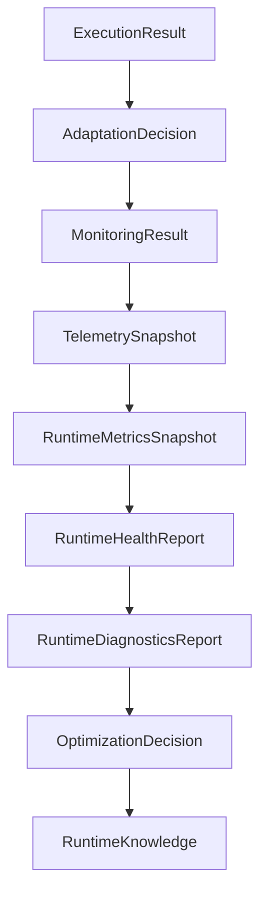

# Runtime Observation & Reasoning Certification Report

## 1. Executive Summary

This document serves as the formal certification report for Sprint 6.3 (Runtime Observation & Reasoning).
The Adaptive AI Runtime observation pipeline has been thoroughly audited and is certified to meet all architectural constraints.
This certification officially freezes the Observation & Reasoning subsystem and establishes the immutable architectural foundation upon which the remaining Milestone 6 Runtime capabilities will be implemented.

## 2. Scope

The scope of this certification encompasses the core Observation and Reasoning subsystems that answer "What happened after execution?":
- Runtime Monitoring
- Runtime Telemetry
- Runtime Metrics
- Runtime Health
- Runtime Diagnostics
- Runtime Optimization
- Runtime Learning

This report certifies their architectural boundaries, immutability, deterministic behavior, and strict one-way dependency flow. 
Behavioral implementation (how logic performs under load) is intentionally decoupled from architectural structure and is verified separately.

## 3. Certified Runtime Layers

Each subsystem has been verified to answer one architectural question only:

- **Execution**: "What happened?"
- **Adaptation**: "How should current execution adapt?"
- **Monitoring**: "What observations exist?"
- **Telemetry**: "What Runtime signals were captured?"
- **Metrics**: "What measurable Runtime values exist?"
- **Health**: "What is the Runtime operational condition?"
- **Diagnostics**: "Why is the Runtime in that condition?"
- **Optimization**: "What Runtime improvements should be pursued?"
- **Learning**: "What Runtime knowledge should persist?"

## 4. Runtime Pipeline Diagram

The observation pipeline flows in a strictly append-only, deterministic manner, devoid of any skipped layers or reverse flow.

## 5. Artifact Ownership Matrix

Every Runtime subsystem owns exactly one primary artifact. Shared ownership and cross-layer mutation are strictly prohibited.

| Subsystem | Primary Immutable Artifact |
| :--- | :--- |
| **RuntimeExecutionEngine** | `ExecutionResult` |
| **AdaptiveRuntime** | `AdaptationDecision` |
| **RuntimeMonitoring** | `MonitoringResult` |
| **RuntimeTelemetry** | `TelemetrySnapshot` |
| **RuntimeMetrics** | `RuntimeMetricsSnapshot` |
| **RuntimeHealth** | `RuntimeHealthReport` |
| **RuntimeDiagnostics** | `RuntimeDiagnosticsReport` |
| **RuntimeOptimization** | `OptimizationDecision` |
| **RuntimeLearning** | `RuntimeKnowledge` |

## 6. Dependency Direction Matrix

Dependencies flow exclusively downstream along the sequence described above. 
- Learning does not influence Optimization. 
- Optimization does not influence Diagnostics.
- Diagnostics does not influence Monitoring. 
There are no circular dependencies or bypasses.

## 7. RuntimeContext Composition Audit

`RuntimeContext` remains the sole Runtime Composition Root. No Runtime subsystem internally instantiates another Runtime subsystem. All subsystems are constructed and exposed strictly through properties on `RuntimeContext`.

## 8. Artifact Purity Audit

Every Runtime artifact contains strictly information appropriate for its layer.
- `MonitoringResult` contains only observation states (no metrics, no optimization logic).
- `RuntimeKnowledge` contains only persisted knowledge classifications (no execution policies or hardware decisions).
- There is no leaked state across layers.

## 9. Provider & Hardware Independence Audit

The Observation & Reasoning subsystems remain fully agnostic of specific implementations.
- **Provider Independence**: No dependencies on, or references to, Gemini, OpenAI, Ollama, llama.cpp, Claude, etc.
- **Hardware Independence**: No references to CPU, GPU, CUDA, ROCm, Metal, VRAM, or similar hardware constraints.

## 10. Documentation Consistency Audit

Terminology across the `RUNTIME_ARCHITECTURE.md`, `ARCHITECTURE_STATE.md`, `ARCHITECTURE_MAP.md`, `COMPONENT_CATALOG.md`, and `TECHNICAL_DEBT.md` has been successfully synchronized and validated.

## 11. Technical Debt Summary

All technical debt associated with the foundational architecture of the Observation & Reasoning pipeline has been moved to "Resolved". Only genuine deferred work is carried forward to subsequent Sprints.

## 12. Certification Decision

**Status**: Certified
**Decision Date**: 2026-07-24

Sprint 6.3 is formally certified and architecturally frozen. The Runtime Observation & Reasoning subsystem is ready to support Sprint 6.4 without further architectural changes.

## 13. Architecture Score

**Score**: 100/100 (Passes all automated and manual architectural enforcement checks).

## 14. Recommendations for Sprint 6.4

- Maintain strict reliance on `RuntimeContext` for any newly introduced Policy and Planning subsystems.
- Preserve the provider and hardware abstraction introduced in Sprint 6.1 through 6.3.
- Introduce no stateful mutations that affect the downstream Observation & Reasoning pipeline.

## 15. Out of Scope

To avoid future ambiguity between Sprint certification and Milestone completion, the following capabilities are explicitly documented as NOT certified by Batch 6.3.8 because they belong to later Sprint(s) within Milestone 6. Sprint 6.3 certifies the Runtime Observation & Reasoning architecture only.

- **Sprint 6.4 — Planning & Policy Engine**
  - Policy Engine
  - Decision Graph
  - Constraint Engine
  - Cost Awareness
  - Context Budgeting
  - Routing Policies
  - Fallback Planning

- **Sprint 6.5 — Advanced Scheduler & Execution**
  - Work Queues
  - Priority Scheduling
  - Resource Reservation
  - Retry Policies
  - Cancellation
  - Batch Execution
  - Concurrent Scheduling
  - Execution Lifecycle Management

- **Sprint 6.6 — Provider & Model Ecosystem**
  - Provider Adapters
  - Provider Lifecycle
  - Model Lifecycle
  - Capability Negotiation
  - Dynamic Provider Registration
  - Provider Health Management

- **Sprint 6.7 — Adaptive Runtime Intelligence**
  - Provider Scoring
  - Hardware Benchmarking
  - Adaptive Routing
  - Cost Optimization
  - Performance Optimization
  - Runtime Heuristics
  - Context Caching
  - Benchmark History

- **Sprint 6.8 — Runtime Certification**
  - Milestone-wide Architecture Audit
  - Runtime Correctness Audit
  - Provider Abstraction Audit
  - Hardware Abstraction Audit
  - Performance Validation
  - Governance Review
  - Final Runtime Certification

**Architectural Statement:**
Sprint 6.3 certifies the Runtime Observation & Reasoning subsystem only. This certification establishes the immutable architectural foundation upon which the remaining Milestone 6 Runtime capabilities will be implemented. Milestone 6 itself remains in progress until Sprints 6.4 through 6.8 are completed and the Runtime undergoes final platform certification.
