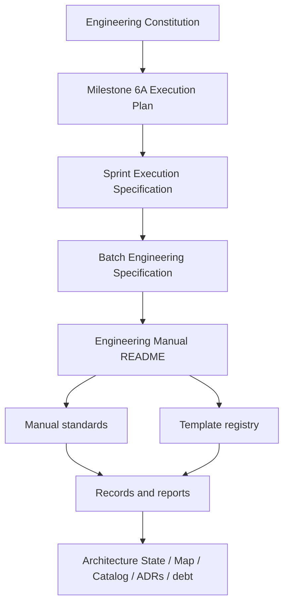

# Batch 6A.1.1 Engineering Specification — Manual Control Baseline

| Field | Value |
| --- | --- |
| Status | Draft for review and approval |
| Version | v0.1.0 |
| Batch | 6A.1.1 |
| Sprint | 6A.1 — Manual Foundation |
| Author | Engineering Governance Lead / Technical Program Manager |
| Reviewer | Architecture Owner and Documentation Reviewer |
| Approver | Architecture Owner |
| Maintainer | Engineering Governance Lead |
| Created date | 2026-08-03 |
| Last updated | 2026-08-03 |
| Supersedes | None |
| Governing documents | [Engineering Specification](MILESTONE_6A_ENGINEERING_SPECIFICATION.md); [Execution Plan](MILESTONE_6A_EXECUTION_PLAN.md); [Sprint 6A.1 Execution Specification](SPRINT_6A_1_EXECUTION_SPECIFICATION.md) |
| Related ADRs | ADR-6A-001 through ADR-6A-004; no new ADR anticipated |
| Applicable milestones | Milestone 6A |
| Review frequency | Before implementation, before batch certification, and on evidence-driven correction |
| Retirement strategy | Preserve as the immutable batch planning and acceptance record |

## Table of Contents

1. [Executive Summary](#1-executive-summary)
2. [Authority, Purpose, and Outcome](#2-authority-purpose-and-outcome)
3. [Scope and Non-Goals](#3-scope-and-non-goals)
4. [Objectives and Decisions](#4-objectives-and-decisions)
5. [Deliverables and Repository Changes](#5-deliverables-and-repository-changes)
6. [Manual Control Model](#6-manual-control-model)
7. [Dependencies and Interfaces](#7-dependencies-and-interfaces)
8. [Implementation Constraints](#8-implementation-constraints)
9. [Repository Evidence Plan](#9-repository-evidence-plan)
10. [Change-Set and Architecture Verification Plan](#10-change-set-and-architecture-verification-plan)
11. [Certification Plan](#11-certification-plan)
12. [Risks, Assumptions, and Escalation](#12-risks-assumptions-and-escalation)
13. [Acceptance Criteria](#13-acceptance-criteria)
14. [Definition of Done](#14-definition-of-done)
15. [Approval and Handoff](#15-approval-and-handoff)
16. [Appendices](#16-appendices)

## 1. Executive Summary

Batch 6A.1.1 establishes the control plane for the Engineering Manual. It creates the Manual entry point and the minimum repository-governance records required to make every subsequent Sprint 6A.1 artifact discoverable, owned, versioned, and traceable to governing authority.

This is a documentation-only batch. It does not create engineering philosophy, workflow, implementation, verification, certification, or prompt standards; those are owned by later batches and sprints. It does not modify production code, runtime behavior, dependency injection, provider/hardware abstractions, or the approved governing documents.

The batch is successful when an engineer can enter through `docs/engineering/README.md`, understand the authority hierarchy, locate the current and planned Manual artifacts, identify owner/status/review cadence for each, and distinguish approved, planned, deferred, and unknown repository knowledge without relying on chat history.

## 2. Authority, Purpose, and Outcome

### 2.1 Authority

This batch implements only the Manual Control Baseline described by Sprint 6A.1. The Engineering Constitution remains the authority for principles and evidence-based engineering. The frozen Execution Plan remains the authority for milestone sequencing, gates, reporting, lifecycle, and long-term plan stability. This specification is a bounded downstream execution artifact and cannot change either authority.

### 2.2 Purpose

The Engineering Manual needs a controlled entry point before standards are added. Without that entry point, later documents can become difficult to discover, lack a clear owner, conflict in authority, or be mistaken for complete when their owning sprint has not yet begun. Batch 6A.1.1 creates the structure that prevents those failures.

### 2.3 Intended outcome

| Outcome | Meaning |
| --- | --- |
| Navigable Manual | A stable README provides authority hierarchy, reading order, artifact index, and contribution path. |
| Controlled inventory | Every planned Manual document/template has a path, status, owner, applicable sprint, and dependency. |
| Ownership visibility | Author, reviewer, approver, and maintainer responsibilities are explicit at the Manual-control level. |
| Lifecycle alignment | Document status, semantic-versioning mode, review cadence, supersession, and retirement behavior follow the Execution Plan. |
| Deferred-work integrity | Future artifacts are listed but not represented as created, approved, or operational. |

## 3. Scope and Non-Goals

### 3.1 Included scope

- Create `docs/engineering/README.md` as the Engineering Manual entry point.
- Create a controlled Manual inventory and ownership matrix, either embedded in the README or in one explicitly linked, controlled companion document.
- Define Manual-level authority hierarchy, reading order, naming/navigation conventions, artifact status vocabulary, ownership roles, review cadence, and contribution/update rules.
- Register planned Manual documents and templates with accurate status and owning sprint.
- Link to the existing Constitution, Execution Plan, and Sprint 6A.1 execution specification.

### 3.2 Explicit non-goals

- Do not revise, summarize, duplicate, or replace the Constitution or Execution Plan.
- Do not create future Manual standards, including philosophy, workflow, specification, implementation, repository inspection, change-set verification, architecture verification, certification, batch workflow, sprint workflow, milestone workflow, or checklists.
- Do not create empty placeholder files for deferred documents.
- Do not create prompt, evidence, verification, certification, ADR, identity-card, or report templates; those are registered only and created by their owning batch/sprint.
- Do not perform repository inspection, runtime validation, DI validation, architecture audit, dead-code review, provider review, hardware review, performance review, or security review.
- Do not modify application, domain, runtime, infrastructure, delivery, build, configuration, test, or production documentation files outside the Manual-control scope.

### 3.3 Scope boundary table

| Area | In scope | Out of scope |
| --- | --- | --- |
| Engineering Manual | README, inventory, ownership, navigation, lifecycle controls. | Content of later Manual standards. |
| Templates | Registry references and maturity status only. | Template files other than future registry references. |
| Architecture governance | Links to authoritative artifacts and status of planned knowledge. | Architecture State/Map/Catalog changes absent evidence. |
| Repository changes | New Manual-control files under `docs/engineering/`. | Any runtime, product, DI, provider, hardware, or test change. |
| Certification | Batch-level planning and later evidence location convention. | Gate G1 decision; this occurs in Batch 6A.1.5. |

## 4. Objectives and Decisions

### 4.1 Objectives

| ID | Objective | Rationale | Completion signal |
| --- | --- | --- | --- |
| O1 | Establish one Manual entry point. | Engineers and agents require a reliable starting location. | README identifies authority, reading order, and navigation. |
| O2 | Make planned artifacts accountable. | Deferred work must not become orphaned or falsely complete. | Inventory has accurate status, owner, sprint, and dependency. |
| O3 | Standardize Manual control metadata. | Documents require lifecycle/ownership to remain trustworthy. | README defines adopted metadata and review conventions. |
| O4 | Preserve authority boundaries. | Downstream documents must not override Constitution/Plan. | Cross-reference review finds no competing normative policy. |
| O5 | Prepare later batches without doing their work. | Sequencing prevents speculative and untested standards. | Future artifacts are registered only, without empty placeholder files. |

### 4.2 Planned decisions

| Decision | Proposed resolution | Reason | Approval needed |
| --- | --- | --- | --- |
| Manual inventory location | Embed the canonical inventory and ownership matrix in `docs/engineering/README.md` for Sprint 6A.1. | Keeps the starting control plane compact and discoverable; avoids creating an unnecessary additional governance file. | Batch approver confirms. |
| Authority order | Constitution → Execution Plan → Sprint/Batch Specifications → Engineering Manual standards/templates → records/reports. | Matches the approved dependency graph and prevents lower-level override. | No new ADR; direct application of governing documents. |
| Artifact status vocabulary | `Planned`, `Draft`, `In Review`, `Approved`, `Superseded`, `Retired`, `Registered Only`, `Deferred`, `Unknown`. | Separates maturity from existence and prevents false readiness claims. | Documentation reviewer validates. |
| Versioning mode | Stable governing/Manual documents use semantic versioning; inventory, reports, state/catalog records use continuous status/date/revision. | Implements approved lifecycle/versioning model. | No new ADR. |
| Future artifact treatment | List future artifacts with path, owner, owning sprint, and status; do not create file placeholders. | Explicit sprint requirement and prevents empty documentation. | No new ADR. |

If evidence or review identifies a materially better location for the inventory, the change must preserve a single canonical index and update all navigation. A new separate file is permitted only if the README remains the sole entry point and links to it directly.

## 5. Deliverables and Repository Changes

### 5.1 Required deliverables

| ID | Deliverable | Path | Required contents | Acceptance condition |
| --- | --- | --- | --- | --- |
| D1 | Engineering Manual README | `docs/engineering/README.md` | Authority, purpose, reading order, artifact index, ownership, lifecycle, contribution/update rules, related knowledge, status. | A new engineer can locate any Manual artifact or its planned owner/sprint. |
| D2 | Manual artifact inventory | Embedded canonical section in `docs/engineering/README.md` | Path, title, purpose, owner, status, versioning mode, owning sprint, dependencies, review cadence. | Every Manual document and template category named by governing documents is represented accurately. |
| D3 | Ownership matrix | Embedded canonical section in `docs/engineering/README.md` | Author, reviewer, approver, maintainer, and escalation responsibility at artifact/role level. | No planned Manual artifact lacks an accountable owner. |
| D4 | Navigation and cross-reference map | Embedded canonical section in `docs/engineering/README.md` | Links to Constitution, Execution Plan, Sprint specification, current Manual artifacts, future knowledge artifacts, and contribution route. | Links resolve and authority order is unambiguous. |
| D5 | Batch evidence-plan location | README identifies intended controlled location and status for later Sprint 6A.1 evidence/certification records. | Avoids inventing a record before its owning Batch 6A.1.5. | Location convention is explicit; no false certification artifact is created. |

### 5.2 Expected changed-file boundary

The expected initial changed-file set is one file: `docs/engineering/README.md`. A separate inventory file is allowed only if review finds the embedded inventory materially harms navigability; such a change must be explicitly justified in the evidence record. No deletion or rename is expected.

### 5.3 Repository impact

| Impact area | Expected effect |
| --- | --- |
| Repository navigation | A single entry point makes engineering governance discoverable. |
| Documentation consistency | Status and ownership prevent documents from being treated as authoritative by implication. |
| Engineering workflow | Later workflow stages have a defined documentation destination and owner. |
| Knowledge preservation | Future Manual artifacts are visible before their delivery, without fake content. |
| Production architecture | No expected effect; changed-file evidence must confirm this. |

## 6. Manual Control Model

### 6.1 Authority and navigation hierarchy



The README must describe this hierarchy in prose and links. The Constitution and Execution Plan are upstream authority. Sprint/Batch specifications define bounded execution. Manual standards operationalize approved rules. Templates guide repeatable work. Records and reports preserve repository facts; they do not redefine policy.

### 6.2 Required Manual artifact inventory

The inventory must list, at minimum, the following planned items and preserve their accurate ownership/sprint state:

| Path / category | Owning sprint | Initial status | Reason |
| --- | --- | --- | --- |
| `README.md` | 6A.1 / Batch 6A.1.1 | To be created | Manual entry point. |
| `01_ENGINEERING_PHILOSOPHY.md` | 6A.1 / Batch 6A.1.2 | Planned | Philosophy foundation. |
| `02_DEVELOPMENT_WORKFLOW.md` | 6A.1 / Batch 6A.1.3 | Planned | Daily engineering lifecycle. |
| `03_ENGINEERING_SPECIFICATION_STANDARD.md` | 6A.1 / Batch 6A.1.2 | Planned | Future specification quality. |
| `04_IMPLEMENTATION_STANDARD.md` | 6A.1 / Batch 6A.1.3 | Planned | Architecture-preserving implementation practice. |
| `05_CHANGESET_VERIFICATION.md` | 6A.3 | Deferred | Requires inspection and pilot evidence. |
| `06_ARCHITECTURE_VERIFICATION.md` | 6A.4 | Deferred | Requires verified change-set context. |
| `07_CERTIFICATION_STANDARD.md` | 6A.5 | Deferred | Requires verification and architecture inputs. |
| `08_REPOSITORY_INSPECTION.md` | 6A.2 | Deferred | Next inspection capability sprint. |
| `09_BATCH_WORKFLOW.md` | 6A.6 | Deferred | Must reflect pilot learnings. |
| `10_SPRINT_WORKFLOW.md` | 6A.6 | Deferred | Must reflect actual 6A execution. |
| `11_MILESTONE_WORKFLOW.md` | 6A.6 | Deferred | Requires closeout/readiness practice. |
| `12_ENGINEERING_CHECKLISTS.md` | 6A.1 / Batch 6A.1.4 | Planned | Role-specific controls. |
| `templates/` registry | 6A.1 / Batch 6A.1.4 | Planned | Controlled template navigation and maturity. |
| Engineering Document Template | 6A.1 / Batch 6A.1.4 | Registered Only | Created only with template registry/checklist batch. |
| Engineering Specification Template | 6A.1 / Batch 6A.1.2 | Planned | Produced with specification standard. |
| Repository Evidence Template | 6A.2 | Deferred | Requires inspection standard. |
| Change Set Verification Template | 6A.3 | Deferred | Requires verification standard. |
| Architecture Verification Template | 6A.4 | Deferred | Requires architecture standard. |
| Certification / Refinement / Acceptance Templates | 6A.5 | Deferred | Requires certification/prompt standard. |

### 6.3 Ownership model

| Role | Batch responsibility | Manual-level responsibility |
| --- | --- | --- |
| Engineering Governance Lead | Authors README/control model and maintains inventory. | Owns operational Manual navigation and template governance. |
| Documentation Reviewer | Reviews clarity, consistency, metadata, status vocabulary, and link integrity. | Reviews controlled documentation quality. |
| Architecture Owner | Verifies authority hierarchy, boundary consistency, and approves batch. | Resolves architecture/governance conflict and controls constitutional alignment. |
| Technical Program Manager | Validates sprint ownership/dependency assignments and progress visibility. | Maintains milestone execution accountability. |
| Future artifact owner | Accepts ownership of planned/deferred artifact upon its owning batch/sprint. | Maintains document after approval. |

### 6.4 Status semantics

| Status | Meaning | Permitted claim |
| --- | --- | --- |
| Planned | Approved for a future scoped batch but not yet created. | “Scheduled”; not “available.” |
| Registered Only | Identified in inventory/registry without operational content. | “Known and owned”; not “ready.” |
| Draft | File exists but is awaiting review. | “Draft”; not authoritative. |
| In Review | Draft is undergoing named review. | “Under review”; not approved. |
| Approved | Accepted controlled artifact. | “Authoritative within declared scope.” |
| Deferred | Intentionally postponed to named sprint because prerequisites are missing. | “Deferred with owner”; not abandoned. |
| Superseded / Retired | Historical artifact remains discoverable but no longer governs. | “Historical only.” |
| Unknown | No evidence supports a status claim. | “Unknown; inspection required.” |

## 7. Dependencies and Interfaces

### 7.1 Upstream dependencies

| Dependency | Required use in this batch |
| --- | --- |
| Constitution | Preserve repository-truth doctrine, authority model, capability/provider/hardware neutrality, explicit dependencies, documentation and certification principles. |
| Execution Plan | Preserve Sprint 6A.1 scope, G1 meaning, document lifecycle/versioning, knowledge hierarchy, reporting/repository knowledge relationships, and plan freeze. |
| Sprint 6A.1 Execution Specification | Implement only Batch 6A.1.1 deliverables, scope, risks, review expectations, and handoff. |

### 7.2 Downstream interfaces

| Consumer | What this batch provides |
| --- | --- |
| Batch 6A.1.2 | Documentation location, metadata, ownership, navigation, and status vocabulary. |
| Batch 6A.1.3 | Controlled workflow-document location and authority hierarchy. |
| Batch 6A.1.4 | Template registry location, ownership/inventory rules, and future-artifact conventions. |
| Batch 6A.1.5 | Complete manual inventory, evidence location convention, and documentation control evidence. |
| Sprints 6A.2–6A.6 | A discoverable Manual entry point and explicit planned destination for their deliverables. |

## 8. Implementation Constraints

1. Use Markdown only; do not introduce a documentation generator, build system, dependency, or automation in this batch.
2. Preserve the approved filenames and numbering. Do not create empty files for planned/deferred standards.
3. The README must link with relative repository paths and must not invent paths for Architecture State, Map, Catalog, ADRs, or debt records if they cannot be verified. It may identify them by artifact name and status `Unknown` or `Planned`.
4. Claims about current repository state must be limited to confirmed governing-artifact context or direct repository evidence available during implementation.
5. The README must reference, not reproduce, detailed constitutional and execution-plan sections.
6. Do not add mandatory process stages, role requirements, quality thresholds, or architecture policies that contradict or expand governing authority.
7. No product, source, configuration, DI, runtime, provider, hardware, test, or CI file may be changed under this specification.

## 9. Repository Evidence Plan

### 9.1 Required evidence matrix

| Evidence ID | Claim | Evidence source | Pass condition |
| --- | --- | --- | --- |
| EV-01 | Batch scope is documentation-only. | Changed-file inventory. | Only approved `docs/engineering/` Manual-control files changed. |
| EV-02 | README is present and navigable. | File existence and link/navigation review. | All required local governing/manual links resolve. |
| EV-03 | Authority hierarchy is preserved. | README authority section compared to governing documents. | No lower-level document claims to override Constitution/Plan. |
| EV-04 | Planned/deferred artifacts are accurately represented. | Inventory/status review. | Every required artifact has owner, sprint, status, and no fake file/claim. |
| EV-05 | Ownership and lifecycle are explicit. | Matrix/metadata review. | Required roles/review/version/retirement information is recorded. |
| EV-06 | No production architecture changed. | Changed-file inventory and direct path review. | No production/runtime/configuration/test file changed. |
| EV-07 | Batch findings are controlled. | Findings record. | Evidence, severity, owner, disposition, and limitations are complete. |

### 9.2 Evidence limitations

This batch does not establish the full Repository Inspection Standard. Evidence collection is therefore intentionally limited to documentation change-set evidence and direct consistency review. It must not claim that all existing engineering documentation, links, architecture artifacts, or repository modules have been exhaustively inspected.

## 10. Change-Set and Architecture Verification Plan

### 10.1 Documentation-focused change-set verification

The verifier will:

1. Compare the changed-file set to the approved scope in Section 3.
2. Confirm each file has a direct Manual-control purpose.
3. Verify every expected README link and every referenced local artifact path that exists.
4. Review inventory entries for accurate path, status, owner, owning sprint, and dependency.
5. Verify no planned/deferred item is represented as an approved/available file.
6. Confirm no governing document or production/runtime/configuration/test artifact was modified.
7. Record findings, limitations, residual risks, and disposition.

### 10.2 Architecture consistency verification

| Dimension | Verification question | Responsible role |
| --- | --- | --- |
| Authority | Does README preserve Constitution and Execution Plan priority? | Architecture Owner |
| Architecture boundaries | Does it avoid defining contradictory runtime/provider/hardware/composition rules? | Architecture Owner |
| Repository knowledge | Does it distinguish verified, planned, deferred, and unknown information? | Documentation Reviewer |
| Maintainability | Are ownership, review, versioning, and retirement rules discoverable? | Governance Lead |
| Scope discipline | Does changed-file evidence show no production architecture effect? | Change-set Verifier |

The expected verdict is **Conformant**. A contradiction of upstream authority, an unsupported repository-state claim that materially affects future engineering decisions, or an out-of-scope production change is a blocker.

## 11. Certification Plan

Batch 6A.1.1 receives lightweight documentation certification only. It is not a runtime, platform, repository-wide, security, performance, or G1 certification.

| Certification input | Requirement |
| --- | --- |
| Approved scope | This specification is approved before implementation. |
| Changed-file evidence | EV-01 through EV-07 are satisfied or exceptions recorded. |
| Change-set review | Documentation-focused review is complete. |
| Architecture consistency | Conformant verdict or approved, time-bounded exception. |
| Findings | No blocker/major finding remains unresolved without approved exception. |
| Decision | Explicit `Certified`, `Certified with tracked debt`, or `Not certified` verdict. |

Certification of this batch permits Batch 6A.1.2 planning/implementation under the approved Sprint specification. It does not pass Gate G1; Gate G1 is assessed only by Batch 6A.1.5 after all Sprint 6A.1 batches are certified.

## 12. Risks, Assumptions, and Escalation

### 12.1 Risks

| Risk | Impact | Mitigation | Escalation trigger |
| --- | --- | --- | --- |
| README duplicates governing documents | Conflicting authority and maintenance burden. | Link/refer rather than copy policies. | Material contradiction found. |
| Inventory has no canonical location | Multiple sources drift. | Embed canonical inventory in README unless exception approved. | Second competing inventory proposed. |
| Deferred artifacts appear complete | Engineers use unapproved/empty guidance. | Status semantics and no-placeholder rule. | File created without owning-batch authorization. |
| Unknown artifact paths are invented | Repository truth doctrine is violated. | Use `Unknown` and assign later inspection/update. | Link/path cannot be verified. |
| Scope reaches production files | Batch invalidates documentation-only plan. | Changed-file gate before review. | Any non-approved file appears. |
| Ownership is nominal | Future artifacts become orphaned. | Require role and owning sprint in inventory. | Owner field absent or non-actionable. |

### 12.2 Assumptions

- The three governing engineering documents exist at their approved paths.
- The approved path `docs/engineering/` is the correct Manual location.
- Role names may be used as accountable roles when individual identities are not available; responsibility must remain actionable.
- Existing Architecture State, Map, Catalog, ADR, and debt-register paths may be unknown. This batch will not guess them.

### 12.3 Escalation rules

| Condition | Required action |
| --- | --- |
| Governing documents conflict | Stop batch; Architecture Owner resolves through approved governance/ADR process. |
| Required artifact requires a new architecture policy | Stop and request an ADR or downstream Manual decision; do not embed policy silently. |
| Out-of-scope file change is needed | Split/re-scope through a separate approved specification. |
| Planned artifact path/status cannot be verified | Mark unknown/deferred; record limitation; do not invent. |
| Major/Blocker finding | Do not certify until resolved or formally excepted. |

## 13. Acceptance Criteria

| ID | Criterion | Evidence | Result requirement |
| --- | --- | --- | --- |
| AC1 | `docs/engineering/README.md` exists as the Manual entry point. | EV-01, EV-02. | Required. |
| AC2 | Authority hierarchy and reading order identify the Constitution and Execution Plan as upstream authority. | EV-02, EV-03. | Required; no contradictory rule. |
| AC3 | Canonical inventory lists every required Manual document/category and template category with accurate status. | EV-04. | Required. |
| AC4 | Every planned/deferred artifact has an accountable owner, owning sprint, dependencies, and review/lifecycle treatment. | EV-04, EV-05. | Required. |
| AC5 | No empty future-standard/template placeholder is created. | EV-01, EV-04. | Required. |
| AC6 | Navigation links are valid for all existing local artifacts; missing/unknown artifacts are honestly marked. | EV-02, EV-04. | Required. |
| AC7 | Batch change set remains documentation-only and within approved paths. | EV-01, EV-06. | Required. |
| AC8 | Findings and limitations are recorded with owner and disposition. | EV-07. | Required. |
| AC9 | Architecture consistency verdict is Conformant or formally excepted. | Architecture review record. | Required. |

## 14. Definition of Done

Batch 6A.1.1 is done only when:

- [ ] This specification has been approved.
- [ ] The Engineering Manual README and embedded canonical control artifacts meet Sections 5 and 6.
- [ ] All planned and deferred Manual artifacts/templates are accurately registered without empty placeholder files.
- [ ] Ownership, versioning/status, review cadence, and retirement/supersession expectations are visible.
- [ ] Changed-file, link, metadata, inventory, authority, and scope reviews are complete.
- [ ] The architecture consistency verdict is recorded.
- [ ] Findings, limitations, risks, and exceptions have evidence, severity, owner, and disposition.
- [ ] Lightweight documentation certification is issued with an explicit verdict.
- [ ] Batch handoff identifies Batch 6A.1.2 as the next permitted unit of work.

## 15. Approval and Handoff

Approval authorizes creation of only the deliverables in Section 5. It does not authorize implementation prompts for later batches, creation of deferred documents/templates, modification of the Constitution/Execution Plan, or production repository changes.

After certification, Batch 6A.1.1 provides the Manual control baseline to Batch 6A.1.2. The handoff package must include the README, changed-file inventory, evidence record, architecture consistency verdict, certification decision, and any tracked debt/limitations.

## 16. Appendices

### Appendix A — Expected README Reading Order

1. Engineering Constitution.
2. Milestone 6A Execution Plan.
3. Current Sprint/Batch execution specifications.
4. Engineering Manual README and approved applicable Manual standard.
5. Applicable controlled template/checklist.
6. Current Architecture State/Map/Catalog/identity cards/ADRs, if available and relevant.
7. Evidence, verification, certification, report, and debt artifacts appropriate to work maturity.

### Appendix B — Batch Evidence Record Skeleton

```markdown
# Batch 6A.1.1 Repository Evidence Record

## Approved scope and non-goals
## Changed-file inventory
## README navigation and link validation
## Inventory, ownership, status, and lifecycle validation
## Authority and architecture consistency review
## Findings, limitations, residual risks, and dispositions
## Acceptance criteria evidence matrix
## Lightweight documentation certification verdict
```

### Appendix C — Reviewer Questions

1. Can a new engineer find the governing documents and applicable Manual artifact without chat history?
2. Is there exactly one canonical inventory location?
3. Does every deferred artifact have an owner and owning sprint without an empty placeholder file?
4. Does the README make any unverified claim about repository, runtime, architecture, or certification state?
5. Does any language silently override the Constitution or frozen Execution Plan?
6. Is the changed-file set limited to the approved Manual-control scope?
