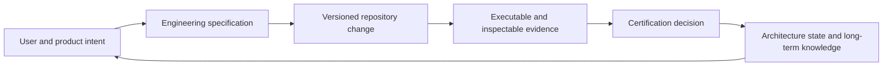
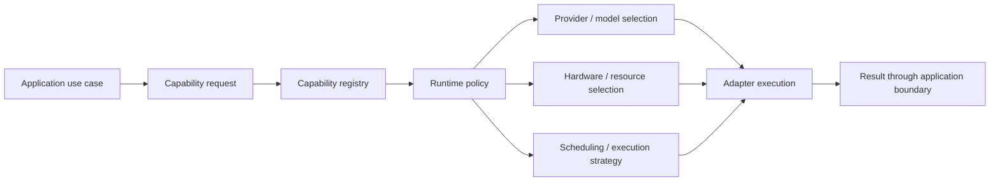
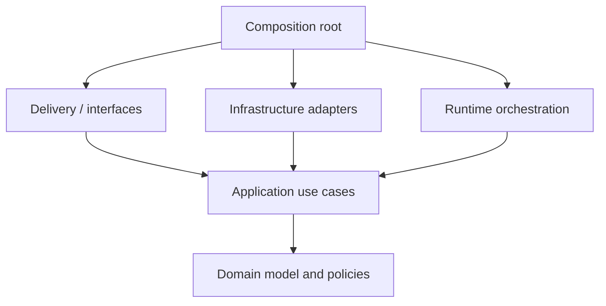
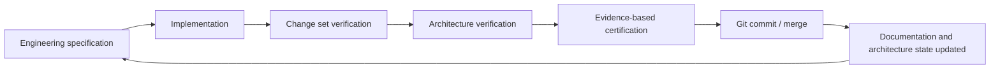
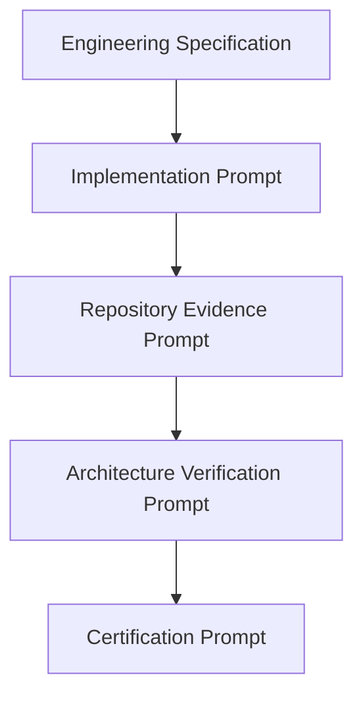
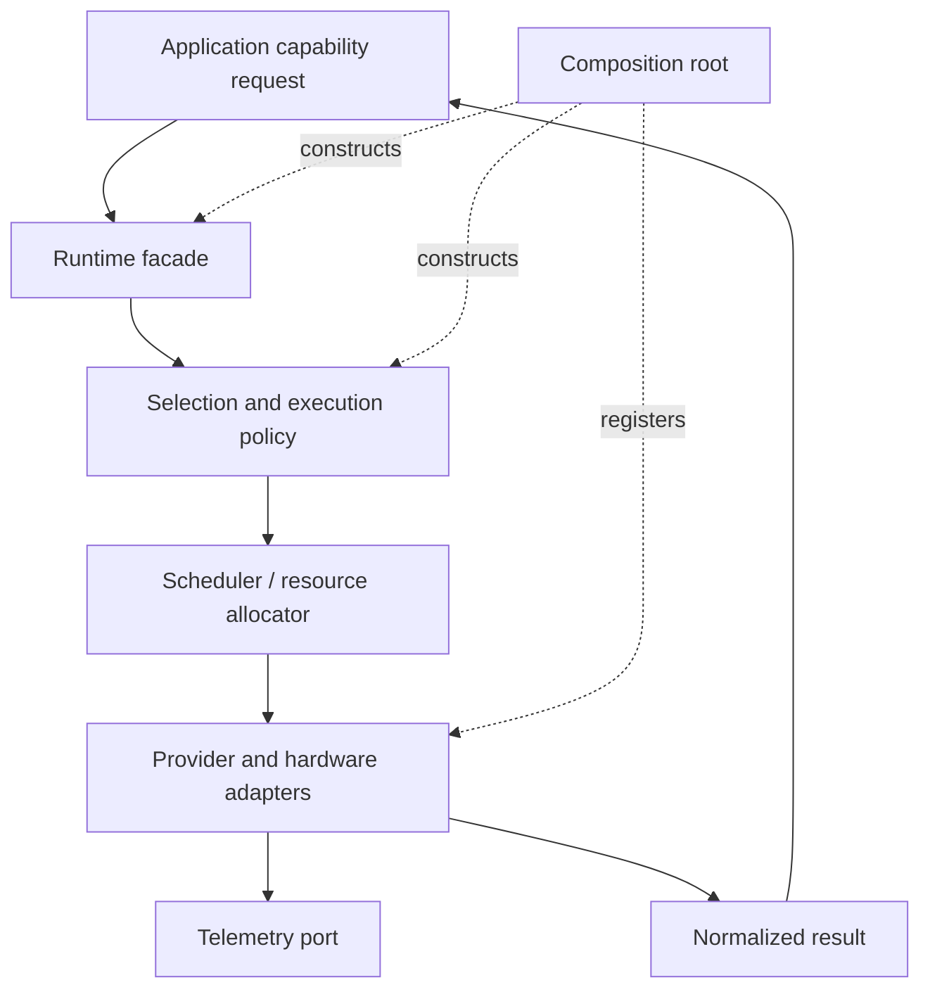
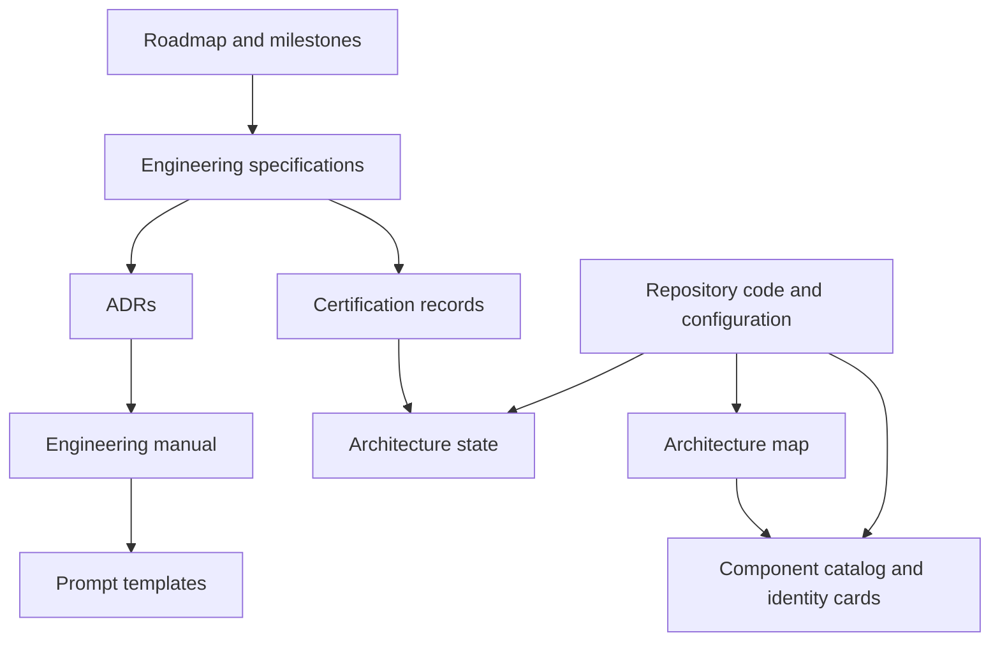

# Milestone 6A Engineering Specification

| Field | Value |
| --- | --- |
| Status | Approved baseline specification — Revision 2 Engineering Constitution |
| Owner | Chief Software Architect / Platform Engineering |
| Applies to | ClipForge Milestone 6A and all work in Milestones 7–9 |
| Audience | Engineers, architecture reviewers, technical program managers, and AI-assisted engineering agents |
| Authority | Normative; supersedes summary-only verification for in-scope work |
| Last updated | 2026-08-03 |

## Executive Summary — ClipForge Engineering Constitution

### Project vision and mission

ClipForge exists to make high-quality content creation an intelligible, repeatable, and eventually adaptive system rather than a sequence of isolated editing tasks. Its immediate purpose is to turn long-form and source media into useful short-form content. Its enduring mission is broader: provide an AI Operating System that can understand stories, reason about narratives and campaigns, plan work, execute media operations, publish outcomes, observe results, and improve future decisions.

The target users are creators, content teams, agencies, media operators, and platform operators who need a reliable path from source material and intent to measurable content outcomes. The platform is designed for human-directed work today and progressively more autonomous, bounded execution tomorrow. Autonomy is never an excuse for opaque behavior: every important decision must have an owner, policy, evidence, and observability path.

### Why ClipForge is architected this way

Content creation crosses volatile technology boundaries. Models change; providers differ in capability and cost; hardware availability changes; execution may move between local, accelerated, and remote environments; and product workflows will expand faster than individual SDKs remain stable. A provider-led application would spread these volatile concerns through product code and turn each change into a rewrite. ClipForge instead adopts capability-driven architecture: application code states the outcome it requires, while the runtime chooses provider, model, hardware, schedule, resources, and execution strategy under explicit policy.

This yields four durable properties:

| Property | Meaning |
| --- | --- |
| Provider-agnostic runtime | Use cases request capabilities rather than importing a vendor model or SDK. |
| Hardware-agnostic runtime | Product policy is independent of CPU, GPU, accelerator, local, or remote execution details. |
| Adaptive runtime | Selection and scheduling can evolve using policy, telemetry, availability, cost, quality, and latency constraints. |
| Governed autonomy | Future planning and execution agents remain observable, bounded, certifiable, and architecture-preserving. |

### Current and future scope

The current baseline is the engineering foundation established through Milestones 1–6: Clean/hexagonal architecture, runtime and provider/hardware abstractions, capability registry, documentation governance, architecture governance artifacts, and certification foundations. Milestone 6A makes this foundation operationally provable.

The future scope is an AI Operating System for content creation: story understanding; narrative and campaign reasoning; planning; clip and edit selection; motion and subtitle planning; rendering; publishing; analytics; adaptive optimization; and autonomous learning. These functions are a roadmap, not a claim that every subsystem is currently implemented. The repository evidence standard in this constitution governs the distinction between implemented, partially implemented, planned, and unknown states.

### Repository and engineering governance philosophy

ClipForge treats the repository as the primary executable memory of the system. Specifications express intent. Architecture maps describe approved structure. Tests, source, registrations, configuration, traces, and reproducible runs establish facts. Summaries, including AI-generated summaries, are useful context but cannot prove integration. Engineering process exists to preserve this distinction as the platform grows.



## Table of Contents

0. [Executive Summary — ClipForge Engineering Constitution](#executive-summary--clipforge-engineering-constitution)
1. [Purpose and Authority](#1-purpose-and-authority)
2. [Context and Problem Statement](#2-context-and-problem-statement)
3. [Scope, Non-Goals, and Outcomes](#3-scope-non-goals-and-outcomes)
4. [Normative Language and Definitions](#4-normative-language-and-definitions)
5. [Architecture and Engineering Philosophy](#5-architecture-and-engineering-philosophy)
6. [Target Engineering Operating Model](#6-target-engineering-operating-model)
7. [Repository Evidence Standard](#7-repository-evidence-standard)
8. [Change Set Verification Standard](#8-change-set-verification-standard)
9. [Architecture Verification Standard](#9-architecture-verification-standard)
10. [Certification Standard](#10-certification-standard)
11. [Engineering Manual Information Architecture](#11-engineering-manual-information-architecture)
12. [Prompt Artifact Hierarchy](#12-prompt-artifact-hierarchy)
13. [Milestone 6A Sprint Structure](#13-milestone-6a-sprint-structure)
14. [Definition of Done and Checklists](#14-definition-of-done-and-checklists)
15. [Decision Records](#15-decision-records)
16. [Metrics, Governance, and Exception Handling](#16-metrics-governance-and-exception-handling)
17. [Risks and Mitigations](#17-risks-and-mitigations)
18. [Impact on Milestones 7–9](#18-impact-on-milestones-79)
19. [Acceptance Criteria](#19-acceptance-criteria)
20. [Appendices](#20-appendices)
21. [Project Evolution and Historical Context](#21-project-evolution-and-historical-context)
22. [Milestone History](#22-milestone-history)
23. [Current Repository Baseline Before Milestone 7](#23-current-repository-baseline-before-milestone-7)
24. [Architecture Audit Baseline and Engineering Retrospective](#24-architecture-audit-baseline-and-engineering-retrospective)
25. [Runtime Governance](#25-runtime-governance)
26. [God-Object Prevention and Runtime Fitness](#26-god-object-prevention-and-runtime-fitness)
27. [Architecture Metrics Standard](#27-architecture-metrics-standard)
28. [Subsystem Identity Cards](#28-subsystem-identity-cards)
29. [Constitution for AI-Assisted Engineering](#29-constitution-for-ai-assisted-engineering)
30. [Engineering Prompt Specification](#30-engineering-prompt-specification)
31. [Repository Knowledge Preservation](#31-repository-knowledge-preservation)
32. [Long-Term Roadmap: Milestones 7–9](#32-long-term-roadmap-milestones-79)
33. [Engineering Constitution](#33-engineering-constitution)
34. [Revision 2 Acceptance Criteria](#34-revision-2-acceptance-criteria)
35. [Revision 2 Cross-Reference and Maintenance Rules](#35-revision-2-cross-reference-and-maintenance-rules)

## 1. Purpose and Authority

Milestone 6A modernizes how ClipForge is engineered, verified, documented, and certified. It does not introduce a new end-user content-creation capability. It establishes the operating system by which every subsequent capability is specified, implemented, inspected, proven, and accepted.

ClipForge is evolving into an AI Operating System for content creation: story understanding, narrative reasoning, campaign intelligence, planning, selection, editing, motion and subtitle planning, rendering, publishing, analytics, adaptive optimization, and autonomous learning. This scope requires architecture that remains coherent while providers, models, hardware, scheduling policies, and execution strategies evolve. Application code requests a capability; runtime infrastructure resolves how that capability is executed.

This specification is normative for Milestone 6A and establishes the default engineering contract for Milestones 7–9. A team may adopt stricter controls. A team may not weaken a requirement in this document without an approved Architecture Decision Record (ADR) and an explicit, time-bounded exception.

## 2. Context and Problem Statement

Milestones 1–6 established Clean Architecture, hexagonal boundaries, a runtime, provider and hardware abstractions, a capability registry, architecture governance, component cataloging, architecture state and mapping, a project constitution, engineering standards, and a certification framework. The structural foundation is mature.

Architecture reviews found a process gap: implementation was often assessed through implementation summaries. A summary can describe intent, but it cannot establish that a registration is reachable, a consumer uses the intended port, an execution path is complete, or an obsolete implementation is no longer active. The repository—not an implementation narrative—is the authoritative record of the executable system.

Milestone 6A responds to the following failure modes:

- A port, adapter, or provider exists but is never registered or selected at runtime.
- A dependency-injection registration exists but is shadowed, incorrectly scoped, or resolves an unintended implementation.
- A feature compiles while its actual entry point cannot reach it.
- Legacy, dead, placeholder, or bypass code remains credible because it is not inspected.
- A runtime coordinator accumulates responsibilities until it becomes a god object.
- Documentation records aspirational architecture while imports, call paths, or construction code establish different architecture.
- Certification asserts completion without durable evidence that a reviewer can independently reproduce.

The required correction is a repository-evidence operating model.

## 3. Scope, Non-Goals, and Outcomes

### 3.1 In scope

Milestone 6A defines and installs the engineering manual, standards, templates, checklists, certification evidence model, repository inspection practice, and sprint operating model. It establishes repeatable verification of changed files, dependency injection, call paths, imports, consumers, dead code, architectural boundaries, and execution reachability. It also establishes continuous inspection signals for runtime growth, coupling, documentation drift, and god-object risk.

### 3.2 Out of scope

The milestone does not replace the existing runtime architecture, select a provider, add a model, redesign product workflows, promise full automated static analysis on day one, or retroactively certify every historical line of code. It may identify historical debt; remediation must be planned and evidenced separately.

### 3.3 Measurable outcomes

At milestone close, the repository MUST contain an engineering manual with the required documents, reusable prompt templates, verification and certification checklists, an evidence-backed certification format, and an adopted workflow. A representative change MUST be traceable from specification through executable evidence to certification. Reviewers MUST be able to determine, from repository artifacts, what changed, why it is reachable, which boundaries it crosses, and what risks remain.

## 4. Normative Language and Definitions

The terms **MUST**, **MUST NOT**, **REQUIRED**, **SHOULD**, **SHOULD NOT**, and **MAY** are normative. MUST indicates an invariant unless an approved exception exists; SHOULD indicates the default expected practice, with recorded reasoning required when it is not followed.

| Term | Definition |
| --- | --- |
| Capability | A provider-neutral outcome requested by application code, such as transcription, clip scoring, or rendering. |
| Port | A boundary interface owned by the core/application layer that declares a required interaction. |
| Adapter | An implementation of a port that connects to a provider, device, framework, or delivery mechanism. |
| Composition root | The sole approved location(s) where concrete infrastructure is assembled and dependency injection is configured. |
| Execution path | The ordered, runtime-reachable path from an externally callable entry point to observable effect or returned result. |
| Repository evidence | Durable, inspectable material in the repository or reproducible command output that substantiates a claim. |
| Change set | All modified, added, deleted, generated, and configuration files associated with one coherent change. |
| Reachability | Evidence that runtime control flow can invoke an implementation from a supported entry point. |
| Dead code | Code, configuration, registration, or artifact with no supported reachable consumer, excluding explicitly retained compatibility paths. |
| Placeholder | An implementation that intentionally does not fulfill its production contract, including stubs, mocks, TODO returns, empty handlers, and NotImplemented branches. |
| Architecture drift | A material divergence between approved architecture and repository reality. |
| Certification | A formal determination, based on cited evidence, that a change meets its declared acceptance criteria. |

## 5. Architecture and Engineering Philosophy

### 5.1 Core principles

1. **Repository truth over implementation narratives.** Narratives explain decisions; code, configuration, tests, and reproducible output prove behavior.
2. **Evidence over assumptions.** Every material claim needs a cited source of evidence and a reviewer-verifiable path to it.
3. **Verification over trust.** Author confidence is useful but never substitutes for inspection.
4. **Architecture before features.** New product behavior is introduced through approved boundaries, ownership, and runtime policies.
5. **Small, cohesive changes.** A change set should make one coherent architectural move and expose its consequences.
6. **Continuous architectural validation.** Boundary and coupling checks occur on each meaningful change, not only during redesigns.
7. **Continuous repository inspection.** Reachability, registrations, imports, consumers, and placeholders are routinely examined.
8. **Continuous documentation.** Documentation evolves in the same change set as the behavior or decision it describes.
9. **Continuous certification.** Certification is a release-quality activity attached to work completion, not a retrospective ceremony.
10. **Executable completion.** Every completed capability must be executable in an approved environment or explicitly classified as an interface-only increment.

### 5.2 Capability-driven execution model



Application and domain code MUST express required capability and policy-relevant constraints without selecting vendor SDKs, model identifiers, GPU APIs, or scheduling mechanisms. Provider-specific concerns belong behind adapters; assembly belongs in the composition root. A verification record MUST make any approved exception visible.

### 5.3 Dependency direction



Dependencies point inward toward stable policy. Concrete dependencies MAY be assembled outward in the composition root, but the domain MUST NOT import delivery, infrastructure, provider SDK, hardware, or framework details. The exact module names may vary; the direction does not.

## 6. Target Engineering Operating Model

### 6.1 Lifecycle



No stage is a prose-only gate. Implementation produces a change set. Verification inspects that change set and its reachable context. Certification cites inspection results. A commit represents a certified repository state, not merely a completed coding session.

### 6.2 Required artifacts per change

Every non-trivial change MUST have: a scoped engineering specification or approved work item; an implementation record identifying the change set; a change set verification record; an architecture verification record when boundaries, runtime, contracts, composition, or dependencies change; certification; and documentation updates where the public engineering truth changes.

Trivial changes (formatting-only, spelling-only, or non-behavioral comment changes) MAY use a lightweight record, but must still declare why architecture verification is not applicable.

### 6.3 Roles and segregation of concerns

| Role | Primary accountability |
| --- | --- |
| Author | Implements the approved scope and supplies accurate evidence references. |
| Change-set verifier | Inspects changed files, registrations, consumers, tests, and execution path. |
| Architecture verifier | Evaluates dependency direction, coupling, drift, and future risk. |
| Certifier | Determines whether the evidence substantiates each criterion; may be the reviewer in small teams only if evidence remains independent and explicit. |
| Architecture owner | Approves exceptions, ADRs, and remediation priorities. |

AI-assisted agents may perform any role subject to the same evidence standards. An AI-generated assertion is not evidence until it cites repository material or reproducible results.

## 7. Repository Evidence Standard

### 7.1 Evidence hierarchy

Evidence is ranked by strength. Higher-ranked evidence is preferred for behavioral claims.

| Level | Evidence | Appropriate claims |
| --- | --- | --- |
| E1 | Executed automated test, integration run, or deterministic command output | Behavior, resolution, reachability, regression prevention |
| E2 | Source, configuration, and build artifact inspection with exact locations | Structure, registration, imports, contracts, ownership |
| E3 | Runtime logs, traces, metrics, or captured execution output | Operational behavior and observed selection |
| E4 | Architecture map, ADR, or specification | Intended design and approved decisions |
| E5 | Implementation summary or verbal assertion | Context only; never sufficient for certification alone |

Certification MUST use E1–E4 for each material claim. E5 MAY provide orientation but cannot establish completion.

### 7.2 Evidence record format

Each evidence item MUST contain a unique identifier, claim, evidence type, exact repository path or reproducible command, observed result, reviewer interpretation, and limitations. References should use immutable revision identifiers when available; otherwise use file paths and line anchors captured at review time.

| ID | Claim | Source | Observation | Limitation |
| --- | --- | --- | --- |
| EV-01 | `RenderCapability` resolves to the selected adapter | composition-root registration and integration test | requested capability returns adapter result | test uses deterministic fake provider |

### 7.3 Evidence rules

- Source code demonstrates existence, not necessarily runtime use.
- A registration demonstrates intended assembly, not necessarily resolution; pair it with a resolution or integration test where feasible.
- A unit test demonstrates isolated behavior, not the complete execution path.
- A trace demonstrates one observed execution, not universal correctness.
- Negative searches are supporting evidence only and MUST state their search scope and patterns.
- Generated files are not authoritative when their source and generation process are available.
- Screenshots are supplementary; text logs, source, configuration, and tests are preferred for reviewable claims.

## 8. Change Set Verification Standard

### 8.1 Objective

Change set verification determines whether the repository change is complete, coherent, integrated, and free of obvious orphaned or bypassed work. It precedes certification and is not a restatement of the author’s summary.

### 8.2 Required inspection sequence

1. Establish the change boundary: enumerate added, modified, deleted, renamed, generated, configuration, and documentation files.
2. Classify each file by architectural layer and responsibility.
3. Review public contracts, ports, schemas, configuration, and compatibility implications.
4. Inspect dependency injection and composition-root changes, including lifetime/scope and selection policy.
5. Trace the primary execution path from supported entry point to observable result.
6. Identify consumers and call sites for added or changed public symbols.
7. Inspect imports and references for forbidden inward-to-outward dependencies.
8. Search for obsolete implementations, duplicate registrations, placeholders, TODO branches, and dead code made relevant by the change.
9. Execute proportionate tests, builds, static checks, and integration paths.
10. Record evidence, open findings, scope exclusions, and residual risks.

### 8.3 Mandatory verification questions

| Area | Questions |
| --- | --- |
| Changed files | Does every changed file serve the declared scope? Is any required file absent? |
| DI and composition | Is every production implementation registered exactly as intended? Does lifetime fit state and concurrency? Can a competing registration shadow it? |
| Execution path | Which entry point invokes the use case? Which policy selects the adapter? What observable output proves completion? |
| Consumers | Who calls the changed contract? Are all consumers compatible? Is migration complete? |
| Imports | Does any core layer import framework, provider, or delivery code? Did a shortcut bypass a port? |
| Reachability | Is new production code reachable from a supported entry point? If not, is it explicitly staged and non-certified? |
| Dead code | Did replacement leave legacy classes, registrations, feature flags, or configuration unread? |
| Placeholders | Do any production paths return defaults, no-op, TODO, mock data, or unimplemented exceptions? |
| Tests | Do tests prove the highest-risk behavior and failure path, rather than merely compilation? |

### 8.4 Call-graph evidence

For each material runtime change, the verifier MUST record a primary path in this form:

`Entry point → delivery handler → application use case → capability/port → runtime policy → adapter/provider → result/persistence/event`

The record MUST identify the implementation selected at each polymorphic boundary and the evidence for selection. For asynchronous or event-driven paths, include producer, transport, consumer, retry/error path, and idempotency boundary.

### 8.5 Findings classification

| Severity | Meaning | Certification effect |
| --- | --- | --- |
| Blocker | Cannot establish correctness, reachability, safety, or required boundary compliance | Certification denied |
| Major | Material defect, unmitigated drift, missing test/evidence, or high future risk | Certification denied unless formally excepted |
| Minor | Non-blocking gap with clear owner and due milestone | May certify with tracked remediation |
| Observation | Improvement opportunity; no current noncompliance | Recorded for planning |

## 9. Architecture Verification Standard

### 9.1 Objective

Architecture verification evaluates the changed system in context, not merely whether code is well formatted or tests pass. It determines whether ClipForge remains capability-driven, boundary-respecting, maintainable, scalable, and evolvable.

### 9.2 Review dimensions

| Dimension | Required assessment |
| --- | --- |
| Dependency direction | Confirm core policy does not depend on infrastructure, delivery, provider SDKs, or hardware details. |
| Runtime coupling | Confirm capability consumers request abstractions and runtime owns selection, allocation, and execution policy. |
| Boundary integrity | Confirm ports are owned by the right layer, adapters do not leak provider types inward, and contracts are explicit. |
| Composition | Confirm concrete assembly is centralized, visible, and testable. |
| God-object risk | Measure responsibility growth, dependency breadth, orchestration depth, and change-frequency concentration. |
| Drift | Compare architecture maps, catalog, and state against imports, registrations, module layout, and actual paths. |
| Abstraction quality | Confirm abstractions represent stable domain/application needs rather than a single provider’s API. |
| Maintainability | Evaluate cohesion, naming, failure handling, observability, test seams, and migration cost. |
| Scalability | Evaluate concurrency, resource ownership, scheduling, backpressure, isolation, and configuration growth. |
| Future risk | Identify lock-in, unbounded retries, data coupling, policy scattering, and irreversible public contracts. |

### 9.3 God-object detection protocol

An object, module, or service is a god-object candidate when it accumulates unrelated responsibilities, has broad dependencies across layers, owns both policy and mechanics, becomes the default coordinator for unrelated workflows, or changes frequently for unrelated features. Verifiers MUST inspect candidates introduced or materially expanded by the change.

Signals include unusually high constructor dependency count, cross-layer imports, mixed orchestration and business rules, direct provider calls combined with application decisions, numerous unrelated public methods, and a central module modified across multiple unrelated changes. Thresholds are prompts for review, not automatic proof. The remedy is to separate use-case orchestration, policy, adapter mechanics, state ownership, and event handling according to stable responsibility boundaries.

### 9.4 Architecture verification procedure

1. Read the approved specification, ADRs, architecture state, and component catalog relevant to the change.
2. Map changed symbols to layers, owners, ports, adapters, and composition points.
3. Trace imports/references outward and inward; identify violations and bypass paths.
4. Trace runtime selection and concrete assembly, including configuration-driven alternatives.
5. Assess cohesion, coupling, failure behavior, observability, and testability.
6. Compare repository reality with architectural documents; create a drift finding or update documentation in the same change.
7. Record findings, required remediation, exceptions, and a forward-looking risk statement.

### 9.5 Architecture verdicts

An architecture review returns one of: **Conformant**, **Conformant with tracked debt**, **Exception required**, or **Non-conformant**. “Conformant with tracked debt” requires a minor finding with owner and target milestone. “Exception required” requires an ADR before certification. “Non-conformant” blocks certification.

## 10. Certification Standard

### 10.1 Purpose

Certification is the final evidence-based decision that a scoped change may represent an accepted repository state. It replaces declaration-based completion. Certification is a conclusion drawn from linked evidence, not a summary of work performed.

### 10.2 Required certification record

Each certification MUST contain:

- Scope and immutable change identifier where available.
- Acceptance criteria, each with pass/fail status and evidence IDs.
- Changed-file inventory and layer classification.
- Primary execution-path record.
- DI/composition verification result where applicable.
- Test, build, static-analysis, and integration evidence.
- Architecture verdict and findings.
- Documentation and catalog/state updates.
- Known limitations, non-goals, and residual risks.
- Exception references, owners, expiry dates, and remediation work items.
- Certifier identity/date and final verdict: Certified, Certified with tracked debt, or Not certified.

### 10.3 Certification invariants

No claim may be certified merely because it appears in an implementation summary. No execution claim may be certified without a test, trace, reproducible run, or an explicitly justified evidence limitation. No architectural claim may be certified without inspection of relevant imports, contracts, registrations, or composition. Open blocker or major findings deny certification unless a formally approved exception explicitly addresses them.

### 10.4 Re-certification triggers

Re-certification is required if a certified change is amended in a way that changes execution, contracts, registration, runtime policy, security boundary, configuration behavior, or architecture evidence. Documentation-only amendments need only lightweight re-certification unless they alter normative guidance.

## 11. Engineering Manual Information Architecture

Milestone 6A introduces `docs/engineering/` as the controlled engineering manual. The directory is the navigation point for engineering governance. The following documents are required; each MUST declare its owner, authority, update triggers, and cross-references.

| Path | Purpose |
| --- | --- |
| `docs/engineering/README.md` | Manual index, document authority, reading order, contribution rules, and current governance status. |
| `docs/engineering/01_ENGINEERING_PHILOSOPHY.md` | Durable principles, repository-truth doctrine, capability-driven architecture intent, and behavioral expectations. |
| `docs/engineering/02_DEVELOPMENT_WORKFLOW.md` | End-to-end daily workflow from specification through merge, including responsibilities and artifact handoffs. |
| `docs/engineering/03_ENGINEERING_SPECIFICATION_STANDARD.md` | Required structure, precision, assumptions, acceptance criteria, ADR linkage, and review rules for engineering specifications. |
| `docs/engineering/04_IMPLEMENTATION_STANDARD.md` | Implementation expectations for boundaries, composition, testing, observability, error handling, and incremental delivery. |
| `docs/engineering/05_CHANGESET_VERIFICATION.md` | Operational procedure, evidence records, and findings taxonomy for changed-file and integration inspection. |
| `docs/engineering/06_ARCHITECTURE_VERIFICATION.md` | Architecture review method for dependencies, coupling, runtime, drift, god objects, and future risk. |
| `docs/engineering/07_CERTIFICATION_STANDARD.md` | Certification record format, evidence threshold, exception rules, verdicts, and re-certification conditions. |
| `docs/engineering/08_REPOSITORY_INSPECTION.md` | Repeatable repository inspection techniques for callers, imports, registrations, placeholders, dead code, and configuration. |
| `docs/engineering/09_BATCH_WORKFLOW.md` | Controls for grouped, repetitive, or automated changes, including sampling, rollback, and aggregate evidence. |
| `docs/engineering/10_SPRINT_WORKFLOW.md` | Sprint planning, execution, review, certification, demo, and closeout mechanics. |
| `docs/engineering/11_MILESTONE_WORKFLOW.md` | Milestone scope management, dependency control, architecture checkpoints, readiness, and closeout. |
| `docs/engineering/12_ENGINEERING_CHECKLISTS.md` | Reusable checklists for authors, verifiers, architecture reviewers, certifiers, sprint leads, and release readiness. |
| `docs/engineering/templates/` | Versioned templates for specifications, implementation records, evidence logs, architecture reviews, certifications, ADRs, and prompts. |

The manual MUST link to existing project constitution, engineering standards, architecture map, architecture state, component catalog, and certification framework when those locations are established. If a source conflicts with this specification, the conflict MUST be resolved through an ADR; silent divergence is prohibited.

## 12. Prompt Artifact Hierarchy

Prompts are governed engineering artifacts, not informal requests. They guide AI-assisted work but do not replace review. The hierarchy is:



### 12.1 Engineering Specification

Defines problem, scope, non-goals, architecture constraints, interfaces, acceptance criteria, risks, dependencies, and documentation updates. It MUST not prescribe unsupported facts or conceal unresolved decisions.

### 12.2 Implementation Prompt

Converts an approved specification into bounded implementation work. It MUST name allowed files/areas where known, prohibited shortcuts, tests expected, architecture constraints, and required evidence. It MUST NOT claim completion in advance or substitute an implementation summary for evidence.

### 12.3 Repository Evidence Prompt

Instructs the verifier to inspect repository reality. It MUST request changed-file inventory, callers, DI registrations, entry points, call graph, imports, consumers, tests, placeholders, dead code, and unresolved findings. It MUST require exact paths and reproducible observations.

### 12.4 Architecture Verification Prompt

Instructs an independent architectural assessment of dependency direction, runtime coupling, boundary integrity, composition, drift, abstraction quality, god-object risk, scalability, and future risk. It MUST produce a verdict and evidence-backed findings.

### 12.5 Certification Prompt

Requires a criterion-by-criterion decision based on the evidence and architecture records. It MUST distinguish verified facts from assumptions, list residual risks, and refuse certification when required evidence is absent.

All template prompts MUST be versioned under `docs/engineering/templates/`, cite this specification, state inputs and outputs, and forbid invention of repository facts.

## 13. Milestone 6A Sprint Structure

The exact sprint count may be adapted to team capacity, but the following six-sprint structure is the default delivery plan. Each sprint closes with a certified repository state.

### Sprint 6A.1 — Establish the Engineering Manual

| Attribute | Requirement |
| --- | --- |
| Purpose | Create the controlled documentation foundation and establish its authority. |
| Objectives | Install the manual index, philosophy, workflow, specification, implementation, verification, certification, inspection, batch, sprint, milestone, and checklist documents. |
| Deliverables | `docs/engineering/` manual structure; initial templates directory; document ownership and update triggers. |
| Acceptance criteria | All required documents exist, link coherently, declare authority, and contain no contradictory process guidance. |
| Certification criteria | File inventory, rendered/link inspection, manual navigation evidence, and architecture-owner approval are recorded. |
| Documentation produced | Entire initial manual and this specification. |
| Expected repository changes | Documentation and template additions only; no production behavior change. |
| Engineering risks | Copying stale standards, duplicate authorities, or vague ownership. |
| Dependencies | Existing constitution, architecture governance, catalog, state, and standards where present. |

### Sprint 6A.2 — Operationalize Repository Inspection

| Attribute | Requirement |
| --- | --- |
| Purpose | Turn repository inspection into a repeatable, evidence-producing practice. |
| Objectives | Define changed-file, import, consumer, registration, reachability, placeholder, and dead-code inspection procedures. |
| Deliverables | Repository inspection standard, evidence-log template, findings taxonomy, and example inspection record against a representative existing path. |
| Acceptance criteria | A reviewer can reproduce an inspection from the written procedure and locate all primary evidence. |
| Certification criteria | Representative inspection includes file inventory, call graph, import review, DI review, search scope, findings, and limitations. |
| Documentation produced | `08_REPOSITORY_INSPECTION.md`, verification template refinements, and example evidence record. |
| Expected repository changes | Documentation/templates; optional narrowly scoped inspection scripts that do not become mandatory gatekeepers without approval. |
| Engineering risks | Tool-specific instructions becoming brittle; false confidence from shallow searches. |
| Dependencies | Sprint 6A.1 manual and access to representative runtime/application paths. |

### Sprint 6A.3 — Establish Change Set Verification

| Attribute | Requirement |
| --- | --- |
| Purpose | Make integration completeness a standard pre-certification activity. |
| Objectives | Define verification sequence, execution-path record, DI verification, severity model, and proportional test expectations. |
| Deliverables | Change set verification standard, checklist, template, and one pilot verification. |
| Acceptance criteria | Pilot identifies changed files, concrete assembly, consumers, primary path, tests, and any dead/placeholder code in scope. |
| Certification criteria | Pilot evidence is independently reviewable and all blocker/major findings are resolved or formally excepted. |
| Documentation produced | `05_CHANGESET_VERIFICATION.md` and checklist/template updates. |
| Expected repository changes | Documentation, examples, and test improvements discovered by pilot. |
| Engineering risks | Verification becoming a mechanical checklist; excessive scope expansion into historical cleanup. |
| Dependencies | Sprint 6A.2 inspection procedure and a coherent representative change. |

### Sprint 6A.4 — Establish Architecture Verification

| Attribute | Requirement |
| --- | --- |
| Purpose | Detect architecture drift and coupling before they become structural debt. |
| Objectives | Define dependency, runtime, boundary, god-object, scalability, and future-risk assessment methods. |
| Deliverables | Architecture verification standard, review template, risk rubric, and baseline review of a representative runtime path. |
| Acceptance criteria | The baseline review maps actual dependencies and identifies conformances, drift, and remediation ownership. |
| Certification criteria | Architecture verdict is evidence-based; any exception has ADR, owner, expiry, and remediation plan. |
| Documentation produced | `06_ARCHITECTURE_VERIFICATION.md`, ADR template, and architecture-state update rules. |
| Expected repository changes | Documentation; architecture-map/state/catalog corrections; targeted remediation work items. |
| Engineering risks | Treating stylistic preferences as violations; failure to distinguish staged work from dead code. |
| Dependencies | Existing architecture map/state/catalog and Sprint 6A.3 change-set model. |

### Sprint 6A.5 — Modernize Certification and Prompt Artifacts

| Attribute | Requirement |
| --- | --- |
| Purpose | Replace claim-based completion with a reproducible certification decision. |
| Objectives | Adopt evidence levels, certification record, exception policy, re-certification triggers, and official prompt hierarchy. |
| Deliverables | Certification standard, certification template, five prompt templates, and an end-to-end pilot package. |
| Acceptance criteria | Every pilot acceptance criterion cites evidence; no material claim depends only on narrative. |
| Certification criteria | Pilot is either certified with all evidence attached or correctly denied with actionable gaps. |
| Documentation produced | `07_CERTIFICATION_STANDARD.md` and template set. |
| Expected repository changes | Documentation/templates and any tests/configuration needed to close evidence gaps. |
| Engineering risks | Treating certification as paperwork; excessive evidence burden for low-risk work. |
| Dependencies | Sprints 6A.1–6A.4. |

### Sprint 6A.6 — Institutionalize the Workflow

| Attribute | Requirement |
| --- | --- |
| Purpose | Demonstrate the complete operating model and prepare it for Milestones 7–9. |
| Objectives | Run an end-to-end pilot change, collect process metrics, establish routine sprint/milestone rituals, and publish backlog remediation. |
| Deliverables | Certified pilot change package, workflow retrospective, baseline architecture/risk register, and adoption readiness decision. |
| Acceptance criteria | A change can move from specification to commit using the manual without undocumented process steps. |
| Certification criteria | Pilot change is certified; manual gaps are tracked; adoption decision is recorded by architecture ownership. |
| Documentation produced | `09_BATCH_WORKFLOW.md`, `10_SPRINT_WORKFLOW.md`, `11_MILESTONE_WORKFLOW.md`, updated README, and closeout record. |
| Expected repository changes | Process docs, templates, example records, state/catalog updates, and prioritized remediation items. |
| Engineering risks | Pilot is unrepresentative; process is abandoned under delivery pressure. |
| Dependencies | All prior 6A sprints and one suitable real or representative change. |

## 14. Definition of Done and Checklists

### 14.1 Universal Definition of Done

A change is done only when its scope is implemented; applicable tests and checks pass; execution path is evidenced; composition and consumers are inspected; architecture review is complete when triggered; documentation is current; evidence-backed certification is issued; residual risks are recorded; and the commit/merge represents the certified state. “Code written,” “tests pass,” and “summary delivered” are individually insufficient.

### 14.2 Author checklist

- [ ] Scope, assumptions, and non-goals are explicit.
- [ ] All changes align to a capability, port, adapter, use case, or approved policy.
- [ ] No inward layer depends on provider, framework, hardware, or delivery details.
- [ ] Concrete wiring is placed in approved composition root(s).
- [ ] Error, cancellation, retry, observability, and resource behavior are addressed where relevant.
- [ ] Tests cover success, meaningful failure, and highest-risk integration behavior.
- [ ] Documentation, architecture state, catalog, and ADRs are updated as triggered.
- [ ] Evidence sources are identified without asserting unverified completion.

### 14.3 Change-set verifier checklist

- [ ] Changed-file inventory is complete and each file is classified.
- [ ] Public contracts and all known consumers are reviewed.
- [ ] DI registrations, scopes, ordering, and runtime selection are inspected.
- [ ] Primary execution path is traced from entry point to outcome.
- [ ] Relevant imports/references reveal no boundary bypass.
- [ ] Searches inspect likely duplicate, obsolete, dead, and placeholder implementations.
- [ ] Tests/builds/integration runs are executed or their limitations are recorded.
- [ ] Findings have severity, evidence, owner, and disposition.

### 14.4 Architecture verifier checklist

- [ ] Dependency direction conforms or exception is explicitly proposed.
- [ ] Capability-driven runtime selection remains isolated from application policy.
- [ ] Ports and adapters preserve abstraction quality and provider neutrality.
- [ ] Composition is explicit and does not leak concrete dependencies inward.
- [ ] God-object signals are assessed for expanded components.
- [ ] Architecture maps, state, and catalog match repository reality.
- [ ] Scalability, maintainability, observability, and future-risk implications are documented.
- [ ] Verdict and remediation requirements are recorded.

### 14.5 Certifier checklist

- [ ] Every acceptance criterion maps to E1–E4 evidence.
- [ ] Evidence demonstrates claims rather than restating intent.
- [ ] Change-set and architecture verdicts are included and compatible with certification.
- [ ] Blocker/major findings are absent or covered by approved, time-bounded exception.
- [ ] Residual risk, limitations, and non-goals are stated.
- [ ] Final verdict is explicit and references the exact reviewed change.

## 15. Decision Records

### ADR-6A-001: Repository evidence is the certification authority

**Decision:** Certification claims must be proven with repository evidence or reproducible execution evidence; implementation summaries are contextual only.

**Rationale:** Summaries cannot establish integration, reachability, wiring, or absence of obsolete paths.

**Consequences:** Reviews take deliberate inspection time; certification records become more durable and auditable.

### ADR-6A-002: Verification is layered and proportional

**Decision:** Change-set, architecture, and certification reviews are distinct but use proportional depth based on change risk.

**Rationale:** Combining them obscures responsibility; applying the maximum process to every typo wastes attention.

**Consequences:** Every change declares review applicability; risk judgments must be documented.

### ADR-6A-003: Composition roots are mandatory evidence points

**Decision:** DI registration and runtime assembly are first-class verification targets for any relevant change.

**Rationale:** Existence of code is not integration; the composition root is where intended dependencies become executable.

**Consequences:** Runtime integration tests and registration inspection become standard evidence for infrastructure changes.

### ADR-6A-004: Documentation is part of the change set

**Decision:** Architecture-affecting work updates documentation, map/state/catalog, or records why no update is necessary.

**Rationale:** Unmaintained documentation becomes an alternate, misleading system description.

**Consequences:** Documentation omissions are verification findings, not optional follow-up.

## 16. Metrics, Governance, and Exception Handling

### 16.1 Metrics

Metrics guide improvement; they must not become targets that encourage superficial compliance. Track at least: percentage of non-trivial changes with certification; percentage with primary execution-path evidence; unresolved blocker/major findings; open exceptions and age; architecture drift findings; placeholder/dead-code findings; changes to high-centrality runtime components; documentation update coverage; and lead time from implementation completion to certification.

### 16.2 Governance cadence

Each sprint reviews new findings, expiring exceptions, architecture drift, and documentation gaps. Each milestone conducts a readiness review, samples certification quality, updates the architecture risk register, and validates that manual guidance matches actual practice. The architecture owner maintains the authoritative state and approves exception decisions.

### 16.3 Exceptions

An exception request MUST identify the precise requirement, technical reason, alternatives considered, affected boundaries, risk, mitigation, owner, expiry date, and remediation plan. Exceptions are narrow and temporary. An exception does not silently redefine the architecture. Expired exceptions block affected certification until renewed or remediated.

## 17. Risks and Mitigations

| Risk | Mitigation |
| --- | --- |
| Process becomes performative paperwork | Require evidence locations, reproducible observations, and sampled independent review. |
| Delivery slows due to excessive review | Use risk-based depth while retaining core evidence requirements. |
| Historical debt overwhelms new work | Record and prioritize debt; do not silently expand each change into a rewrite. |
| Automation produces false certainty | Treat tool output as evidence with stated scope; combine with architectural judgment. |
| AI invents facts or paths | Prompt templates require repository citations and explicit uncertainty; certification rejects uncited claims. |
| Architecture documents drift again | Make documentation update triggers and sprint/milestone audits mandatory. |
| Central runtime grows into a god object | Monitor responsibility/dependency growth and split policy, orchestration, and mechanics early. |
| Provider behavior leaks into core | Inspect imports/contracts and require provider-neutral capability language. |

## 18. Impact on Milestones 7–9

Milestones 7–9 inherit this operating model. New AI Operating System capabilities must be introduced as capability requests backed by explicit ports, runtime policy, composition evidence, execution-path verification, and certification. As ClipForge gains story understanding, reasoning, campaign intelligence, editing, rendering, publishing, analytics, and learning loops, the manual ensures that provider/model/hardware changes remain operational choices rather than application-wide rewrites.

Before a later milestone begins, its engineering specification MUST identify the capability vocabulary, owning layer, runtime implications, provider-neutral contracts, persistence/event implications, observability, risk class, and required evidence. Before it closes, its architecture state, catalog, documentation, verification records, certifications, and known debt MUST be current.

## 19. Acceptance Criteria

Milestone 6A is complete only when all of the following are true:

1. This specification is approved and published under `docs/engineering/`.
2. The engineering manual contains each required document and templates directory described in Section 11.
3. The manual defines repository evidence, change-set verification, architecture verification, certification, prompt artifacts, batch/sprint/milestone workflows, and checklists.
4. A representative change has completed the full lifecycle from specification through evidence-based certification.
5. The pilot record proves changed-file review, DI/composition inspection where applicable, execution-path trace, consumer/import inspection, dead/placeholder inspection, architecture verdict, and certification decision.
6. Architecture maps, state, catalog, and relevant standards are reconciled with pilot repository evidence or tracked through approved remediation.
7. Exceptions and unresolved findings have named owners, expiry/target dates, and visible remediation work.
8. Teams can apply the workflow without relying on undocumented implementation-summary review practices.
9. Milestone 7 planning explicitly adopts this specification as a governing dependency.

## 20. Appendices

### Appendix A — Minimum Certification Skeleton

```markdown
# Certification: <change identifier>

## Scope
## Change-set inventory
## Acceptance criteria and evidence matrix
## Primary execution path
## DI / composition verification
## Tests and operational validation
## Change-set findings
## Architecture verdict and findings
## Documentation updates
## Exceptions and residual risks
## Final verdict
```

### Appendix B — Risk-Based Verification Guidance

| Change class | Minimum evidence |
| --- | --- |
| Documentation-only | Changed-file review, link/render validation, lightweight certification. |
| Internal refactor | Changed-file, consumer/import inspection, focused tests, architecture review if boundaries move. |
| New application capability | Full execution-path record, relevant integration evidence, consumer/DI inspection, certification. |
| Runtime/provider/hardware change | Full change-set and architecture verification, composition and selection evidence, failure-path operational validation. |
| Cross-boundary/public contract change | Full verification, compatibility analysis, migration evidence, architecture-owner review. |

### Appendix C — Required Template Inventory

`templates/` MUST contain, at minimum: Engineering Specification Template; Implementation Record Template; Repository Evidence Log Template; Change Set Verification Template; Architecture Verification Template; Certification Template; ADR Template; Engineering Specification Prompt; Implementation Prompt; Repository Evidence Prompt; Architecture Verification Prompt; and Certification Prompt.

---

This specification is intentionally foundational. Its success is measured not by the volume of process documentation, but by ClipForge’s ability to make architecture-preserving, executable, and independently verifiable changes as platform capability accelerates.

## 21. Project Evolution and Historical Context

### 21.1 Evolution narrative

ClipForge began with the bounded problem of AI-assisted clipping: identifying and producing useful excerpts from source media. That problem exposed an important reality: clipping quality depends on understanding meaning, audience, intent, pacing, and campaign context, not solely on media segmentation. The platform therefore evolved from a clipping workflow toward campaign intelligence and execution planning.

Planning exposed a second reality: intelligence is only useful when it can reliably invoke the right model, provider, resource, and media operation. This required an AI runtime, a capability registry, provider abstraction, and hardware abstraction. Each step shifted a volatile operational choice away from application logic and into governed infrastructure. Once these abstractions existed, the main architectural risk became not capability absence but silent integration drift. Documentation governance, architecture state, component cataloging, and certification were introduced to preserve structure. Milestone 6A completes this progression by making engineering evidence—not narrative—the mechanism of trust.


| Evolution | Why it occurred | Enduring architectural consequence |
| --- | --- | --- |
| AI clipping platform | Media excerpts required automation and quality selection. | Media operations became application capabilities, not UI-only behavior. |
| Campaign intelligence | A “good” clip depends on audience, objective, and narrative context. | Reasoning and knowledge must be separable from rendering mechanics. |
| Execution planning | Recommendations must become coordinated work. | Plans require explicit ownership, state, and observable execution paths. |
| AI runtime | Models and execution environments are variable. | Runtime owns selection and execution policy. |
| Capability registry | Consumers need stable language for outcomes. | Application code requests provider-neutral capabilities. |
| Provider abstraction | SDK and model churn must not spread through the system. | Adapters isolate provider contracts and types. |
| Hardware abstraction | Performance and availability cannot dictate product-layer dependencies. | Hardware/resource policy remains outside domain and application code. |
| Engineering governance | Architecture maturity is lost if repository reality is not continuously checked. | Evidence, verification, certification, and knowledge preservation are mandatory. |
| AI Operating System | Content creation is a connected lifecycle, not a single model call. | Subsystems evolve as coordinated capabilities under a common runtime and constitution. |

### 21.2 Historical evidence discipline

This section preserves the known architectural rationale. It MUST NOT be read as proof of historical file-level implementation. When historical claims need validation, a maintainer MUST attach repository evidence to the Architecture State and Component Catalog. Unknown details are intentionally classified as unknown; filling gaps from memory, a prior chat, or presumed conventions violates Section 31.

## 22. Milestone History

The following history is the canonical milestone-level record available to this specification. The currently supplied project record confirms completion of Milestones 1–6 and their combined architectural outcomes, but does not provide a verified feature-by-feature delivery log for each milestone. Accordingly, each milestone card preserves known intent and mandates evidence completion rather than inventing a false chronology.

| Milestone | Verified historical contribution | Architecture introduced or consolidated | Knowledge to preserve / evidence gap |
| --- | --- | --- | --- |
| 1 | Foundational platform work (detailed scope must be recovered from repository history). | Baseline layering direction is attributable to the M1–M6 foundation, but exact introduction point is unverified. | Reconstruct objectives, feature list, and decisions from commits, ADRs, and earliest architecture documents. |
| 2 | Foundational platform work (detailed scope unverified). | Clean/hexagonal practices contributed to the baseline. | Attach commit ranges, completed features, and lessons to the milestone record. |
| 3 | Foundational platform work (detailed scope unverified). | Runtime-related evolution occurred during M1–M6; exact milestone attribution is unverified. | Recover runtime design decisions and evidence. |
| 4 | Foundational platform work (detailed scope unverified). | Provider and/or hardware abstraction evolution occurred within M1–M6; exact attribution is unverified. | Recover ports, adapters, composition decisions, and rationale. |
| 5 | Foundational platform work (detailed scope unverified). | Capability registry and governance evolution occurred within M1–M6; exact attribution is unverified. | Recover registry ownership, consumers, and architectural lessons. |
| 6 | Architecture maturity and certification framework are verified as completed baseline outcomes. | Documentation governance, architecture governance, catalog/state/map, constitution, standards, and certification framework are known baseline artifacts. | Validate exact files, integrations, and unresolved findings through repository inspection. |

### 22.1 Mandatory milestone reconstruction card

For each M1–M6, the Architecture Owner MUST maintain a card containing: objectives; accepted deliverables; changed component inventory; architecture introduced or changed; composition/runtime impact; tests and certification evidence; ADRs; incidents or regressions; lessons learned; technical debt created or retired; and commit/release references. A milestone card is complete only when each factual claim carries evidence. Until then, the table above is the authoritative, deliberately limited record.

### 22.2 Lessons retained from M1–M6

The durable lessons across the completed baseline are: architecture must precede uncontrolled feature growth; capability language is more stable than provider language; composition determines whether abstractions are real; architecture documentation is a living asset; and certification must inspect repository reality. Section 24 expands these into operational mandates.

## 23. Current Repository Baseline Before Milestone 7

### 23.1 Baseline status model

This is the baseline governance report, not a fabricated inventory. The following statuses are used: **Verified baseline** means directly confirmed by the project context supplied to this specification; **Requires inspection** means the architecture is intended/known at a high level but file-level truth has not been supplied; **Planned** means a future subsystem; and **Unknown** means no claim may be made until inspection occurs.

| Area | Baseline status | Current engineering interpretation | Required pre-M7 evidence |
| --- | --- | --- | --- |
| Architecture | Verified baseline | Clean Architecture and hexagonal architecture are established. | Layer/module map, forbidden dependency scan, and composition-root locations. |
| Documentation | Verified baseline | Documentation governance, architecture map/state, catalog, constitution, and standards exist in project history. | Exact paths, owners, currency review, and conflict reconciliation. |
| Runtime | Verified baseline / requires inspection | A runtime exists; detailed responsibilities and reachable paths must be proven. | Runtime identity card, registrations, entry points, tests, telemetry state. |
| Campaign intelligence | Requires inspection | It is part of platform evolution and future operating model. | Component inventory, ownership, capability contracts, and status classification. |
| AI infrastructure | Verified baseline / requires inspection | Provider, hardware, runtime, and capability abstraction foundations exist. | Ports/adapters, selection policy, configuration, and operational validation. |
| Testing | Requires inspection | A certification framework exists; actual coverage and test tiers are not asserted. | Test inventory, CI commands, coverage method, integration-path evidence. |
| Repository organization | Requires inspection | Governance artifacts exist, exact layout unverified. | Directory map, ownership boundaries, build/module graph. |
| Dependency injection | Requires inspection | DI is an explicit verification concern; registrations must be located and traced. | Composition root inventory and resolution tests. |
| Provider architecture | Verified baseline / requires inspection | Provider abstraction exists conceptually. | Provider-neutral port list, adapter mapping, leak scan. |
| Hardware abstraction | Verified baseline / requires inspection | Hardware abstraction exists conceptually. | Resource policy, adapter mapping, and execution evidence. |
| Engineering manual | In progress | Section 11 defines its required controlled structure. | Creation/completeness/currency certification in Sprint 6A.1. |
| Composition root | Requires inspection | Its purity and passivity are constitutional requirements. | Exact locations, registrations, and prohibited-policy assessment. |
| Capability registry | Verified baseline / requires inspection | Registry is a core provider-neutral mechanism. | Identity card, contract catalog, selection-path evidence. |
| Architecture governance | Verified baseline | Governance artifacts and standards are established; operational evidence is being modernized. | Current owners, update triggers, audit findings, and exception register. |
| Security | Unknown | No unsupported security posture claim is made. | Threat model, secrets/configuration review, dependency and access-control baseline. |
| Performance | Unknown | No unsupported performance claim is made. | Workload definitions, latency/throughput/resource baselines, bottleneck findings. |

### 23.2 Repository health assessment

The architectural foundation is mature by project declaration, while operational repository truth requires systematic validation. Overall health is therefore **architecturally promising, evidence-incomplete**. This is not a defect verdict; it is the precise baseline that Milestone 6A exists to improve. No claim of maintainability, scalability, security, or performance maturity is certified until the relevant metrics and evidence in Sections 29 and 30 exist.

### 23.3 Technical-debt baseline

Known governance debt is the reliance on implementation summaries as a principal verification input. Suspected debt classes requiring inspection are incomplete runtime integration, unvalidated DI registrations, unreachable paths, dead code, placeholders, runtime responsibility growth, and documentation drift. They are hypotheses and MUST be recorded as findings only after inspection. The technical-debt register must distinguish observed debt from risk hypotheses.

## 24. Architecture Audit Baseline and Engineering Retrospective

### 24.1 Review findings register

Multiple architectural reviews established the following baseline. Statuses reflect the known project record, not inferred code behavior.

| Category | Finding | Status | Required disposition |
| --- | --- | --- | --- |
| Resolved | Architecture governance, documentation governance, map/state/catalog, and certification framework were introduced by M1–M6. | Resolved at framework level; current implementation requires inspection. | Validate current artifacts and owners. |
| Partially resolved | Strong architecture exists, but implementation verification relied too heavily on summaries. | Partially resolved by this specification. | Install and use evidence workflow; certify pilot. |
| Deferred | Systematic verification of runtime integration and DI registration. | Deferred to 6A operational work. | Inspect representative and changed runtime paths. |
| Future work | Continuous automated architectural detection and metric baselines. | Future work. | Introduce incrementally after manual practices stabilize. |
| Known risk | Dead code, placeholders, and unreachable execution paths can remain unnoticed. | Open risk. | Add repository inspection and change-set checks. |
| Architecture risk | Runtime can centralize unrelated policy and mechanics. | Open risk. | Apply Sections 26–28. |
| Repository risk | Architecture documents can diverge from actual imports, configuration, and registrations. | Open risk. | Reconcile artifacts on each relevant change. |
| Runtime risk | Provider/hardware detail may leak into capability consumers or selection may be unproven. | Open risk. | Inspect ports, adapters, composition, and execution. |
| Documentation risk | Narrative summaries may be treated as authoritative. | Open risk. | Enforce evidence hierarchy and controlled manual. |

### 24.2 Engineering lessons learned

1. Implementation summaries are useful orientation but insufficient evidence.
2. Repository truth is authoritative because it captures executable wiring, configuration, and tests.
3. Architecture must be validated continuously; drift is expected in an actively changing system.
4. The runtime must remain modular: policy, selection, scheduling, resource management, execution, and telemetry must not collapse into one owner.
5. The composition root must remain passive: it assembles dependencies but does not become a business-policy or workflow engine.
6. The capability registry must remain provider- and hardware-neutral, otherwise it becomes an SDK catalog rather than an application contract.
7. Documentation must change with the implementation that changes its truth.
8. Dead abstractions and duplicate paths accumulate silently without caller, registration, and reachability inspection.
9. An abstraction is real only if consumers use it and runtime assembly honors it.
10. Every completed capability must be executable, observable, and certifiable at the level appropriate to its risk.

## 25. Runtime Governance

### 25.1 Runtime charter

The runtime is the operational decision layer that turns a provider-neutral capability request into an executable plan. It is responsible for selection, validation, scheduling, resource allocation, execution coordination, failure normalization, telemetry emission, and policy-driven adaptation. It is not the domain model, campaign strategy engine, persistence owner, presentation controller, or a catch-all workflow service.

| Runtime responsibility | Boundary rule |
| --- | --- |
| Capability resolution | Receives stable capability identifiers and constraints; does not expose vendor SDK types inward. |
| Provider/model selection | Applies explicit selection policy and availability/quality/cost constraints. |
| Hardware/resource selection | Allocates approved execution resources without making product-layer code hardware-aware. |
| Execution planning and scheduling | Coordinates work units, concurrency, cancellation, retries, and backpressure through explicit policy. |
| Adapter invocation | Invokes infrastructure through ports/adapters; preserves normalized errors and results. |
| Monitoring and telemetry | Emits structured, privacy-appropriate operational facts without owning analytics product semantics. |
| Adaptation | Uses approved policy inputs and observed outcomes; changes must be explainable, bounded, and auditable. |

### 25.2 Ownership, lifecycle, and dependencies

Runtime ownership belongs to the platform/runtime subsystem. It is instantiated by the composition root, receives explicit dependencies, and exposes provider-neutral interfaces to application consumers. Runtime-owned state must have declared lifetime, concurrency guarantees, persistence semantics, and shutdown/cancellation behavior.

Allowed dependencies are domain/application contracts, runtime-owned policy abstractions, clocks/identifiers/telemetry ports, provider and hardware ports, configuration abstractions, and narrowly scoped resilience primitives. Forbidden dependencies include delivery/UI controllers, presentation view models, direct persistence queries for unrelated business state, provider SDK types in public runtime contracts, campaign/product policy hidden in selection code, and service-locator access that conceals dependencies.



### 25.3 Composition and extension rules

The composition root selects concrete runtime components and adapters. It MUST be declarative and passive: registration, configuration binding, boundary composition, and startup validation are allowed; campaign reasoning, business decisions, media workflow branching, provider-specific fallback algorithms, and long-running orchestration are not. Such behavior belongs in explicit application/runtimes services with tests and identity cards.

New runtime capability support follows this extension sequence: define/validate the provider-neutral capability contract; identify application owner and consumer; add selection/execution policy only where reusable; implement adapter behind the correct port; register at composition root; add integration and failure-path evidence; update identity cards, map/state/catalog, and certification. Adding a provider MUST NOT require application-layer imports or a new conditional branch in unrelated use cases.

### 25.4 Growth, refactoring, and future evolution

Runtime growth is managed by responsibility, not by a single central class. Split components when selection policy, scheduling, resource allocation, execution mechanics, and telemetry evolve independently. Prefer small policy objects, command/job representations, adapter facades, and event/telemetry ports. Refactoring triggers are mandatory in Section 28.

Future evolution may introduce multi-step execution plans, queue-backed scheduling, distributed workers, capability negotiation, quality/cost optimization, learned routing, and autonomous execution. Each evolution retains the same boundaries: application declares intent; runtime plans and coordinates; adapters execute; composition assembles; telemetry observes; governance verifies.

## 26. God-Object Prevention and Runtime Fitness

### 26.1 Policy

No class, module, service, or runtime facade may become the default home for unrelated responsibilities. Centrality is not itself a defect; unbounded ownership, hidden dependencies, and cross-layer policy accumulation are. Runtime components receive heightened scrutiny because they naturally sit at integration boundaries.

### 26.2 Measurable indicators and warning levels

Thresholds are review triggers, not automatic acceptance thresholds. They must be calibrated to language and repository conventions after measurement baselines exist.

| Indicator | Green | Warning | Critical / mandatory action |
| --- | --- | --- | --- |
| Constructor-injected collaborators | 0–7 cohesive collaborators | 8–10 or mixed responsibility groups | More than 10, or dependencies span three responsibility groups: architecture review and split plan required. |
| Fan-in (distinct production callers) | Intentional facade with documented contract | Growth without stable contract/ownership | High fan-in plus unrelated callers: introduce narrower interfaces or routing boundary. |
| Fan-out (direct collaborators/imports) | Focused policy/adapter boundary | Broad cross-subsystem reach | Crosses application, infrastructure, delivery, and provider concerns: refactor before expansion. |
| Public methods | Cohesive contract | More than 10 methods or multiple verb families | More than 15 or distinct subsystem verbs: split interfaces/owners. |
| Responsibilities | One primary reason to change | Two independently changing responsibilities | Three or more: mandatory decomposition ADR/work item before feature extension. |
| Cross-layer imports | Approved inward contracts only | One justified exception | Any unapproved outward/inward violation: block certification. |
| Modification frequency | Changes within one responsibility | Frequent changes from several feature areas | Repeated unrelated modifications across two sprints: architecture review required. |
| Coupling growth | Stable/decreasing | Increase without explanation | Increase across two releases with no decomposition plan: critical debt. |

### 26.3 Mandatory refactoring triggers

Refactoring is required before further expansion when a component owns product policy plus provider mechanics; contains both orchestration and persistence/presentation logic; has an unapproved boundary violation; exceeds a critical indicator; masks dependencies through service location; or has caused unrelated-change conflicts across two successive sprints. The architecture owner may approve a short exception only with a decomposition plan, owner, and expiry.

### 26.4 Review record

Every runtime expansion record MUST state: component responsibilities before/after; constructor collaborators; direct dependencies by layer; callers and consumers; public surface change; expected change drivers; relevant indicators; verdict; and refactoring/exception actions. This record belongs with architecture verification evidence.

## 27. Architecture Metrics Standard

Metrics are decision-support instruments. They MUST be measured consistently, interpreted in component context, and never used as a substitute for review. Initial thresholds below are provisional governance defaults; the Architecture Owner MUST calibrate them after two measured sprints and preserve calibration decisions in an ADR.

| Metric | Purpose | Measurement | Acceptable range | Warning threshold | Critical threshold / interpretation |
| --- | --- | --- | --- | --- | --- |
| Coupling | Detect broad dependency reach. | Direct production dependencies/imports per component, classified by layer. | Stable and cohesive; no forbidden edges. | Material increase or mixed-layer expansion. | Any forbidden edge or continuing unexplained growth; architecture action required. |
| Cohesion | Detect mixed responsibility. | Review change reasons, method groups, and collaborator clusters. | One primary reason to change. | Two independent reason groups. | Three or more groups; split required. |
| Cyclomatic complexity | Identify difficult-to-test decision paths. | Per-method static complexity where supported. | ≤10 for ordinary methods. | 11–15; require tests and simplification review. | >15; refactor or document exception before expansion. |
| DI registrations | Control ambiguous assembly. | Registrations per capability/port and duplicate resolution behavior. | One intentional default per resolution context. | Multiple registrations without explicit policy. | Shadowed/ambiguous production registration; certification block. |
| Composition complexity | Keep composition root passive. | Conditional branches, policy logic, and registration breadth in composition. | Declarative assembly/configuration. | Complex environment branching. | Business/workflow policy or hidden selection logic; extract immediately. |
| Module dependencies | Preserve dependency direction. | Module/import graph and forbidden-edge scan. | Approved inward direction. | New edge needing review. | Boundary violation; block. |
| Runtime growth | Prevent centralization. | Section 26 indicators over time. | Green signals or documented facade. | Any warning signal. | Critical signal; refactoring trigger. |
| Interface stability | Protect consumers. | Breaking changes, consumer migration count, compatibility period. | Additive/compatible by default. | Unplanned breaking change. | Breaking change without migration/certification evidence. |
| Documentation coverage | Preserve long-term memory. | Relevant architecture changes with map/state/catalog/identity-card update. | 100% for architecture-affecting changes. | Missing update rationale. | Documentation contradicts repository or no owner; certification block for architecture change. |
| Testing coverage | Ensure executable confidence. | Risk-weighted unit/integration/contract/execution-path evidence. | All critical paths have appropriate evidence. | Missing failure or integration test. | No evidence for material execution claim. |
| Architecture drift | Identify mismatches. | Confirmed discrepancy count and age. | Zero unowned critical drift. | Open drift past one sprint. | Unowned critical drift or repeated contradiction. |
| Repository health | Reveal accumulated governance risk. | Weighted open findings, exceptions, stale docs, placeholders, and dead paths. | Stable or improving trend. | Deterioration in one sprint. | Deterioration across two milestones; recovery plan required. |

## 28. Subsystem Identity Cards

### 28.1 Purpose and template

Identity cards are the durable, component-level memory of ClipForge. They do not replace code or tests; they provide a governed index into both. Every major subsystem MUST eventually have one card in the Component Catalog or a linked controlled location.

```markdown
# Subsystem Identity Card: <name>
Status: Verified / Partially Verified / Planned / Deprecated
Architecture layer: <domain | application | runtime | infrastructure | delivery>
Owner: <role/team>

## Purpose and responsibilities
## Non-responsibilities
## Public interfaces and capability contracts
## Consumers and entry points
## Dependencies and forbidden dependencies
## Construction and DI registration
## State, lifecycle, concurrency, and failure behavior
## Tests and execution evidence
## Monitoring and telemetry
## Documentation, ADRs, and certification records
## Current status, risks, technical debt
## Future evolution and deprecation/migration plan
```

### 28.2 Required card inventory

The catalog MUST maintain cards for Runtime, Campaign Intelligence, Execution, Reasoning, Knowledge, Projects, Video, Rendering, Infrastructure, Presentation, Persistence, AI Providers, Capability Registry, Monitoring, and Telemetry. The existence of a required card does not assert that its subsystem is implemented. Each card must accurately state Planned, Partially Verified, Verified, or Deprecated status and cite evidence.

### 28.3 Card quality rules

Cards must name actual consumers rather than “the application,” actual construction rather than “DI,” and actual tests/evidence rather than “tested.” If any information is unknown, mark it unknown with an owner and inspection action. A card changes whenever its public contract, consumers, dependencies, registration, status, owner, or evolution plan changes.

## 29. Constitution for AI-Assisted Engineering

Every AI agent working on ClipForge is subject to the same architecture and evidence obligations as a human engineer. An AI agent must not confuse a plausible implementation with an integrated, approved, or certified one.

### 29.1 Mandatory AI rules

1. Never invent repository state, paths, test results, registrations, owners, or historical decisions.
2. Never assume integration from the presence of a class, port, adapter, or summary.
3. Never certify from implementation summaries alone.
4. Never duplicate architecture because existing components were not inspected.
5. Never bypass the runtime, composition root, DI, or approved ports for convenience.
6. Always inspect repository evidence before asserting a material fact.
7. Always preserve dependency direction and provider/hardware isolation.
8. Always update applicable documentation, state, catalog, and identity cards.
9. Always search for consumers, duplicate paths, dead code, placeholders, and migration remnants when changing a contract or implementation.
10. Always question assumptions and state uncertainty plainly.
11. Always verify the intended execution path, including concrete runtime selection where applicable.
12. Always keep changes small, cohesive, reversible where practical, and aligned to an approved specification.

### 29.2 Forbidden AI behavior

AI agents MUST NOT create fake evidence, claim commands were run when they were not, use broad refactors to conceal uncertainty, alter architecture documents to match an unverified implementation, introduce service locators or direct SDK imports to avoid proper wiring, leave placeholders on certified production paths, or silently omit a required verification stage. When access is unavailable, the agent must report the limitation and request or define the evidence needed.

### 29.3 Required AI output structure

For non-trivial work, AI outputs must distinguish: verified facts; assumptions; work performed; files changed; evidence collected; tests/commands executed and results; limitations; architecture impact; documentation impact; and certification status. This distinction is mandatory even when a human author will perform the final review.

## 30. Engineering Prompt Specification

All engineering prompts are controlled artifacts. The templates described here expand Section 12 and are mandatory for material AI-assisted work.

| Prompt type | Purpose | Required inputs | Required outputs | Forbidden behavior |
| --- | --- | --- | --- | --- |
| Engineering Specification | Define an approved, bounded problem before implementation. | Product intent, repository context, constraints, risks, dependencies. | Scope, non-goals, architecture, interfaces, acceptance criteria, evidence plan. | Prescribing facts not inspected; hiding unresolved choices. |
| Implementation Prompt | Direct bounded code/configuration/documentation work. | Approved specification, relevant files, constraints, test/evidence expectations. | Cohesive change, changed-file list, tests, documentation updates, limitations. | Claiming unverified integration; bypassing boundaries. |
| Repository Evidence Prompt | Produce inspection evidence independent of author narrative. | Change identifier, files, repository access, relevant standards. | Inventory, callers, imports, DI, path trace, tests, findings, citations. | Treating summaries as proof; omitting negative/unknown results. |
| Architecture Verification Prompt | Evaluate design fit and future risk. | Specification, evidence record, maps/state/catalog, affected paths. | Dependency/coupling analysis, drift assessment, metrics, verdict, remediation. | Stylistic review without structural evidence; inventing repository state. |
| Certification Prompt | Decide acceptance based on evidence. | Acceptance criteria, verification records, findings, exception register. | Criterion matrix, limitations, residual risk, explicit verdict. | Certifying absent evidence or unresolved blockers. |

Each template MUST include the following sections: purpose; authority and scope; inputs; constraints; responsibilities; required inspection/actions; required deliverables; evidence format; review criteria; acceptance criteria; forbidden behavior; uncertainty/blocked-work protocol; documentation updates; and final status vocabulary. Prompt templates must tell the agent to stop and report when the requested result requires unavailable repository access or unapproved scope expansion.

## 31. Repository Knowledge Preservation

### 31.1 Knowledge system

The repository’s durable engineering memory consists of a connected set of controlled artifacts:



| Artifact | Preserves | Update trigger |
| --- | --- | --- |
| Architecture Map | Structural relationships and allowed dependency direction. | Module/layer/boundary changes. |
| Architecture State | Current verified implementation state, gaps, and risks. | Any verified status or risk change. |
| Component Catalog | Component index, ownership, and links to identity cards. | Add/change/deprecate component. |
| Engineering Manual | Process, standards, and controlled templates. | Governance/process decision or observed ambiguity. |
| Roadmap | Milestone intent, sequence, dependencies, and outcome boundaries. | Milestone plan or dependency change. |
| ADRs | Durable rationale for consequential choices and exceptions. | Decision/exception that is hard to reverse. |
| Certification Records | Evidence-backed acceptance history. | Each non-trivial certified change. |
| Prompt Templates | Repeatable AI/human engineering instructions. | Process or verification learning. |
| Identity Cards | Component-level purpose, ownership, contracts, and status. | Any card field changes. |

### 31.2 Preservation protocol

Every architecture-affecting change must identify which artifacts change and which do not, with rationale. Documents must link to the source-of-truth implementation and certification, never copy unverified code details into prose. Deprecated knowledge is retained with status and replacement links; it is not silently deleted. At milestone close, the Architecture Owner performs a knowledge reconciliation: sample implementation paths, compare state/map/catalog/cards to repository reality, record drift, and certify the baseline or open remediation work.

## 32. Long-Term Roadmap: Milestones 7–9

The following roadmap describes architectural direction, not committed feature scope. Detailed milestones require independent specifications and evidence plans.

| Milestone | Intended focus | Expected architecture/runtime evolution | AI evolution |
| --- | --- | --- | --- |
| 7 | Expand governed platform capabilities on the 6A operating model. | Mature identity cards, execution-path evidence, runtime contracts, and component boundaries for selected capabilities. | More structured reasoning/planning inputs with provider-neutral contracts. |
| 8 | Coordinate multi-capability workflows and operational intelligence. | Explicit execution planning, richer scheduling/observability, durable state/event boundaries as justified by evidence. | Campaign/narrative intelligence can inform plans under observable policy. |
| 9 | Establish adaptive, bounded autonomous optimization. | Policy-driven adaptation, robust telemetry, quality/cost/latency feedback, and stronger safety/certification controls. | Learning loops and supervised autonomy, with auditable decision records and rollback boundaries. |

Across all three milestones, runtime evolution must remain modular, capability registry vocabulary must stay provider neutral, hardware selection must stay outside application policy, and every new autonomous behavior must be explainable, observable, bounded, and evidence-certified.

## 33. Engineering Constitution

The following principles are the immutable default rules of ClipForge engineering. They may be clarified, but may not be weakened without an explicit superseding constitution approved through architecture governance.

1. **Repository Truth.** Repository evidence is authoritative over narrative.
2. **Architecture First.** No feature justifies uncontrolled boundary erosion.
3. **Evidence-Based Development.** Material claims are cited, reproducible, and reviewable.
4. **Capability-Driven Design.** Application code requests outcomes, not providers or hardware.
5. **Provider Neutrality.** Provider SDKs and models remain behind adapters and runtime policy.
6. **Hardware Neutrality.** Hardware selection and allocation remain operational concerns.
7. **Continuous Verification.** Changed systems are inspected as systems, not as isolated files.
8. **Continuous Documentation.** Engineering knowledge changes with repository truth.
9. **Continuous Certification.** Completion is an evidence-based decision.
10. **Repository Before Narratives.** Summaries explain; they do not prove.
11. **Small Cohesive Changes.** Each change has a focused purpose and visible consequences.
12. **No God Objects.** Responsibilities, dependencies, and ownership must remain bounded.
13. **Composition Root Purity.** Assembly is explicit and passive; business policy lives elsewhere.
14. **Single Responsibility.** Components have one primary reason to change.
15. **Explicit Dependencies.** Dependencies are declared, constructed, and testable.
16. **Future Maintainability.** Reversible, understandable design outranks short-term convenience.
17. **Engineering Over Velocity.** Sustainable delivery includes verification, documentation, and debt control.
18. **Long-Term Sustainability.** The system must remain operable and intelligible beyond the current team, model, provider, and milestone.

## 34. Revision 2 Acceptance Criteria

Revision 2 is accepted when this document retains Sections 1–20 unchanged in intent and adds: the Executive Summary; evolution narrative; evidence-disciplined milestone history; baseline status report; audit and retrospective register; runtime charter and boundaries; god-object controls; metrics standard; identity-card template/inventory; AI constitution; complete prompt specification; knowledge-preservation system; M7–M9 roadmap; and immutable engineering constitution. The implementation of future manual files, identity cards, metrics automation, and historical reconstruction is governed by the Sprint 6A plan and MUST be independently certified; their descriptions here are not evidence that they already exist.

## 35. Revision 2 Cross-Reference and Maintenance Rules

This constitution is read with Sections 5–20 as its operating standards. Section 21 provides historical rationale; Sections 22–24 define the evidence-disciplined baseline and lessons; Sections 25–27 govern runtime health and measurement; Sections 28–31 preserve long-term system memory and AI behavior; Sections 32–33 govern future direction. On any conflict, the stricter evidence or boundary-preserving interpretation applies until an ADR resolves the conflict.

Revision history must record substantive changes to this document, why they were needed, affected standards, and approved authority. A revision must not retroactively turn an unknown or planned claim into a verified claim without repository evidence.
