# Milestone 6A Execution Plan

| Field | Value |
| --- | --- |
| Status | Approved execution blueprint — Revision 3 (frozen) |
| Governing authority | [Milestone 6A Engineering Specification](MILESTONE_6A_ENGINEERING_SPECIFICATION.md) |
| Program owner | Engineering Governance Lead / Architecture Owner |
| Delivery owner | Technical Program Manager |
| Applies to | Milestone 6A; operational baseline for Milestones 7–9 |
| Last updated | 2026-08-03 |

## Table of Contents

1. [Executive Summary](#1-executive-summary)
2. [Current Repository Baseline](#2-current-repository-baseline)
3. [Milestone Objectives](#3-milestone-objectives)
4. [Execution Strategy](#4-execution-strategy)
5. [Sprint Breakdown](#5-sprint-breakdown)
6. [Batch Planning Philosophy](#6-batch-planning-philosophy)
7. [Engineering Knowledge Roadmap](#7-engineering-knowledge-roadmap)
8. [Operational Engineering Workflow](#8-operational-engineering-workflow)
9. [Prompt Workflow](#9-prompt-workflow)
10. [Repository Inspection Strategy](#10-repository-inspection-strategy)
11. [Repository Evidence Standard](#11-repository-evidence-standard)
12. [Architecture Verification](#12-architecture-verification)
13. [Certification Strategy](#13-certification-strategy)
14. [Risk Management](#14-risk-management)
15. [Success Criteria](#15-success-criteria)
16. [Definition of Done](#16-definition-of-done)
17. [Program Governance and Reporting](#17-program-governance-and-reporting)
18. [Appendices](#18-appendices)
19. [Engineering Document Lifecycle](#19-engineering-document-lifecycle)
20. [Engineering Document Versioning](#20-engineering-document-versioning)
21. [Document Dependency Graph](#21-document-dependency-graph)
22. [ADR Lifecycle](#22-adr-lifecycle)
23. [Technical Debt Lifecycle](#23-technical-debt-lifecycle)
24. [Runtime Health Report](#24-runtime-health-report)
25. [Architecture Fitness Report](#25-architecture-fitness-report)
26. [Repository Snapshot](#26-repository-snapshot)
27. [Repository Quality Dashboard](#27-repository-quality-dashboard)
28. [Engineering Reporting Cadence](#28-engineering-reporting-cadence)
29. [Long-Term Maintainability and Plan Freeze](#29-long-term-maintainability-and-plan-freeze)
30. [Revision 3 Acceptance and Maintenance Rules](#30-revision-3-acceptance-and-maintenance-rules)

## 1. Executive Summary

Milestone 6A is an engineering-quality milestone. It does not add a new ClipForge product capability. It operationalizes the Engineering Constitution so that future capabilities can be implemented with higher confidence, clearer ownership, durable repository knowledge, and evidence-based certification.

The inherited Milestone 6 foundation is architecturally strong: Clean and hexagonal architecture, a capability-driven runtime, provider and hardware abstractions, governance artifacts, and a certification foundation are established. The operational gap is that implementation confidence has relied too often on summaries rather than inspectable repository evidence. Milestone 6A closes that gap.

The expected outcome is a repeatable program in which a change progresses through specification, implementation, repository evidence, change-set verification, architecture verification, certification, commit, and controlled knowledge updates. The repository impact is primarily documentation, templates, verification records, and targeted validation/remediation discovered through inspection. The engineering impact is a durable shift from “work reported complete” to “change demonstrably certified.” The roadmap impact is that Milestones 7–9 inherit a practical operating system for safely expanding ClipForge toward an AI Operating System for content creation.

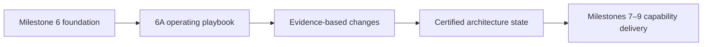

## 2. Current Repository Baseline

### 2.1 Inherited strengths

This plan uses the Engineering Specification as the source of truth. It does not repeat prior repository audits. The known inherited baseline is:

| Area | Inherited condition | Execution implication |
| --- | --- | --- |
| Architecture | Clean/hexagonal architecture is established. | Verify actual dependency direction when a changed path is inspected. |
| Runtime | Runtime, capability registry, provider abstraction, and hardware abstraction exist at baseline. | Prove registrations, selections, and reachable execution paths rather than assuming them. |
| Governance | Constitution, standards, architecture map/state, component catalog, and certification framework are known governance outcomes. | Reconcile their actual files and currency; operationalize their use. |
| Organization | Repository organization was assessed as strong. | Preserve cohesion; do not use 6A as a pretext for unbounded restructuring. |
| Engineering quality | Architectural reviews found the foundation strong. | Focus program capacity on validation, evidence, and drift prevention. |

### 2.2 Risks inherited into the program

The risks are work inputs, not repeated audit claims. They require evidence-driven inspection and disposition:

- Runtime integration and dependency-injection registrations may be insufficiently proven.
- Execution paths, consumers, and adapter selection may be assumed rather than traced.
- Dead code, placeholders, duplicate abstractions, and unreachable registrations may be undiscovered.
- Runtime growth can accumulate unrelated responsibility and coupling.
- Architecture maps, state, catalog, and implementation can drift.
- Documentation may describe intended behavior without demonstrating current repository truth.
- Certification may lack criterion-level, reproducible evidence.

### 2.3 Program principle

Milestone 6A improves engineering quality, not feature quantity. It optimizes confidence in every future implementation. If a proposed task does not improve operationalization, evidence, verification, certification, repository knowledge, or a directly discovered integration defect, it is outside the default 6A scope and must be separately approved.

## 3. Milestone Objectives

| ID | Objective and purpose | Deliverables | Expected repository / engineering impact | Verification method | Completion criteria |
| --- | --- | --- | --- | --- | --- |
| O1 | Operationalize the Constitution so it is usable during real delivery. | Controlled manual, ownership model, workflow, checklists. | Governance moves from principle to repeatable execution. | Manual navigation and pilot application. | A real/representative change follows the workflow without undocumented steps. |
| O2 | Build the Engineering Manual. | Required documents and versioned templates under `docs/engineering/`. | Single discoverable operating reference. | File inventory, content review, cross-link validation. | Every required document has purpose, owner, sprint, dependencies, and completion record. |
| O3 | Replace summary-led review with evidence-led review. | Evidence log, change-set record, certification matrix. | Material claims become traceable to source/tests/runs. | Independent sample of claims against cited evidence. | No pilot material claim depends only on narrative. |
| O4 | Establish repository inspection and change-set verification. | Inspection procedure, findings taxonomy, checklists, pilot record. | Integration, consumer, DI, and reachability questions become routine. | Reproducible pilot inspection. | Pilot includes changed files, callers, imports, DI, path, placeholders, and findings. |
| O5 | Establish architecture verification and runtime health controls. | Architecture review template, metrics baseline, runtime/god-object protocol. | Drift and centralization become visible before they compound. | Review of representative runtime-related path. | Verdict, metrics, risks, and actions are recorded. |
| O6 | Modernize certification and prompt workflow. | Certification standard/templates; controlled prompt hierarchy. | Completion becomes criterion-by-criterion and AI-assisted work is governed. | Pilot certification and prompt artifact review. | Certification is issued or denied strictly from evidence. |
| O7 | Prepare M7–M9 execution readiness. | Baseline state, debt register, cadence, adoption decision. | Future milestones begin with known process and risks. | Milestone closeout review. | Owners accept workflow, open risks are assigned, readiness is certified. |

## 4. Execution Strategy

### 4.1 Strategy statement

Execute Milestone 6A in progressive layers: establish governance artifacts; make inspection repeatable; validate integration in a pilot; add architecture and certification controls; then institutionalize the program. This order prevents process documents from becoming aspirational: every major standard is exercised on repository evidence before milestone close.

### 4.2 Sequencing principles

Documentation precedes implementation because the manual defines the controlled vocabulary, responsibilities, evidence expectations, and acceptance rules by which later work will be judged. Repository evidence precedes certification because code existence and author summaries cannot establish wiring, reachability, or runtime behavior. Architecture verification precedes milestone completion because a well-documented process is insufficient if it permits dependency drift, provider leakage, or a central runtime god object.

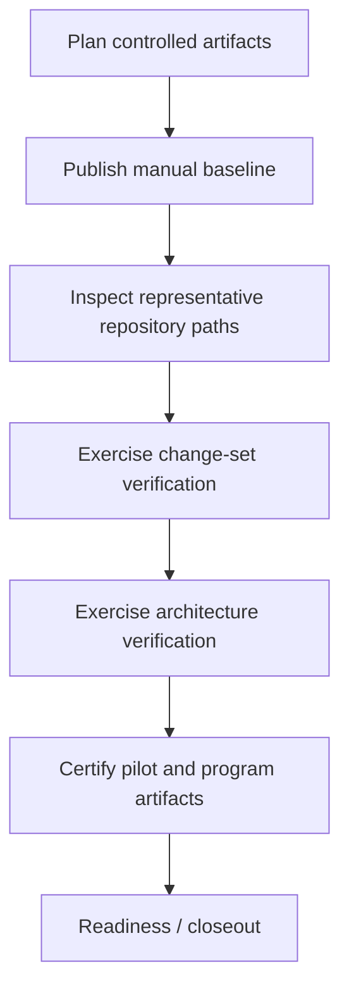

### 4.3 Decision gates

| Gate | Decision | Required evidence | Authority | If not passed |
| --- | --- | --- | --- | --- |
| G1: Manual baseline | Is the operating model sufficiently defined to use? | Manual inventory, owners, cross-links, unresolved gaps. | Architecture Owner. | Correct manual; do not claim operational adoption. |
| G2: Inspection readiness | Can evidence be gathered reproducibly? | Procedure, template, sample searches/path tracing. | Governance Lead. | Improve inspection standard/template. |
| G3: Verification readiness | Can a real change be assessed end-to-end? | Pilot change-set record and findings disposition. | Change-set Verifier. | Resolve/block gaps or choose a better pilot. |
| G4: Certification readiness | Is certification evidence-driven? | Criterion matrix, architecture verdict, exceptions. | Certifier. | Deny certification; create remediation. |
| G5: Milestone readiness | Is the program adopted and future-ready? | Certified pilot, manual, metrics/debt baseline, closeout. | Architecture Owner and TPM. | Extend only the required stabilization work. |

## 5. Sprint Breakdown

The plan uses six default sprints, each producing a certified repository state. A team may alter calendar duration but not omit dependencies, exit criteria, or evidence gates.

### Sprint 6A.1 — Manual Foundation

| Dimension | Plan |
| --- | --- |
| Purpose | Establish the controlled Engineering Manual and make the Constitution operationally navigable. |
| Engineering objective | Define standard workflow, artifacts, owners, and update triggers. |
| Repository objective | Create the `docs/engineering/` manual structure and templates location without changing product behavior. |
| Documentation objective | Publish the manual index and all first-pass required manual documents. |
| Deliverables | Manual documents, document control metadata, template inventory, cross-reference map. |
| Dependencies | Approved Engineering Specification; known governance artifacts. |
| Expected changed areas | `docs/engineering/` and controlled documentation links only. |
| Engineering artifacts | Manual inventory, ownership matrix, document review record. |
| Risks | Duplicate authority, stale copied guidance, undefined owner. |
| Verification | Existence, navigation, link/content review, conflict review against Constitution. |
| Certification | Lightweight documentation certification with cited inventory and review evidence. |
| Exit criteria | G1 passed; every planned manual document has an accountable owner and delivery sprint. |

### Sprint 6A.2 — Repository Inspection Capability

| Dimension | Plan |
| --- | --- |
| Purpose | Make repository inspection repeatable and evidence-producing. |
| Engineering objective | Define how to inspect files, dependencies, consumers, registrations, paths, placeholders, and documentation. |
| Repository objective | Produce a representative inspection without asserting an unproven full-repository audit. |
| Documentation objective | Complete repository inspection standard and evidence log template. |
| Deliverables | Inspection procedure, evidence taxonomy, findings model, representative inspection record. |
| Dependencies | 6A.1 manual and repository access to a representative path. |
| Expected changed areas | Manual/templates; narrowly scoped inspection utilities only if approved. |
| Engineering artifacts | Inventory, search scope, call-graph record, DI observations, findings register. |
| Risks | Shallow search creates false confidence; tool-specific practices become brittle. |
| Verification | Independent reviewer reproduces sample evidence location and interpretation. |
| Certification | G2 record demonstrates reproducible inspection and explicit limitations. |
| Exit criteria | Inspection template can support all mandatory evidence categories. |

### Sprint 6A.3 — Change-Set Verification Pilot

| Dimension | Plan |
| --- | --- |
| Purpose | Turn inspection into an integration-completeness gate. |
| Engineering objective | Exercise changed-file, consumer, DI, execution path, test, and dead-code review. |
| Repository objective | Select one coherent, bounded representative change; validate it in context. |
| Documentation objective | Finalize change-set verification process and checklist. |
| Deliverables | Change-set standard, verification template, pilot record, findings dispositions. |
| Dependencies | 6A.2 procedure; suitable change with an observable path. |
| Expected changed areas | Manual/templates; pilot test/documentation/remediation changes as evidence requires. |
| Engineering artifacts | File inventory, layer classification, primary call graph, test outputs, findings log. |
| Risks | Pilot scope is too trivial or too broad; historical cleanup expands scope. |
| Verification | G3: verifier independently confirms file and path records. |
| Certification | Pilot is certified only after blockers/major findings are resolved or formally excepted. |
| Exit criteria | Evidence identifies concrete integration state rather than restating author intent. |

### Sprint 6A.4 — Architecture and Runtime Governance Pilot

| Dimension | Plan |
| --- | --- |
| Purpose | Establish practical drift, coupling, and runtime-health controls. |
| Engineering objective | Apply dependency direction, composition, provider/hardware isolation, metric, and god-object review. |
| Repository objective | Baseline a representative runtime-related path and record actual/unknown state. |
| Documentation objective | Complete architecture verification, identity-card, metrics, and runtime review materials. |
| Deliverables | Architecture review template, initial metric baseline, runtime identity card, risk/debt actions. |
| Dependencies | 6A.3 evidence model; architecture map/state/catalog access. |
| Expected changed areas | Manual, catalog/state/map corrections, identity cards, targeted remediation work items. |
| Engineering artifacts | Architecture verdict, dependency map, composition review, metric observations, ADRs/exceptions. |
| Risks | Metrics treated as automatic truth; stylistic preferences framed as violations. |
| Verification | Independent architecture review of pilot evidence. |
| Certification | G4 requires conformant verdict or approved, expiring exception. |
| Exit criteria | Runtime risks and drift are visible, owned, and linked to evidence. |

### Sprint 6A.5 — Certification and Prompt Modernization

| Dimension | Plan |
| --- | --- |
| Purpose | Make certification and AI-assisted workflow evidence-led and repeatable. |
| Engineering objective | Install criterion matrix, verdict rules, prompt hierarchy, and re-certification controls. |
| Repository objective | Demonstrate an end-to-end certification package using the pilot. |
| Documentation objective | Complete certification standard and controlled prompts/templates. |
| Deliverables | Certification template, prompt templates, completed certification or evidence-based denial record. |
| Dependencies | 6A.3 change-set verification and 6A.4 architecture verdict. |
| Expected changed areas | Manual/templates, certification records, tests/remediation required by evidence gaps. |
| Engineering artifacts | Evidence matrix, residual-risk register, exceptions, prompt acceptance review. |
| Risks | Paper certification; AI-generated claims presented as evidence. |
| Verification | Certifier samples every material criterion against E1–E4 evidence. |
| Certification | The pilot must receive a clear Certified, Certified with tracked debt, or Not certified verdict. |
| Exit criteria | No material certification claim relies solely on an implementation summary. |

### Sprint 6A.6 — Institutionalization and Readiness

| Dimension | Plan |
| --- | --- |
| Purpose | Adopt the workflow as normal engineering practice and prepare M7–M9. |
| Engineering objective | Establish cadence, reporting, adoption controls, and closeout. |
| Repository objective | Reconcile governance knowledge and create a visible debt/risk baseline. |
| Documentation objective | Complete batch, sprint, milestone workflow documents and program closeout. |
| Deliverables | Certified program package, adoption decision, metrics/debt baseline, M7 handoff. |
| Dependencies | All prior sprints and one complete pilot package. |
| Expected changed areas | Manual, roadmap/architecture state/catalog, closeout and remediation records. |
| Engineering artifacts | Readiness review, process retrospective, adoption scorecard, open-action register. |
| Risks | Process is abandoned under feature pressure; closeout claims exceed pilot evidence. |
| Verification | G5 review samples manual, pilot, metrics, owners, and outstanding exceptions. |
| Certification | Milestone certification confirms operational readiness, not absence of all historical debt. |
| Exit criteria | M7 has an accepted workflow, named owners, and no unowned critical governance risk. |

## 6. Batch Planning Philosophy

A batch is the smallest planned, reviewable grouping of changes that accomplishes one cohesive engineering outcome. Batches are not calendar slices, prompt sizes, or arbitrary file counts.

| Rule | Operational requirement |
| --- | --- |
| Cohesive purpose | One batch has one primary outcome and one explainable architectural move. |
| Scope limit | A batch must be understandable through a bounded changed-file set and one primary execution or documentation path. |
| Complexity limit | If it alters more than one major boundary, multiple runtime policies, or unrelated subsystems, split it unless an ADR justifies coupling. |
| Evidence limit | The team must be able to inspect every changed file and relevant consumer; if not, split the batch. |
| Rollback/reversibility | Prefer changes that can be reverted or isolated without destabilizing unrelated work. |
| Acceptance | Acceptance criteria, expected artifacts, test/evidence plan, and owner are written before implementation. |
| No hidden cleanup | Historical refactoring or debt remediation is separately scoped unless it is necessary for the batch’s correctness. |

Changed-file review is the default for batches because it offers complete, repeatable scrutiny of the introduced risk without pretending every batch must re-audit the entire platform. Subsystem review is required when a batch changes a subsystem’s public contract, composition, ownership, runtime behavior, or critical metric. Full repository review is reserved for baseline establishment, milestone closeout, major architectural transition, detected systemic drift, or architecture-owner direction.

## 7. Engineering Knowledge Roadmap

Engineering knowledge is larger than documentation. The Engineering Manual is the operational reference, but it is only one layer of ClipForge’s durable memory. The Constitution establishes non-negotiable engineering principles; this Execution Plan governs how Milestone 6A delivers them; the Manual supplies evolving standards and templates; repository-governance artifacts preserve the verified state and history of the actual system.

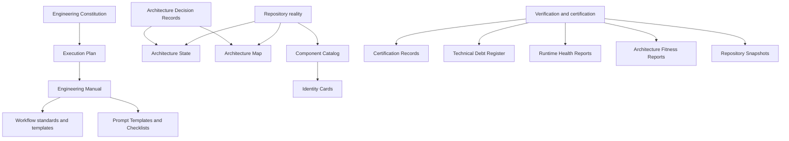

| Knowledge artifact | Relationship and role | Primary owner | Update trigger |
| --- | --- | --- | --- |
| Engineering Constitution | Stable authority for engineering principles and architectural philosophy. | Architecture Owner | Rare, formal constitutional revision only. |
| Execution Plan | Frozen program blueprint for delivering Milestone 6A. | TPM / Governance Lead | Only correction or formal exception under Section 29. |
| Engineering Manual | Evolving operational standards, workflow details, templates, and checklists. | Governance Lead | Process learning or approved standard change. |
| Architecture State and Map | Current verified architecture and structural relationships. | Architecture Owner | Verified boundary, module, or status change. |
| Component Catalog and Identity Cards | Component ownership, contracts, consumers, construction, and evolution. | Component Owner | Component lifecycle or public contract change. |
| Technical Debt Register | Observed debt, priority, owner, remediation, and historical closure. | Debt Owner / Architecture Owner | Discovery, classification, disposition, closure. |
| ADRs | Durable rationale for consequential architecture decisions and exceptions. | Decision Owner | Decision proposal, approval, supersession, retirement. |
| Runtime Health / Fitness Reports | Longitudinal operational architecture signals. | Runtime Owner / Architecture Owner | Every sprint. |
| Certification Records | Evidence-backed acceptance history. | Certifier | Each non-trivial certified change. |
| Repository Snapshots | Time-series record of repository condition and milestone progress. | Governance Lead | Every sprint. |
| Prompt Templates and Checklists | Repeatable human/AI work instructions and controls. | Governance Lead | Manual/process revision. |

| Document | Purpose | Owner | Produced during | Dependencies | Completion criteria |
| --- | --- | --- | --- | --- | --- |
| `README.md` | Manual navigation, authority, reading order, contribution rules. | Governance Lead | 6A.1 | Constitution | All controlled documents linked; owners/status visible. |
| `01_ENGINEERING_PHILOSOPHY.md` | Durable principles and repository-truth doctrine. | Architecture Owner | 6A.1 | Constitution | Principles, examples, update triggers approved. |
| `02_DEVELOPMENT_WORKFLOW.md` | Day-to-day stage handoffs and responsibilities. | TPM / Governance Lead | 6A.1 | Workflow model | Roles, inputs, outputs, escalation defined. |
| `03_ENGINEERING_SPECIFICATION_STANDARD.md` | Required specification quality and acceptance rules. | Architecture Owner | 6A.1 | Constitution | Template and review criteria linked. |
| `04_IMPLEMENTATION_STANDARD.md` | Boundary, testing, observability, error-handling implementation rules. | Principal Engineering | 6A.1 | Architecture standards | Applicable implementation requirements are explicit. |
| `05_CHANGESET_VERIFICATION.md` | Operational changed-file/integration verification. | Change-set Verifier | 6A.3 | 6A.2 inspection | Pilot-tested checklist and severity model. |
| `06_ARCHITECTURE_VERIFICATION.md` | Drift, coupling, runtime, boundary, and future-risk review. | Architecture Owner | 6A.4 | Map/state/catalog; 6A.3 | Pilot-tested verdict and exception process. |
| `07_CERTIFICATION_STANDARD.md` | Evidence matrix, verdict, re-certification, and exception rules. | Certifier | 6A.5 | 6A.3–6A.4 records | Pilot certification issued/denied from evidence. |
| `08_REPOSITORY_INSPECTION.md` | Search, caller, import, DI, path, dead-code, documentation inspection. | Governance Lead | 6A.2 | 6A.1 manual | Reproducible representative inspection. |
| `09_BATCH_WORKFLOW.md` | Batch sizing, scope, evidence, and acceptance management. | TPM | 6A.6 | Pilot learnings | Batch rules and escalation path adopted. |
| `10_SPRINT_WORKFLOW.md` | Sprint planning, review, certification, and closeout. | TPM | 6A.6 | All sprint learnings | Cadence, reporting, gates, and roles defined. |
| `11_MILESTONE_WORKFLOW.md` | Milestone readiness, dependencies, closeout, and handoff. | TPM / Architecture Owner | 6A.6 | Certification strategy | M7 entry/exit checklist adopted. |
| `12_ENGINEERING_CHECKLISTS.md` | Reusable author, verifier, architecture, certifier, and release checklists. | Governance Lead | 6A.1; refined 6A.6 | All standards | Every checklist links to evidence and owner. |
| `templates/` | Controlled reusable templates and prompts. | Governance Lead | 6A.1–6A.5 | Relevant standard | Templates exercised by pilot and versioned. |

## 8. Operational Engineering Workflow

```mermaid
flowchart LR
    S[Engineering specification] --> I[Implementation]
    I --> E[Repository evidence]
    E --> CV[Change-set verification]
    CV --> AV[Architecture verification]
    AV --> C[Certification]
    C --> G[Git commit / merge]
    G --> D[Documentation update]
    D --> AS[Architecture state update]
    AS --> CC[Component catalog update]
    CC --> MP[Milestone progress update]
```

| Stage | Accountable role | Operational responsibilities | Required output / proceed condition |
| --- | --- | --- | --- |
| Engineering specification | Author; Architecture Owner approves where required | State problem, scope, non-goals, architecture constraints, risks, evidence plan, acceptance. | Approved or accepted work item with unambiguous criteria. |
| Implementation | Author | Make cohesive repository changes, preserve boundaries, run relevant checks, identify documentation impacts. | Bounded change set and honest implementation record. |
| Repository evidence | Author/Verifier | Capture files, registrations, callers, execution path, test outputs, limitations. | Evidence log using E1–E4 where material. |
| Change-set verification | Change-set Verifier | Inspect change inventory, consumers, imports, DI, reachability, dead/placeholder code, tests. | Findings record; blockers/majors resolved or exception requested. |
| Architecture verification | Architecture Verifier | Assess layers, runtime, composition, drift, metrics, maintainability, future risk. | Conformant verdict, tracked debt, exception request, or non-conformance. |
| Certification | Certifier | Decide each acceptance criterion from evidence and verdicts. | Explicit certification status and residual risks. |
| Git commit / merge | Author / reviewer | Ensure committed state exactly matches certified state. | Immutable change identifier linked in certification. |
| Documentation update | Author / owner | Update manual, map/state, ADRs, roadmap as triggered. | Documentation evidence or justified N/A record. |
| Architecture state update | Architecture Owner | Record verified status, drift, debt, exceptions, evolution. | Current state linked to evidence. |
| Component catalog update | Component Owner | Update identity, ownership, interfaces, consumers, registration/status. | Accurate card/catalog entry. |
| Milestone progress update | TPM | Record completed objective, gate status, risks, and dependencies. | Program dashboard/closeout record. |

Commit sequencing may place documentation and state/catalog updates in the same certified change before merge. The essential invariant is that the merged repository state and its engineering knowledge remain consistent.

## 9. Prompt Workflow

The official hierarchy is controlled and versioned under `docs/engineering/templates/`. Prompts invoke work; they do not prove it.

| Prompt | Purpose | Inputs | Outputs | Responsibilities | Acceptance criteria |
| --- | --- | --- | --- | --- | --- |
| Engineering Specification Prompt | Create bounded, architecture-aware work definition. | Intent, context, constraints, existing standards. | Scope, non-goals, interfaces, risks, acceptance/evidence plan. | Surface unknowns and dependencies. | No material ambiguity or invented repository state. |
| Implementation Prompt | Direct cohesive approved work. | Approved spec, allowed areas, boundaries, tests. | Change set, test results, docs updates, limitations. | Preserve architecture and disclose uncertainty. | Scope honored; no unsupported completion claim. |
| Repository Evidence Prompt | Inspect facts independent of narrative. | Change identifier, files, repository access. | Inventory, callers, registrations, paths, observations, limitations. | Cite exact evidence. | Every material claim traceable. |
| Change Set Verification Prompt | Evaluate integration completeness. | Spec, change set, evidence log. | Findings, severity, dispositions, verification verdict. | Inspect consumers, DI, imports, reachability, tests. | No unresolved blocker/major absent exception. |
| Architecture Verification Prompt | Evaluate structural fit and future risk. | Evidence, map/state/catalog, affected paths. | Verdict, metrics, drift, debt, actions. | Preserve dependency/runtimes boundaries. | Evidence-backed architecture judgment. |
| Certification Prompt | Decide whether change meets acceptance. | Criteria, all verification records, exceptions. | Criterion matrix, verdict, residual risks. | Refuse unsupported certification. | Each criterion linked to E1–E4 evidence. |
| Refinement Prompt | Improve an artifact after a specific finding. | Finding, affected artifact, constraints. | Focused revision and resolved/open status. | Avoid scope creep and preserve traceability. | Finding disposition demonstrated. |
| Acceptance Prompt | Obtain authorized acknowledgement of a verified deliverable. | Certification, evidence, open risks. | Approval/rejection and conditions. | Record decision authority. | Clear decision, scope, and follow-up owner. |

## 10. Repository Inspection Strategy

### 10.1 Default batch inspection

For every non-trivial batch, the verifier reviews the complete changed-file set and the relevant surrounding context. Inspection MUST cover: added/modified/deleted files; direct dependencies/imports; changed public interfaces; consumers and call sites; DI/composition registrations; primary execution path; architecture boundaries; tests; placeholder and dead-code risk; and documentation implications.

### 10.2 Inspection procedure

1. Establish exact change boundary and classify each file by layer and responsibility.
2. Inspect interfaces, configuration, registrations, and migrations before judging implementation detail.
3. Identify entry points and trace a primary path to observable result.
4. Inspect direct callers/consumers and the polymorphic selection point.
5. Inspect imports and dependency graph for boundary violations.
6. Search for replaced/duplicate registrations, legacy paths, TODO/no-op/throwing placeholders, and orphaned configuration.
7. Run risk-appropriate build, tests, static checks, integration checks, and/or trace capture.
8. Compare documentation/state/catalog requirements to the observed change.
9. Record evidence, limitations, findings, owner, severity, and disposition.

### 10.3 Escalation scope

| Review scope | Trigger | Outcome |
| --- | --- | --- |
| Changed-file review | Every non-trivial batch. | Complete review of introduced risk and direct context. |
| Subsystem review | Public contract, runtime, composition, ownership, central metric, or cross-boundary change. | Updated identity card, dependency/consumer view, subsystem verdict. |
| Full repository review | Baseline, milestone close, major architecture transition, systemic drift, or architecture-owner direction. | Time-bounded audit with explicit scope, findings, and remediation plan. |

## 11. Repository Evidence Standard

Every implementation claim must map to evidence. The authoritative evidence hierarchy and definitions are in the Engineering Specification; this plan defines the minimum execution package.

| Evidence category | Required observation |
| --- | --- |
| Changed/new/deleted files | Exact inventory and purpose/layer classification. |
| Modified interfaces | Contract change, consumers, compatibility/migration decision. |
| Registrations | Composition-root location, lifetime/selection behavior, competing registration check. |
| Consumers | Callers, entry points, migration state, and unsupported/orphaned consumer findings. |
| Execution paths | Entry point to observable result, including polymorphic/async boundaries. |
| Removed dead code | Search scope, removed symbols/configuration, remaining references check. |
| Documentation | Manual/map/state/catalog/identity-card/ADR changes or explicit N/A rationale. |
| Tests and runs | Command/test identity, result, covered claim, and limitation. |
| Architecture impact | Dependency/composition/runtime assessment and metric signals. |

Evidence records must distinguish existence evidence from runtime evidence. A source file proves existence; a registration proves intended assembly; a resolution/integration test or trace is required to substantiate runtime selection where feasible.

## 12. Architecture Verification

Architecture verification is conducted after change-set verification and before certification whenever a change affects boundaries, contracts, runtime, composition, configuration selection, public modules, or a high-centrality component.

| Review area | Verification activity | Required decision |
| --- | --- | --- |
| Layer validation | Classify changed symbols and inspect imports. | Conformant or violation/exception. |
| Dependency validation | Trace direct dependencies and prohibited edges. | Approved direction and ownership. |
| Runtime validation | Inspect capability request, selection, scheduling/resource behavior, adapter isolation. | Runtime remains modular and provider/hardware neutral. |
| Composition validation | Inspect registrations, scopes, configuration, and policy leakage. | Composition root remains explicit and passive. |
| God-object detection | Apply constructor, fan-in/out, responsibility, public-surface, and modification-frequency indicators. | Green/warning/critical action. |
| Metrics | Record applicable coupling, cohesion, complexity, registration, drift, docs/test coverage signals. | Trend/action, not a metric-only verdict. |
| Architecture drift | Compare map/state/catalog/cards with repository facts. | Update or create tracked drift finding. |
| Technical debt | Separate observed debt from hypothesis; assign owner/target. | Remediate, defer, or exception. |
| Future maintainability | Assess change drivers, migration cost, observability, scalability, and reversibility. | Risk statement and required guardrails. |

## 13. Certification Strategy

Certification is a layered decision, not a single document. Lower-level certification is evidence for higher-level certification; it never substitutes for the higher-level review.

| Certification level | Inputs | Evidence / verification | Required documents | Approval criteria |
| --- | --- | --- | --- | --- |
| Batch certification | Approved batch, change set, evidence log, verification findings. | Changed files, tests/runs, path/DI/consumer review as applicable. | Batch record, evidence log, change-set verdict. | All criteria passed; no unresolved blocker/major without approved exception. |
| Sprint certification | Certified batch records, sprint objectives, risk/debt status. | Sampling plus objective/exit-criteria review. | Sprint report, certification roll-up, open actions. | Sprint deliverables/exit criteria met or explicitly deferred. |
| Milestone certification | Certified sprints, manual, pilot, metrics/debt baseline, readiness review. | Gate G5, knowledge reconciliation, owner acceptance. | Milestone closeout, program certification, M7 handoff. | 6A objectives met and no unowned critical governance risk. |
| Repository certification | Defined repository scope/baseline, audit evidence, drift/debt register. | Scope-appropriate structural, operational, documentation evidence. | Repository assessment and remediation plan. | Only claims within inspected scope are certified. |
| Platform certification | Cross-subsystem readiness evidence for a platform release. | Integration, operational, security/performance evidence as required by release scope. | Release certification package. | Release-specific criteria and governance requirements met. |

A certification must state what it does not certify. Approval does not erase technical debt; it makes risk and ownership explicit.

## 14. Risk Management

| Risk class | Risk | Leading indicator | Mitigation | Owner | Escalation |
| --- | --- | --- | --- | --- |
| Engineering | Workflow becomes paperwork rather than inspection. | Evidence records cite no exact sources or reproduce no paths. | Sample independently; require criterion-level evidence. | Governance Lead | G3/G4 block. |
| Repository | Pilot reveals broad historical debt. | Many unrelated findings from one bounded change. | Separate remediation backlog; do not expand pilot without approval. | TPM / Architecture Owner | Scope decision. |
| Architecture | Boundary drift/provider leakage. | Forbidden imports or concrete SDK types in core contracts. | Block certification; ADR only for temporary narrow exception. | Architecture Owner | Immediate. |
| Runtime | Central runtime accumulates unrelated responsibility. | Section 26 metrics enter warning/critical. | Decompose policies/mechanics; require refactoring plan. | Runtime Owner | Architecture review. |
| Documentation | Manual/state/catalog contradict repository. | Inspection finds stale or missing update. | Correct in same change or track a dated drift finding. | Document Owner | Certification condition. |
| Certification | Summaries are treated as proof. | Evidence items are narrative-only. | Enforce E1–E4 matrix and denial discipline. | Certifier | G4 block. |
| Adoption | Feature pressure bypasses process. | Uncertified batches or missing artifacts. | Make gates visible in sprint reporting; Architecture Owner intervention. | TPM | Sprint escalation. |
| Tooling | Automation creates false confidence. | Tool output without scope/interpretation. | Pair automation with explicit review scope and limitations. | Governance Lead | Process corrective action. |

## 15. Success Criteria

| Dimension | Measurable success condition |
| --- | --- |
| Repository quality | Pilot and governed changes have complete changed-file evidence, no unowned critical integration finding, and visible debt dispositions. |
| Engineering quality | A change can be executed through all required stages with accountable owners and no undocumented handoff. |
| Documentation quality | Required manual documents/templates exist, are navigable, have owners, and are reconciled with pilot evidence. |
| Architecture quality | Pilot path has an evidence-backed architecture verdict; detected drift and runtime risks are owned. |
| Certification quality | Every pilot acceptance criterion maps to E1–E4 evidence; final verdict is explicit. |
| Maintainability | Identity-card/dependency/ownership information is available for reviewed subsystems; no unaddressed critical god-object trigger. |
| Scalability | Runtime execution/resource/scheduling assumptions and unknowns are recorded; future evolution remains boundary-preserving. |
| Developer experience | Engineers can locate the correct template, checklist, owner, and next gate without relying on prior chat context. |

## 16. Definition of Done

| Artifact or level | Done when |
| --- | --- |
| Batch | Scope/acceptance are approved; implementation is cohesive; evidence and change-set review are complete; applicable architecture review/certification is issued; documentation impact is addressed. |
| Sprint | Planned deliverables and exit criteria are met; all batches have disposition; risks/debt/actions are current; sprint certification is issued. |
| Milestone | Objectives and G5 are passed; Engineering Manual is operational; certified pilot exists; knowledge is reconciled; M7 handoff and open actions are owned. |
| Engineering Manual | All required documents/templates exist, link coherently, declare owners/update triggers, and have been exercised where planned. |
| Repository Inspection | Scope, inventory, searches, evidence, limitations, findings, owners, and dispositions are recorded and reproducible. |
| Architecture Verification | Relevant layers/dependencies/runtime/composition/metrics/drift/future risk are assessed; verdict and exception/remediation status are explicit. |
| Certification | Each criterion is evaluated against cited evidence; findings/exceptions/risks are explicit; decision authority and immutable scope are recorded. |

## 17. Program Governance and Reporting

### 17.1 Cadence

At sprint start, the TPM confirms objective, dependencies, batch boundaries, decision gates, and acceptance evidence. During execution, the Governance Lead tracks evidence readiness and blockers; the Architecture Owner reviews boundary/runtime escalation; the Certifier remains independent of summary-only claims. At sprint close, the team reviews objective completion, certification status, evidence quality, open findings, exceptions, documentation state, and next-sprint dependencies.

### 17.2 Minimum status report

Each sprint status record contains: objective status; delivered artifacts; gate status; certified batches; evidence gaps; blocker/major/minor findings; exceptions and expiry dates; documentation/manual status; runtime/god-object warnings; architecture drift; debt added/retired; and decisions required. “Green” means evidence supports exit criteria, not merely that implementation work appears complete.

### 17.3 Change control

Changes to 6A scope require an impact statement covering objectives, affected sprint/gate, repository impact, evidence/certification effect, owner, and schedule/dependency effect. New product capabilities remain out of scope unless explicitly approved as a representative pilot or prerequisite to validation.

## 18. Appendices

### Appendix A — Repository Lifecycle

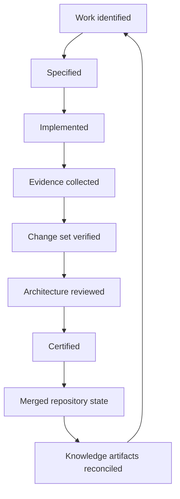

### Appendix B — Prompt Lifecycle

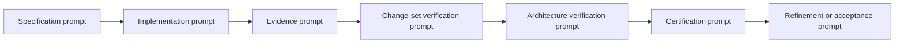

### Appendix C — Certification Lifecycle

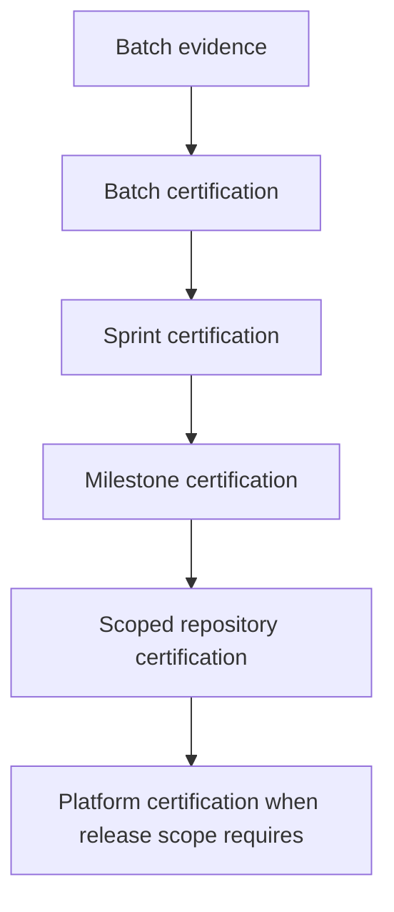

### Appendix D — Documentation and Architecture Governance Flow

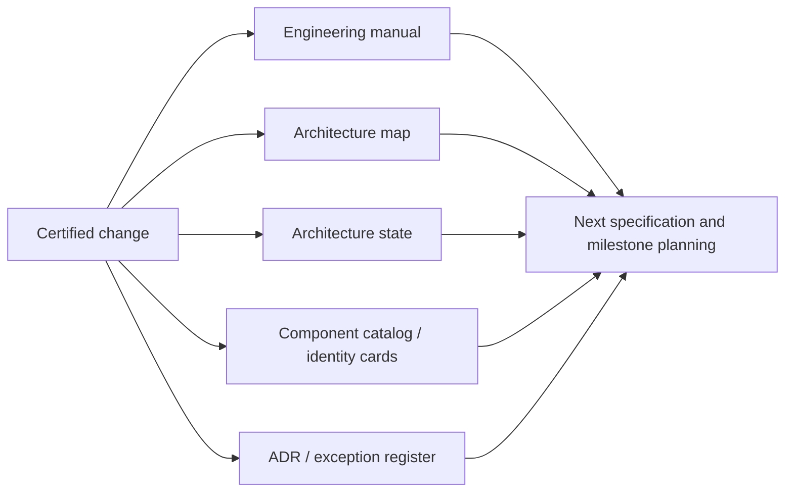

### Appendix E — Program Closeout Checklist

- [ ] All six sprint exit criteria have evidence-backed disposition.
- [ ] Required Engineering Manual documents and templates exist or have an approved, dated exception.
- [ ] At least one representative change completed the full operational workflow.
- [ ] Pilot certification includes changed-file, DI, execution-path, architecture, and documentation evidence as applicable.
- [ ] Runtime and architecture-risk findings are owned and visible.
- [ ] Technical-debt hypotheses are not mislabeled as repository facts.
- [ ] Architecture State, Map, Component Catalog, and identity cards are reconciled for reviewed scope.
- [ ] M7 entry conditions, owners, dependencies, and open actions are accepted.

---

This plan is the execution companion to the Engineering Constitution. Where it conflicts with the Constitution, the Constitution governs. Where it is silent, teams must choose the interpretation that best preserves repository truth, explicit boundaries, evidence-based certification, and long-term maintainability.

## 19. Engineering Document Lifecycle

### 19.1 Lifecycle policy

Every controlled engineering document is a maintained operational asset. A file becomes authoritative only when its metadata identifies its authority, ownership, applicability, review expectation, and retirement path. Documents that no longer reflect repository truth must be corrected, superseded, or retired; they must not remain silently authoritative.

### 19.2 Standard metadata template

All new controlled engineering artifacts SHOULD begin with the following metadata. Existing artifacts will adopt it during normal maintenance or their next material revision; this does not require unnecessary churn during 6A.

```markdown
| Field | Value |
| --- | --- |
| Status | Draft / In Review / Approved / Superseded / Retired |
| Version | vMAJOR.MINOR.PATCH or Continuous |
| Author | <accountable creator> |
| Reviewer | <technical reviewer> |
| Approver | <approval authority> |
| Maintainer | <ongoing document owner> |
| Created date | YYYY-MM-DD |
| Last updated | YYYY-MM-DD |
| Supersedes | <document/version or None> |
| Related documents | <controlled links> |
| Related ADRs | <ADR identifiers or None> |
| Applicable milestones | <milestone range> |
| Review frequency | <event-driven / sprint / milestone / annual> |
| Retirement strategy | <supersede, archive, retain history> |
```

### 19.3 Ownership responsibilities

| Role | Responsibility |
| --- | --- |
| Author | Creates or materially revises content, declares assumptions, and identifies related artifacts. |
| Reviewer | Validates technical accuracy, repository consistency, and operational completeness. |
| Approver | Accepts authority, scope, and exceptions; approval must be recorded where required. |
| Maintainer | Performs scheduled/event-driven review, keeps links current, initiates supersession or retirement. |
| Architecture Owner | Owns architecture-bearing documents and resolves conflicts with Constitution/ADRs. |
| Governance Lead | Owns process-bearing documents, templates, checklists, and reporting artifacts. |

### 19.4 Lifecycle states

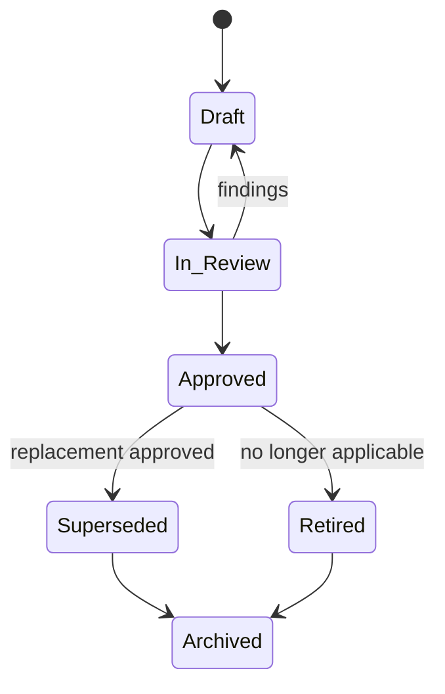

Draft artifacts are non-authoritative. Approved artifacts govern their declared scope. Superseded documents remain discoverable and must link to their replacement. Retired documents preserve historical context and must explain why they no longer apply. Archive retention is the default; deletion requires a documented retention decision.

## 20. Engineering Document Versioning

### 20.1 Versioning model

Controlled, relatively stable artifacts use semantic versioning: `vMAJOR.MINOR.PATCH`. Continuous operational records use a status/date/revision identifier rather than artificial release versions. Version selection is an engineering decision, not cosmetic formatting.

| Artifact | Versioning mode | Version owner |
| --- | --- | --- |
| Engineering Constitution | Semantic; initial baseline `v1.0.0` | Architecture Owner |
| Milestone 6A Execution Plan | Semantic; frozen baseline `v1.0.0` after Revision 3 | TPM and Governance Lead |
| Engineering Manual standards | Semantic, normally `v1.x` | Governance Lead with relevant standard owner |
| Templates and checklists | Semantic, normally `v1.x` | Governance Lead |
| Architecture State | Continuous | Architecture Owner |
| Component Catalog / Identity Cards | Continuous | Component Owner |
| ADRs | Immutable numbered records; status changes tracked in record | Decision Owner / Architecture Owner |
| Certification records | Immutable per certified scope | Certifier |
| Health, fitness, snapshot reports | Continuous time-series | Report owner |

### 20.2 Increment rules

| Increment | Use when | Examples |
| --- | --- | --- |
| Major | Authority, required lifecycle, compatibility, or interpretation changes materially. | Constitution re-baseline; a standard that changes mandatory certification evidence. |
| Minor | Backward-compatible new section, controlled template, procedure, or clarification is added. | New manual checklist or additional evidence example. |
| Patch | Typographical, link, clarity, or non-normative correction that does not change obligations. | Correcting a cross-reference or diagram label. |

The maintainer proposes an increment; the approver confirms it for major/minor changes. A version must not be advanced merely to imply substantive governance work. Continuous artifacts record the date, source revision/scope, reviewer, and trend; their historical sequence is their version history.

## 21. Document Dependency Graph

### 21.1 Dependency model

The dependency direction flows from stable authority to increasingly specific execution evidence. Repository reality informs state, catalog, reports, and certifications, but it does not silently rewrite policy. A lower-level artifact cannot override its governing artifact; a discrepancy becomes a finding, ADR, or controlled update.

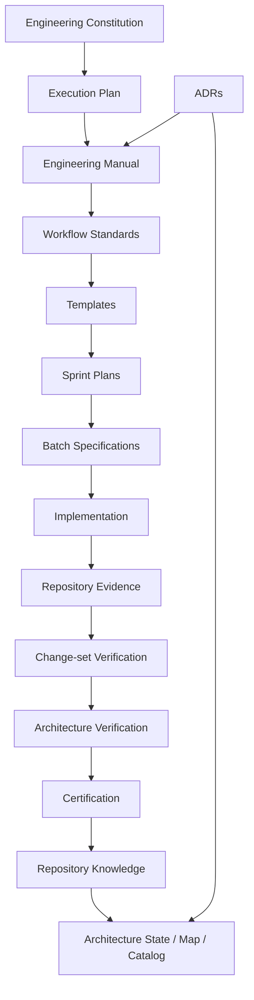

### 21.2 Update order and ownership

| Change type | Update order | Accountable owner |
| --- | --- | --- |
| New policy/architecture decision | ADR → governing standard/manual → templates → implementation plan → state/catalog. | Architecture Owner. |
| New execution practice | Manual/workflow standard → templates/checklists → sprint/batch plan → evidence of use. | Governance Lead. |
| Implemented architecture change | Specification/ADR if needed → implementation → evidence/verification → certification → map/state/catalog/cards. | Author with Architecture Owner. |
| Process learning from a sprint | Report/retrospective → Manual refinement → templates/checklists → future plans. | Governance Lead / TPM. |
| Debt discovery | Debt register → priority/owner → batch specification → evidence/closure → historical archive. | Debt Owner. |

No team may update a downstream document to mask conflict with upstream authority. When repository reality differs from a map, state, catalog, or manual, record the discrepancy, determine whether code, documentation, or the governing decision changes, and use an ADR where the choice is architectural.

## 22. ADR Lifecycle

### 22.1 Mandatory ADR triggers

An Architecture Decision Record is mandatory for a material, consequential, or difficult-to-reverse choice. At minimum, create an ADR for layer changes; runtime architecture changes; composition-root changes; provider or hardware architecture; capability-registry semantics; public interface changes; cross-cutting architecture; breaking changes; major refactoring; new platform capabilities; architecture exceptions; security/trust boundary changes; and durable data/state ownership changes.

An ADR is not required for a local implementation detail that has no material consumer, boundary, operational, or future-evolution impact. When uncertain, create a short ADR rather than relying on implicit reasoning.

### 22.2 Lifecycle

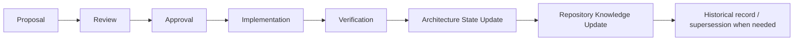

| Stage | Required content / action | Exit condition |
| --- | --- | --- |
| Proposal | Context, decision, options, trade-offs, risks, affected components, migration/rollback, proposed owner. | Reviewable decision statement exists. |
| Review | Architecture, operational, security/performance, consumer, and maintainability review appropriate to scope. | Findings resolved or decision revised. |
| Approval | Authority accepts the decision and any exception constraints. | ADR status is Approved. |
| Implementation | Change follows approved decision; deviations trigger ADR update or new ADR. | Evidence package is complete. |
| Verification | Change-set and architecture verification test the decision in repository reality. | Decision behavior/boundary is evidenced. |
| State update | Map/state/catalog/cards are reconciled. | Current architecture knowledge is accurate. |
| Knowledge update | Manual/templates/roadmap/certification links update where triggered. | Future engineers can discover rationale and effect. |

Superseding an ADR requires a new ADR that links to the prior decision and explains the changed context. Do not edit historical rationale to make a previous decision appear to have predicted later knowledge.

## 23. Technical Debt Lifecycle

### 23.1 Lifecycle and ownership

Technical debt is an observed gap between desired and repository reality, not a synonym for any code an engineer dislikes. It must be evidence-backed, classified, owned, prioritized, and either remediated, consciously deferred, or archived after closure.


| Severity | Definition | Required response |
| --- | --- | --- |
| Critical | Creates an active correctness, security, data-loss, compliance, or architecture-integrity threat; blocks safe operation/certification. | Immediate owner and mitigation; block affected work until controlled. |
| High | Materially increases failure likelihood, delivery risk, integration uncertainty, or architecture drift. | Target current/next milestone; architecture review required. |
| Medium | Meaningful maintainability, testing, performance, documentation, or coupling cost without immediate platform threat. | Owner and scheduled target; review each sprint. |
| Low | Local improvement with limited impact. | Backlog with rationale; reevaluate at milestone planning. |
| Informational | Observation/risk hypothesis with insufficient evidence for debt classification. | Capture source and investigation owner; do not represent as confirmed debt. |

Each debt item includes identifier, discovered date, evidence, affected subsystem/identity card, classification, impact, priority, owner, target milestone/sprint, dependency, mitigation, verification/closure criteria, and archive reference. The Architecture Owner governs architecture debt; a component owner governs local debt; the TPM monitors target-date risk. Closure requires implementation evidence and independent verification, not a statement that the work was completed.

## 24. Runtime Health Report

### 24.1 Purpose and cadence

Every sprint generates a Runtime Health Report, even when the runtime was untouched. “No runtime change” is a meaningful trend observation, not a reason to omit monitoring. Continuous reports make responsibility and coupling growth visible before a runtime facade becomes a god object or provider/hardware details leak across boundaries.

### 24.2 Required report template

| Field | Required content |
| --- | --- |
| Report scope and repository revision | Sprint, date, reviewed runtime areas, source revision/snapshot. |
| Current runtime status | Verified status, recent changes, unknowns, and operational limitations. |
| Responsibilities | Current responsibility groups; additions/removals and ownership. |
| Constructor dependencies | Count, grouped by responsibility/layer, trend, and warning threshold. |
| Fan-in / fan-out | Distinct production callers and direct collaborators/dependencies; trend and interpretation. |
| Provider leakage | Provider SDK/types/semantics in forbidden layers or contracts; evidence and disposition. |
| Hardware leakage | Hardware/device/resource details outside approved runtime/adapter boundaries. |
| Dependency growth | New imports, registrations, public surface, cross-layer edges, and rationale. |
| Public methods | Surface count, grouped by responsibility, compatibility impact. |
| Runtime risks | Findings, severity, owner, expiry/target. |
| Recommendations | Refactoring, inspection, metrics, ADR, or no-action recommendation. |
| Trend | Improving / stable / degrading / unknown, with comparison to prior report. |

The Runtime Owner authors the report; the Architecture Owner reviews warning/critical trends. Report data must distinguish measured values from qualitative assessment and explicitly mark unavailable metrics.

## 25. Architecture Fitness Report

### 25.1 Purpose

The Architecture Fitness Report is the sprint-level historical scorecard for structural quality. It records trend, evidence, confidence, and remediation—not a one-time opinion. Its purpose is to preserve how architecture evolves across milestones and to identify deteriorating signals early.

### 25.2 Required report dimensions

| Dimension | Evidence basis | Rating method |
| --- | --- | --- |
| Architecture quality | Layer and dependency verification, ADR conformance, drift findings. | Green / Amber / Red plus confidence. |
| Runtime quality | Runtime Health Report and execution/composition findings. | Green / Amber / Red plus trend. |
| Dependency health | Import/module graph, coupling metrics, DI complexity. | Green / Amber / Red plus exceptions. |
| Boundary integrity | Ports/adapters, provider/hardware leakage, forbidden edges. | Green / Amber / Red; Red blocks affected certification. |
| Documentation health | Map/state/catalog/card/manual currency and link integrity. | Green / Amber / Red plus coverage. |
| Testing health | Risk-weighted evidence and failing/flaky/absent critical checks. | Green / Amber / Red plus limitation. |
| Maintainability | Cohesion, complexity, god-object signals, debt trend. | Green / Amber / Red plus action. |
| Scalability | Resource/scheduling/concurrency assumptions and known limits. | Green / Amber / Red plus evidence maturity. |
| Technical debt | Open debt by severity/age/owner and closure rate. | Green / Amber / Red plus trend. |
| Repository governance | Evidence/certification/manual/reporting compliance. | Green / Amber / Red plus action. |
| Overall fitness score | Weighted indicator for trend communication only. | 0–100 with published weights, confidence, and no override of individual Reds. |

The score cannot hide a critical finding: any Red boundary-integrity, correctness, or unowned critical-debt signal renders the overall fitness **not ready**, regardless of numeric total. Report history must retain each sprint’s rating and explain rating changes.

## 26. Repository Snapshot

### 26.1 Purpose

A Repository Snapshot is generated once per sprint to preserve repository evolution. It is a scoped, evidence-labeled record, not a claim of exhaustive audit. It enables future engineers to understand what changed, what was measured, what remained unknown, and what risks were carried forward.

### 26.2 Snapshot content

| Category | Required capture |
| --- | --- |
| Repository statistics | Revision/scope, changed files, modules, language/build statistics where available. |
| Documentation statistics | Controlled documents, versions/statuses, changed links, ownership/review currency. |
| Architecture statistics | Modules/layers inspected, dependency edges/findings, drift items, ADR impacts. |
| Testing statistics | Test inventory/run status, coverage method/results if available, flaky/failing status. |
| Engineering statistics | Certified batches, open findings, exceptions, evidence completeness, workflow adoption. |
| Runtime statistics | Health report summary, registrations/selection evidence, growth indicators. |
| Component statistics | Catalog/card counts and status/owner changes. |
| Identity cards | Created/updated/stale/unknown cards and subsystem coverage. |
| ADRs | Proposed/approved/superseded/implemented ADRs. |
| Technical debt | Open/closed debt by severity, owner, age, target. |
| Risks | Repository, engineering, architecture, runtime, documentation risks and trend. |
| Milestone progress | Objectives, sprint/gate status, forecast, blockers, dependencies. |

Each snapshot references the Runtime Health Report, Architecture Fitness Report, relevant certification records, and repository revision. The Governance Lead owns publication; component/runtime owners supply their section inputs.

## 27. Repository Quality Dashboard

The Repository Quality Dashboard is updated every milestone. It visualizes evolution across milestones rather than manufacturing precision from incomplete data. Each dimension records score/rating, confidence, evidence scope, trend, and major action. Metric definitions and weights are published alongside the dashboard and may evolve only through a controlled manual/ADR update.

| Dimension | Inputs | Interpretation |
| --- | --- | --- |
| Architecture | Fitness reports, drift, boundary findings, ADR conformance. | Structural integrity and evolvability. |
| Runtime | Health reports, selection/registration evidence, centralization signals. | Runtime modularity and operational readiness. |
| Documentation | Manual/map/state/catalog/card currency. | Engineering knowledge reliability. |
| Engineering process | Workflow/certification/reporting compliance. | Repeatable delivery confidence. |
| Testing | Risk-weighted test and execution evidence. | Behavioral confidence, not raw test count. |
| Security | Scoped security evidence, unresolved findings, threat/control maturity. | Security posture within assessed scope. |
| Performance | Workload baselines, resource/latency evidence, known limits. | Performance maturity within assessed scope. |
| Maintainability | Coupling, cohesion, complexity, debt, ownership. | Cost and safety of future change. |
| Scalability | Runtime/resource/scheduling/concurrency evidence and risks. | Ability to grow workload and platform scope. |
| Technical debt | Severity/age/closure trend and exceptions. | Debt control, not debt absence. |
| Repository health | Aggregate evidence quality, risk ownership, governance currency. | Overall repository stewardship. |
| Platform readiness | Certification and critical dimensions. | Readiness for the intended milestone/release scope. |

The dashboard uses a historical table or chart for M1–M9. Missing data is shown as **Not Measured**, never as green or zero. The dashboard is an executive decision aid; individual certification evidence remains authoritative.

## 28. Engineering Reporting Cadence

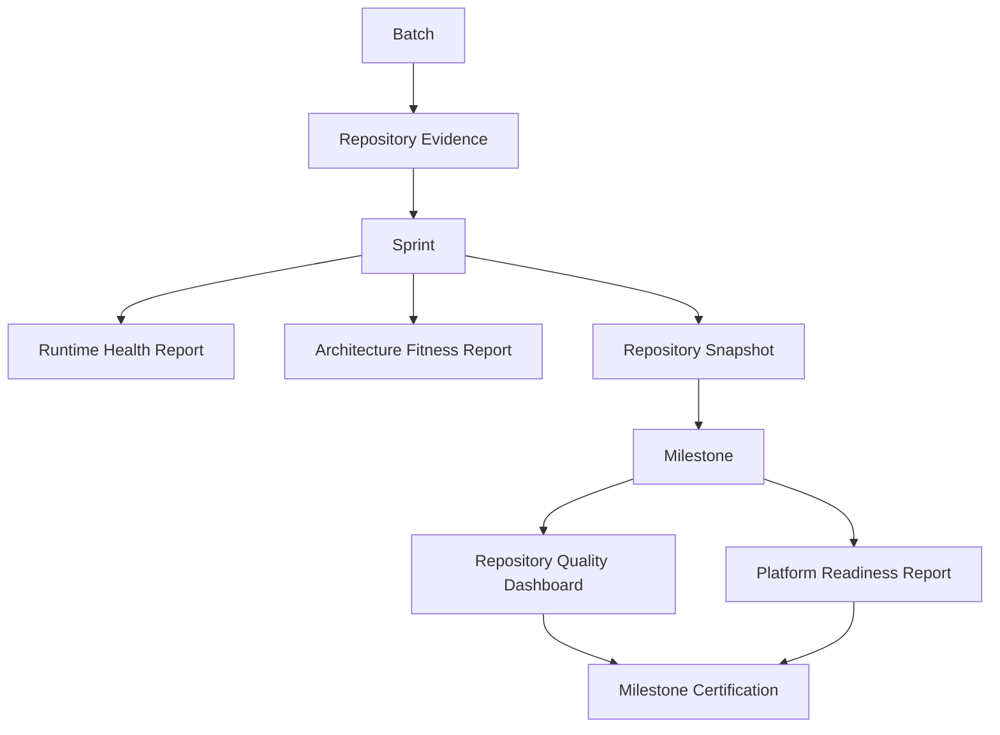

| Cadence | Artifact / event | Accountable role | Review responsibility | Required outcome |
| --- | --- | --- | --- | --- |
| Batch | Repository Evidence and change-set verification. | Author / Change-set Verifier | Architecture Verifier when triggered. | Evidenced batch disposition. |
| Sprint | Runtime Health Report. | Runtime Owner | Architecture Owner. | Runtime trend and actions. |
| Sprint | Architecture Fitness Report. | Architecture Owner | Governance Lead / TPM. | Historical fitness update and risks. |
| Sprint | Repository Snapshot and sprint certification/status. | Governance Lead / TPM | Architecture Owner / Certifier. | Scoped evolution record and gate status. |
| Milestone | Repository Quality Dashboard. | Governance Lead | Architecture Owner / Release Manager. | Comparative milestone scorecard. |
| Milestone | Platform Readiness Report. | Release Manager | Architecture Owner, Security/Performance owners as applicable. | Release/milestone decision input. |
| Milestone | Milestone certification. | Certifier | Approval authority. | Explicit certified/not-certified decision. |

Reporting must surface uncertainty, missing measurement, deteriorating trend, and overdue debt/exceptions. It must not use a green aggregate to conceal a red architectural boundary or unowned critical risk.

## 29. Long-Term Maintainability and Plan Freeze

After Revision 3, this Execution Plan is frozen as the stable operational blueprint for Milestone 6A. It must not be repeatedly expanded to absorb future engineering improvements, local practices, metric calibration, new templates, subsystem details, or evolving architecture. Those changes belong in the Engineering Manual, Architecture State, Architecture Map, Component Catalog, Identity Cards, Technical Debt Register, Runtime Health Reports, Repository Snapshots, ADRs, and Certification Records.

Permitted changes to this plan are limited to: correction of demonstrated error; repair of broken cross-reference; formal, approved exception required to execute 6A; and a major governance correction that cannot reasonably live in a governed downstream artifact. Each permitted change requires a change record identifying reason, impact, version increment, approver, related ADR where applicable, and confirmation that it does not duplicate the Constitution or Manual.

| Future need | Correct home |
| --- | --- |
| A workflow step needs clarification or improvement | Engineering Manual / workflow standard. |
| A consequential architecture choice changes | ADR, then Architecture State/Map/Catalog. |
| A subsystem’s contract/owner/status changes | Identity Card and Component Catalog. |
| A risk or debt is discovered | Technical Debt Register, risk register, and relevant report. |
| Runtime trend changes | Runtime Health Report and Architecture Fitness Report. |
| A sprint changes repository condition | Repository Snapshot and certification record. |
| A template/prompt/checklist improves | Engineering Manual templates/checklists. |
| A platform/milestone readiness judgment is needed | Quality Dashboard, Readiness Report, and certification. |

## 30. Revision 3 Acceptance and Maintenance Rules

Revision 3 is accepted when this plan retains all existing Sections 1–18 and adds the Engineering Knowledge Roadmap, document lifecycle/versioning, dependency model, ADR/debt lifecycles, sprint reports, repository snapshot, milestone dashboard, reporting cadence, and plan-freeze rules. Acceptance verifies that each added artifact has a named owner, cadence or trigger, evidence boundary, and appropriate downstream home.

The frozen plan remains subordinate to the Engineering Constitution and must be read with the Engineering Manual once created. Future teams preserve its stability by recording operational learning in the governed artifacts named in Section 29 rather than revising this plan by default.
