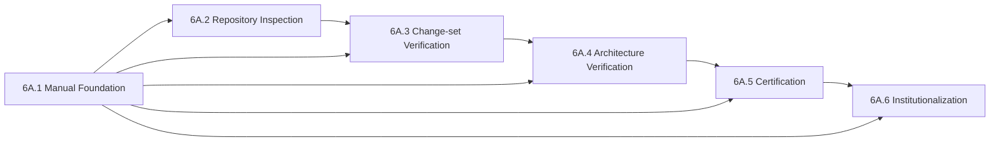

# Sprint 6A.1 Execution Specification — Manual Foundation

| Field | Value |
| --- | --- |
| Status | Draft for review and approval |
| Version | v0.1.0 |
| Author | Engineering Governance Lead / Technical Program Manager |
| Reviewer | Architecture Owner and designated documentation reviewers |
| Approver | Architecture Owner |
| Maintainer | Engineering Governance Lead |
| Created date | 2026-08-03 |
| Last updated | 2026-08-03 |
| Supersedes | None |
| Related documents | [Engineering Specification](MILESTONE_6A_ENGINEERING_SPECIFICATION.md); [Execution Plan](MILESTONE_6A_EXECUTION_PLAN.md) |
| Related ADRs | ADR-6A-001 through ADR-6A-004; new ADRs only if a consequential governance decision arises |
| Applicable milestones | Milestone 6A, Sprint 6A.1 |
| Review frequency | Before approval; at Sprint close; otherwise event-driven |
| Retirement strategy | Retain as the immutable Sprint 6A.1 execution record; supersede only by an approved correction or exception record |

## Table of Contents

1. [Authority and Executive Summary](#1-authority-and-executive-summary)
2. [Sprint Purpose and Strategic Position](#2-sprint-purpose-and-strategic-position)
3. [Objectives and Success Measures](#3-objectives-and-success-measures)
4. [Scope, Exclusions, and Dependencies](#4-scope-exclusions-and-dependencies)
5. [Required Deliverables](#5-required-deliverables)
6. [Engineering Manual Definition](#6-engineering-manual-definition)
7. [Engineering Template Definition](#7-engineering-template-definition)
8. [Repository Modernization Plan](#8-repository-modernization-plan)
9. [Batch Structure](#9-batch-structure)
10. [Repository Evidence and Change-Set Verification](#10-repository-evidence-and-change-set-verification)
11. [Sprint-Specific Architecture Verification](#11-sprint-specific-architecture-verification)
12. [Certification Strategy](#12-certification-strategy)
13. [Risks, Controls, and Escalation](#13-risks-controls-and-escalation)
14. [Acceptance Criteria](#14-acceptance-criteria)
15. [Definition of Done](#15-definition-of-done)
16. [Approval and Handoff](#16-approval-and-handoff)
17. [Appendices](#17-appendices)

## 1. Authority and Executive Summary

This is the execution contract for Sprint 6A.1, **Manual Foundation**. It is subordinate to, and must be read with, the approved [Milestone 6A Engineering Specification](MILESTONE_6A_ENGINEERING_SPECIFICATION.md) (the Engineering Constitution) and [Milestone 6A Execution Plan](MILESTONE_6A_EXECUTION_PLAN.md) (the frozen program blueprint). It does not replace, reinterpret, or weaken either governing artifact.

Sprint 6A.1 creates the controlled Engineering Manual foundation required to operate Milestone 6A. The sprint is documentation and governance modernization work. It introduces no new product capability, production runtime behavior, provider integration, hardware integration, dependency-injection registration, or user-visible functionality.

Its successful completion establishes Gate G1, the Manual Baseline: engineers can locate governing standards, understand accountability, use a consistent workflow vocabulary, find controlled templates and checklists, and identify the future sprint that will produce each later standard. Sprint 6A.1 certifies the Manual foundation only. It does not claim repository inspection readiness (G2), change-set verification readiness (G3), certification readiness (G4), or milestone readiness (G5).

## 2. Sprint Purpose and Strategic Position

### 2.1 Why Sprint 6A.1 exists

Milestone 6A modernizes the engineering process by replacing summary-based confidence with repository evidence, verification, architecture review, certification, and durable knowledge updates. Those activities require a common controlled vocabulary, clear artifact ownership, and discoverable instructions. Without the Manual foundation, later standards would be fragmented documents with ambiguous authority and inconsistent usage.

Sprint 6A.1 establishes that foundation. It converts approved governance principles into an accessible operational surface without prematurely claiming that the later verification capabilities are already installed.

### 2.2 Why it is first

Repository inspection requires a defined evidence vocabulary, severity model ownership, and documentation destination. Change-set verification requires an agreed workflow and checklist context. Architecture verification requires controlled relationships to the Architecture State, Architecture Map, Component Catalog, identity cards, ADRs, and runtime reports. Certification requires controlled acceptance artifacts and authoritative ownership. These conditions begin with the Manual.



### 2.3 How it enables later sprints

| Later sprint | Sprint 6A.1 enabling contribution |
| --- | --- |
| 6A.2 Repository Inspection Capability | Controlled Manual location, ownership, workflow vocabulary, initial evidence/template registry, and documentation update path. |
| 6A.3 Change-Set Verification Pilot | Development workflow, engineering specification standard, implementation standard, and verifier checklist baseline. |
| 6A.4 Architecture and Runtime Governance Pilot | Architecture-aware implementation rules, document lifecycle, manual navigation, and catalog/state update expectations. |
| 6A.5 Certification and Prompt Modernization | Template governance, document control, acceptance vocabulary, and certification ownership context. |
| 6A.6 Institutionalization and Readiness | Complete initial Manual structure, ownership matrix, lifecycle rules, and adoption evidence. |

## 3. Objectives and Success Measures

| ID | Engineering objective | Problem solved | Observable success measure |
| --- | --- | --- |
| O1 | Establish a controlled Engineering Manual foundation. | Governance knowledge is otherwise distributed or hard to navigate. | Manual index, reading order, authority statement, and document inventory exist. |
| O2 | Standardize foundational workflow and artifact language. | Future work can use inconsistent terms, stages, and ownership. | Philosophy, workflow, specification, implementation, and checklist documents agree with governing artifacts. |
| O3 | Establish document and template governance. | Documents/templates can become unowned, stale, or conflicting. | Metadata/lifecycle rules, owners, review cadence, and template registry are visible. |
| O4 | Create discoverable engineering navigation. | Engineers cannot reliably locate the applicable rule or artifact. | New engineer path from Manual README to standard/template/owner is testable. |
| O5 | Prepare later verification and certification work without implementing it early. | Future-sprint scope can be accidentally merged into 6A.1. | Deferred standards/templates are assigned owners and delivery sprints; no unsupported readiness claim occurs. |

## 4. Scope, Exclusions, and Dependencies

### 4.1 Included work

- Create the first-pass controlled Engineering Manual documents listed in Section 6.
- Create the `docs/engineering/templates/` structure, template registry, and only the foundational templates assigned to this sprint.
- Establish Manual navigation, cross-reference conventions, document metadata/lifecycle adoption, ownership matrix, and review record.
- Define where later standards, reports, identity cards, ADRs, debt records, and certification records belong.
- Perform documentation-focused evidence collection, change-set verification, architecture consistency review, and lightweight documentation certification.

### 4.2 Excluded work and non-objectives

- No user-facing feature, API, media, campaign, reasoning, rendering, publishing, analytics, or autonomous behavior change.
- No production runtime, capability registry, provider, hardware, scheduling, model, persistence, presentation, or DI change.
- No repository-wide audit, dead-code sweep, or runtime integration verification; these belong to later sprints.
- No full change-set, architecture, certification, repository-inspection, batch-workflow, sprint-workflow, or milestone-workflow standard implementation beyond the foundational references and scheduled placeholders defined here.
- No implementation prompt, no Gemini prompt execution, and no batch implementation instruction is produced by this specification.
- No alteration of the approved Constitution or frozen Execution Plan.

### 4.3 Deferred work

| Deferred item | Owning sprint | Reason for deferral |
| --- | --- | --- |
| Repository Inspection Standard and evidence-log operational template | 6A.2 | Requires the Manual baseline before inspection procedures are exercised. |
| Change Set Verification Standard | 6A.3 | Requires repeatable inspection capability and a representative pilot. |
| Architecture Verification Standard and runtime governance pilot | 6A.4 | Requires verified change-set evidence and relevant repository context. |
| Certification Standard and full prompt hierarchy | 6A.5 | Requires change-set and architecture verdicts to be meaningful. |
| Batch/Sprint/Milestone workflow standards and full adoption cadence | 6A.6 | Must incorporate learning from prior 6A pilot activity. |

### 4.4 Dependencies

| Dependency | Type | Required condition |
| --- | --- | --- |
| Engineering Constitution | Governing | Approved and unchanged; reviewed before work. |
| Frozen Execution Plan | Governing | Approved and unchanged; reviewed before work. |
| Existing architecture governance artifacts | Knowledge | Located where available; unknown paths are recorded, not invented. |
| `docs/engineering/` directory | Repository | Available or created as part of this documentation-only sprint. |
| Document owners/reviewers | Operational | Named roles available for review and approval. |
| Version-control context | Evidence | Changed-file inventory can be generated before certification. |

## 5. Required Deliverables

| ID | Deliverable | Repository location | Purpose and reason | Dependencies | Repository / engineering impact | Verification method | Acceptance and certification requirement |
| --- | --- | --- | --- | --- | --- | --- | --- |
| D1 | Engineering Manual README | `docs/engineering/README.md` | Establish Manual authority, reading order, navigation, ownership, contribution rules. | Governing documents; document lifecycle policy. | Single entry point for engineers and agents. | Link/navigation review; metadata review. | All controlled artifacts discoverable; no conflicting authority; cited in G1 record. |
| D2 | Engineering Philosophy | `docs/engineering/01_ENGINEERING_PHILOSOPHY.md` | Translate durable principles into daily engineering expectations. | Constitution. | Consistent interpretation of repository truth and architecture-first practice. | Cross-reference and contradiction review. | Must not restate conflicting policy or make unsupported repository claims. |
| D3 | Development Workflow | `docs/engineering/02_DEVELOPMENT_WORKFLOW.md` | Define day-to-day stage handoffs, roles, inputs, outputs, and escalation. | Execution Plan workflow. | Repeatable engineering lifecycle vocabulary. | Stage/role traceability review. | Covers approved stages and points to later standards without preempting them. |
| D4 | Engineering Specification Standard | `docs/engineering/03_ENGINEERING_SPECIFICATION_STANDARD.md` | Define how future engineering and sprint specifications are authored and reviewed. | Constitution, workflow. | Higher-quality bounded work definitions. | Required-section checklist review. | Scope, non-goals, acceptance, risks, evidence plan, and ADR linkage defined. |
| D5 | Implementation Standard | `docs/engineering/04_IMPLEMENTATION_STANDARD.md` | Define boundary-preserving implementation, tests, observability, errors, and documentation expectations. | Constitution, architecture rules. | Consistent implementation conduct before feature work resumes. | Boundary/requirements traceability review. | Does not redefine runtime architecture or bypass future verification standards. |
| D6 | Engineering Checklists | `docs/engineering/12_ENGINEERING_CHECKLISTS.md` | Provide reusable author, verifier, architecture, certifier, and delivery controls. | D2–D5; Constitution. | Reduces omission risk and makes review repeatable. | Checklist-to-standard traceability review. | Each checklist has purpose, consumer, evidence expectation, and owner. |
| D7 | Templates directory and registry | `docs/engineering/templates/README.md` | Control template inventory, ownership, versioning, maturity, and future delivery sprint. | Document lifecycle/versioning rules. | Prevents orphaned prompt/template artifacts. | Registry completeness and path review. | All planned templates are listed with status and owner; no later template falsely marked implemented. |
| D8 | Foundational document-control template | `docs/engineering/templates/ENGINEERING_DOCUMENT_TEMPLATE.md` | Standardize metadata, authority, ownership, lifecycle, and cross-references for Manual artifacts. | D1; Execution Plan Section 19. | Consistent long-term document governance. | Template field review against lifecycle requirements. | Includes all required metadata fields and no unsupported approval claims. |
| D9 | Engineering Specification template | `docs/engineering/templates/ENGINEERING_SPECIFICATION_TEMPLATE.md` | Provide a controlled reusable structure for future sprint/batch specifications. | D4. | Consistent scope, evidence, risk, and acceptance definition. | Template-to-standard traceability review. | Includes required specification sections; templates no implementation outcome. |
| D10 | Manual inventory and ownership matrix | `docs/engineering/README.md` or linked controlled inventory | Record every Manual artifact, owner, maturity, dependencies, delivery sprint, and review cadence. | D1–D7. | Makes deferred work discoverable and accountable. | Inventory completeness review. | Every planned document/template has an owner and scheduled sprint. |
| D11 | Manual baseline review and G1 certification record | Controlled Sprint 6A.1 evidence/certification location to be defined by D1/D7 | Record changed files, review evidence, findings, scope exclusions, and G1 verdict. | D1–D10. | Establishes evidence-backed completion. | Documentation change-set and architecture consistency review. | Lightweight documentation certification issued, denied, or conditionally issued with tracked minor debt. |

## 6. Engineering Manual Definition

The following documents are defined by this Sprint specification; this section does not write their content. Every document must use controlled metadata and link to the governing artifacts.

### 6.1 `README.md`

| Attribute | Definition |
| --- | --- |
| Purpose | Manual navigation, authority hierarchy, reading order, contribution rules, ownership visibility, and current status. |
| Path | `docs/engineering/README.md` |
| Constitution relationship | States that the Constitution governs engineering principles and evidence/architecture requirements. |
| Execution Plan relationship | States that the Execution Plan governs Milestone 6A execution and is frozen after Revision 3. |
| Future-document relationship | Links all Manual standards, templates, reports, State/Map/Catalog, ADRs, debt, and certification locations as they become available. |
| Expected sections | Authority; reading order; controlled artifact index; ownership; lifecycle/versioning; contribution/update rules; related repository knowledge; status. |
| Completion criteria | Every first-pass and planned artifact is discoverable with owner, status, and applicable sprint. |

### 6.2 `01_ENGINEERING_PHILOSOPHY.md`

| Attribute | Definition |
| --- | --- |
| Purpose | Establish daily operational interpretation of repository truth, evidence over assumption, architecture-first delivery, explicit dependencies, and long-term maintainability. |
| Path | `docs/engineering/01_ENGINEERING_PHILOSOPHY.md` |
| Constitution relationship | Operationalizes but does not duplicate or amend immutable constitutional principles. |
| Execution Plan relationship | Explains why the program sequence starts with Manual Foundation and progresses through inspection, verification, certification, and institutionalization. |
| Future-document relationship | Supplies intent for implementation, inspection, verification, certification, prompt, and checklist documents. |
| Expected sections | Purpose; principles; decision behavior; examples/non-examples; evidence discipline; update triggers; cross-references. |
| Completion criteria | Principles are actionable, linked to authority, and free of unsupported repository claims. |

### 6.3 `02_DEVELOPMENT_WORKFLOW.md`

| Attribute | Definition |
| --- | --- |
| Purpose | Define daily operational workflow and handoffs from specification through knowledge updates. |
| Path | `docs/engineering/02_DEVELOPMENT_WORKFLOW.md` |
| Constitution relationship | Preserves the required evidence-first lifecycle and role separation. |
| Execution Plan relationship | Expands operational responsibilities without changing program gates or sprint sequence. |
| Future-document relationship | Links to future inspection, change-set, architecture verification, certification, batch, sprint, and milestone standards. |
| Expected sections | Lifecycle; roles; inputs/outputs; handoff controls; evidence requirements; escalation; exceptions; documentation updates. |
| Completion criteria | Each approved lifecycle stage has an accountable role, required input/output, and destination artifact. |

### 6.4 `03_ENGINEERING_SPECIFICATION_STANDARD.md`

| Attribute | Definition |
| --- | --- |
| Purpose | Define quality requirements for engineering, sprint, and future batch specifications. |
| Path | `docs/engineering/03_ENGINEERING_SPECIFICATION_STANDARD.md` |
| Constitution relationship | Makes architecture-first, evidence planning, and explicit scope/non-goals enforceable at specification time. |
| Execution Plan relationship | Provides the standard used by later sprint and batch planning. |
| Future-document relationship | Governs Engineering Specification Template, ADR linkage, acceptance/certification planning, and future work items. |
| Expected sections | Problem; context; scope; non-goals; constraints; design/boundaries; dependencies; risks; acceptance; evidence; documentation; ADRs. |
| Completion criteria | Required fields are testable and traceable to template/checklist controls. |

### 6.5 `04_IMPLEMENTATION_STANDARD.md`

| Attribute | Definition |
| --- | --- |
| Purpose | Define expectations for implementation behavior before code is introduced: boundaries, composition, tests, observability, failure behavior, documentation, and incremental change. |
| Path | `docs/engineering/04_IMPLEMENTATION_STANDARD.md` |
| Constitution relationship | Enforces capability/provider/hardware isolation, explicit dependencies, composition-root purity, and maintainability. |
| Execution Plan relationship | Defines author responsibilities within the implementation stage. |
| Future-document relationship | Is consumed by inspection, change-set, architecture review, and certification standards. |
| Expected sections | Layering; ports/adapters; composition; tests; error/cancellation/retry; observability; configuration; documentation; prohibited shortcuts. |
| Completion criteria | Requirements remain provider-neutral and do not preempt runtime decisions or later detailed standards. |

### 6.6 `12_ENGINEERING_CHECKLISTS.md`

| Attribute | Definition |
| --- | --- |
| Purpose | Provide reusable, role-specific omission controls. |
| Path | `docs/engineering/12_ENGINEERING_CHECKLISTS.md` |
| Constitution relationship | Converts required evidence, boundary, certification, and documentation principles into reviewable checks. |
| Execution Plan relationship | Supports every workflow stage and future sprint reporting. |
| Future-document relationship | Must evolve to reference future inspection, verification, certification, and reporting standards without duplicating them. |
| Expected sections | Usage rules; author checklist; specification checklist; documentation checklist; provisional verifier/architecture/certifier references; maintenance rules. |
| Completion criteria | Each item has a clear consumer and relation to a governing standard; future-sprint controls are marked provisional or linked when created. |

### 6.7 Manual documents not produced in Sprint 6A.1

The remaining Manual documents are deliberately not authored in this sprint. Their purpose, owner, and delivery sprint must appear in the Manual inventory so no future work is orphaned.

| Deferred document | Owning sprint | Reason |
| --- | --- | --- |
| `05_CHANGESET_VERIFICATION.md` | 6A.3 | Must be exercised on a representative change-set. |
| `06_ARCHITECTURE_VERIFICATION.md` | 6A.4 | Must be grounded in architecture/runtime pilot evidence. |
| `07_CERTIFICATION_STANDARD.md` | 6A.5 | Must consume real verification records. |
| `08_REPOSITORY_INSPECTION.md` | 6A.2 | Is the next operational capability. |
| `09_BATCH_WORKFLOW.md` | 6A.6 | Must incorporate pilot learnings. |
| `10_SPRINT_WORKFLOW.md` | 6A.6 | Must incorporate actual 6A execution learnings. |
| `11_MILESTONE_WORKFLOW.md` | 6A.6 | Requires milestone closeout and readiness learning. |

## 7. Engineering Template Definition

### 7.1 Template governance rule

Sprint 6A.1 establishes template governance and the foundational authoring templates. It registers the complete eventual template hierarchy but does not falsely mark later-sprint operational templates as ready. Detailed repository-evidence, change-set verification, architecture verification, certification, refinement, and acceptance templates are created or finalized by their owning sprint because they require real pilot evidence and the corresponding approved standard.

| Template | Sprint 6A.1 status | Purpose | Owner | Consumers / expected usage | Dependencies |
| --- | --- | --- | --- | --- | --- |
| Engineering Document Template | Create | Controlled document metadata and lifecycle fields. | Governance Lead | Manual authors and maintainers. | Execution Plan document lifecycle. |
| Engineering Specification Template | Create | Standard future specification structure. | Architecture Owner | Sprint/batch specification authors. | Engineering Specification Standard. |
| Implementation Prompt Template | Register only; detail in 6A.5 | Bounded AI/human implementation instruction. | Governance Lead | Approved implementation work. | Implementation Standard; prompt specification. |
| Repository Evidence Template | Register only; create in 6A.2 | Capture reproducible repository facts and limitations. | Governance Lead | Authors/verifiers. | Repository Inspection Standard. |
| Change Set Verification Template | Register only; create in 6A.3 | Record integration completeness and findings. | Change-set Verifier | Verifiers. | Change Set Verification Standard. |
| Architecture Verification Template | Register only; create in 6A.4 | Record dependency, runtime, drift, and fitness assessment. | Architecture Owner | Architecture verifiers. | Architecture Verification Standard. |
| Certification Template | Register only; create in 6A.5 | Criterion-to-evidence certification record. | Certifier | Certifiers/approvers. | Certification Standard. |
| Refinement Template | Register only; finalize in 6A.5 | Focused response to evidence-backed finding. | Governance Lead | Authors/reviewers. | Prompt Workflow. |
| Acceptance Template | Register only; finalize in 6A.5 | Authorized decision acknowledgement. | Governance Lead | Approvers/release roles. | Certification Standard. |
| ADR Template | Register; create only if needed by decision | Consequential architecture decision record. | Architecture Owner | Decision owners. | ADR lifecycle. |
| Identity Card Template | Register; finalize with 6A.4 | Subsystem purpose, owner, contracts, consumers, construction, and evolution. | Component Owner | Component owners/reviewers. | Architecture verification and catalog. |

### 7.2 Template acceptance rules

- A created template must state its purpose, owner, consumers, inputs, outputs, status, version, and governing references.
- A registered-only template must state its owning sprint and must not imply operational readiness.
- Templates must forbid invention of repository facts and must distinguish verified evidence from assumptions.
- Template names and locations must be consistent with Manual navigation and versioning rules.

## 8. Repository Modernization Plan

| Improvement | Expected change | Why necessary | Evidence of completion |
| --- | --- | --- | --- |
| Documentation structure | Controlled `docs/engineering/` Manual hierarchy. | Engineers need one navigable operational entry point. | Directory inventory and README navigation review. |
| Engineering artifact organization | Standards, templates, records, and planned locations are separated by purpose. | Avoids mixing governing standards, execution records, and transient notes. | Artifact map and cross-reference review. |
| Naming consistency | Numbered Manual standards and consistent template naming. | Supports stable reading order and automated/discoverable navigation. | File inventory conforms to approved roadmap. |
| Workflow consistency | Shared lifecycle terminology, roles, inputs, and outputs. | Prevents handoff ambiguity and summary-only completion. | Workflow traceability review. |
| Governance consistency | Metadata, ownership, status, review frequency, and retirement rules. | Prevents stale or authority-conflicting documentation. | Metadata/ownership matrix review. |
| Prompt organization | Controlled template registry with maturity states. | Prevents ad hoc prompts from becoming ungoverned engineering artifacts. | Registry shows owner, status, and owning sprint. |
| Repository navigation | Links among Constitution, Plan, Manual, future reports, and knowledge artifacts. | Future engineers need to reconstruct context without chat history. | New-engineer navigation walkthrough. |

## 9. Batch Structure

This specification defines batch boundaries only. It does not create implementation prompts, detailed implementation steps, or batch execution specifications. Each batch is documentation-only, small, cohesive, independently reviewable, and suitable for change-set verification.

| Batch | Purpose | Expected deliverables and repository changes | Dependencies | Engineering risks | Acceptance criteria | Certification criteria | Exit criteria |
| --- | --- | --- | --- | --- | --- | --- | --- |
| 6A.1.1 — Manual Control Baseline | Establish the Manual entry point and control model. | README; inventory; ownership matrix; lifecycle/versioning/cross-reference conventions. | Governing artifacts. | Ambiguous authority; stale links; missing owner. | All planned artifacts visible with status/owner/sprint; authority hierarchy clear. | Changed-file/link/metadata review; no Constitution/Plan conflict. | Manual can be navigated and controlled artifacts can be located. |
| 6A.1.2 — Philosophy and Specification Foundation | Define principles and how future work is specified. | `01_ENGINEERING_PHILOSOPHY.md`; `03_ENGINEERING_SPECIFICATION_STANDARD.md`; specification template. | 6A.1.1. | Duplicating Constitution; unsupported claims; vague acceptance. | Actionable, linked standards and template traceability. | Documentation review; authority/cross-reference evidence. | Future sprint/batch specifications have a controlled standard/template. |
| 6A.1.3 — Development and Implementation Workflow | Define daily handoffs and implementation expectations. | `02_DEVELOPMENT_WORKFLOW.md`; `04_IMPLEMENTATION_STANDARD.md`. | 6A.1.1; 6A.1.2 for terminology. | Prematurely implementing later verification standards; policy duplication. | Roles, inputs, outputs, boundaries, and escalation are explicit. | Change-set/doc consistency review; governing-artifact conformance. | Implementation stage is governed without claiming verification readiness. |
| 6A.1.4 — Checklist and Template Registry | Install role controls and future-template accountability. | `12_ENGINEERING_CHECKLISTS.md`; templates README; document template; template registry. | 6A.1.2; 6A.1.3. | Checklist drift; false claim that later templates exist. | Each checklist/template has owner, purpose, status, and governing links. | Evidence of inventory completeness and controlled maturity states. | Checklist/template controls are navigable and deferred templates are assigned. |
| 6A.1.5 — Manual Baseline Review and G1 Certification | Validate the completed Manual foundation. | Document review record; G1 evidence/certification record; corrected links/metadata only as findings require. | 6A.1.1–6A.1.4. | Performative certification; scope expansion; unresolved conflict. | G1 criteria satisfied; findings dispositioned; future standards scheduled. | Documentation certification with exact inventory, link review, authority review, scope exclusions. | G1 passed, conditionally passed with tracked minor debt, or explicitly not passed. |

## 10. Repository Evidence and Change-Set Verification

### 10.1 Minimum evidence for every Sprint 6A.1 batch

| Evidence category | Required record |
| --- | --- |
| Changed files | Exact added, modified, deleted, and renamed file inventory. |
| Documentation changes | Purpose, owner, authority, version/status, and governing links for every new artifact. |
| Template changes | Template status, purpose, owner, consumers, maturity, and owning sprint. |
| Repository structure | Created directories and navigation/cross-reference changes. |
| Direct dependencies | Markdown links, referenced standards, template/standard relationships, and no unsupported external dependency. |
| Architecture impact | Explicit statement that production architecture/runtime/DI behavior is unchanged, supported by changed-file scope. |
| Engineering impact | Workflow/artifact/ownership effects and future-sprint handoff. |
| Verification results | Link navigation, metadata completeness, naming, duplication/conflict review, and findings. |
| Limitations | Items deliberately deferred and any inaccessible/unknown existing governance artifacts. |

### 10.2 Batch change-set verification procedure

The full Change Set Verification Standard is a Sprint 6A.3 deliverable. Until then, Sprint 6A.1 applies this bounded documentation-focused procedure:

1. Enumerate changed files and classify them as Manual, template, inventory, or certification record.
2. Confirm each file belongs to the approved batch purpose.
3. Inspect direct links and references to the Constitution, Execution Plan, standards, templates, and planned artifacts.
4. Confirm no batch modifies governing documents or production/runtime files.
5. Review metadata, ownership, status, versioning, and future-sprint assignment.
6. Inspect for duplicate authority, stale copied rules, missing owners, broken links, inconsistent naming, and unsupported readiness claims.
7. Record findings, evidence, severity, owner, disposition, limitations, and residual risk.

### 10.3 Integration review for this sprint

Integration is documentation integration: the Manual must form a coherent navigation and governance system. There is no runtime integration claim. “No production integration changed” must be demonstrated by the changed-file boundary, not assumed.

## 11. Sprint-Specific Architecture Verification

### 11.1 Objective

Architecture verification for Sprint 6A.1 confirms that the Manual preserves the approved architecture and governance model. It does not perform the later Sprint 6A.4 runtime architecture audit.

### 11.2 Required checks and responsibilities

| Check | Responsible role | Evidence / expected result |
| --- | --- | --- |
| Repository consistency | Change-set Verifier | All files are documentation/templates in approved locations; no unrelated product changes. |
| Engineering consistency | Governance Lead | Terms, roles, lifecycle, and evidence doctrine agree across Manual artifacts. |
| Documentation consistency | Documentation Reviewer | No conflict with Constitution or frozen Execution Plan; links and status are current. |
| Dependency validation | Architecture Owner | Manual does not introduce a contradictory dependency direction, runtime ownership, or composition rule. |
| Boundary validation | Architecture Owner | Documents preserve provider/hardware neutrality, composition-root purity, and capability-driven design. |
| Future maintainability | Architecture Owner / Governance Lead | Ownership, lifecycle, versioning, retirement, and deferred-work path are explicit. |

### 11.3 Architecture verdict

The expected verdict is **Conformant** or **Conformant with tracked documentation debt**. Any contradiction of the Constitution, any attempt to redefine the frozen Execution Plan, or any unapproved production architecture change is a blocker and denies Sprint certification.

## 12. Certification Strategy

### 12.1 Batch certification

Each batch receives a lightweight documentation certification. Inputs are the approved batch boundary, changed-file inventory, evidence record, documentation review, architecture consistency review, and findings register. A batch is certified only when its purpose is complete, its artifacts are controlled and navigable, and no blocker/major finding remains without approved exception.

### 12.2 Documentation certification

Documentation certification confirms authoritative location, metadata/status, owner, governing cross-references, link integrity, terminology consistency, scheduled future dependencies, and no unsupported repository facts. It does not certify runtime behavior, DI integration, provider selection, performance, or security posture.

### 12.3 Repository certification

The Sprint 6A.1 repository certification scope is strictly the documentation change set. It confirms that the repository structure and governance artifacts changed as intended. It is not a repository-wide certification and must state that exclusion explicitly.

### 12.4 Sprint certification and G1

Sprint certification aggregates certified batches and determines Gate G1.

| G1 requirement | Evidence |
| --- | --- |
| Manual baseline exists | Controlled Manual file inventory. |
| Documents are navigable | README reading order and link-validation record. |
| Ownership is explicit | Ownership matrix and metadata review. |
| Deferred work is accountable | Manual/document/template registry with owning sprint. |
| No governing conflict | Constitution/Execution Plan consistency review. |
| Scope is preserved | Changed-file boundary confirms documentation-only change. |
| Findings are controlled | Findings register with severity, owner, disposition, and residual risk. |

## 13. Risks, Controls, and Escalation

| Risk type | Risk | Leading indicator | Control / mitigation | Escalation |
| --- | --- | --- | --- | --- |
| Governance | Manual duplicates or overrides governing documents. | Conflicting mandatory language or duplicate process ownership. | Link upward; use operational references; Architecture Owner review. | Block batch and correct before certification. |
| Documentation | Stale, broken, or circular links. | Link/navigation test failure. | Review links per batch; maintain controlled index. | Major finding if navigation prevents artifact discovery. |
| Scope | Later-sprint standards/templates are implemented prematurely. | Detailed inspection/certification workflow appears in 6A.1 artifacts. | Enforce deferred-work table and template maturity states. | Remove/re-scope; Architecture Owner decision. |
| Ownership | No accountable maintainer or approver. | Empty metadata/ownership fields. | Mandatory inventory review. | Batch cannot exit. |
| Repository | Documentation work modifies runtime/product files. | Changed-file inventory includes out-of-scope path. | Stop, split/revert scope, require separate approved specification. | Blocker. |
| Architecture | Manual introduces provider/hardware leakage or composition policy inconsistency. | Contradictory rule found in implementation/workflow standard. | Architecture consistency review. | Blocker unless Constitutional correction is approved separately. |
| Certification | Completion asserted without evidence. | Narrative-only evidence or uncited claim. | Required evidence matrix and independent documentation review. | Certification denied. |
| Maintainability | Documents have no lifecycle, version, or retirement behavior. | Artifact lacks metadata or update trigger. | Adopt document-control template and ownership matrix. | Minor/major depending on authority impact. |

## 14. Acceptance Criteria

| ID | Criterion | Verification / evidence | Certification effect |
| --- | --- | --- | --- |
| AC1 | All deliverables D1–D11 are present or an approved exception explicitly identifies the missing item, owner, and target. | File inventory; exception record. | Missing unexcepted mandatory item denies certification. |
| AC2 | First-pass Manual documents are controlled, navigable, and consistent. | README navigation walkthrough; link review; document matrix. | Broken/manual-incomplete state is a major finding. |
| AC3 | Each created document/template has purpose, owner, status/version, cross-references, and update/review expectations. | Metadata and ownership review. | Missing accountable control requires correction. |
| AC4 | Deferred standards and templates are registered with correct owning sprint and maturity state. | Registry review. | False readiness or orphaned artifact is a major finding. |
| AC5 | Manual content respects Constitution and frozen Execution Plan. | Architecture/document consistency review. | Contradiction is a blocker. |
| AC6 | Sprint scope is documentation/template governance only. | Changed-file boundary. | Production/runtime change is a blocker. |
| AC7 | Every batch has complete evidence, findings disposition, and lightweight certification. | Batch certification roll-up. | Uncertified batch prevents Sprint certification. |
| AC8 | Gate G1 evidence is complete and an explicit decision is recorded. | Sprint certification record. | Required for Sprint exit. |

## 15. Definition of Done

### 15.1 Every batch

- [ ] Approved batch boundary remains unchanged or has recorded approved change control.
- [ ] All changed files are inventoried and classified.
- [ ] Every artifact has valid purpose, owner, status, cross-reference, and appropriate lifecycle information.
- [ ] Direct links and dependencies are reviewed.
- [ ] No governing document or production/runtime file was changed within batch scope.
- [ ] Documentation consistency and architecture-preservation review passes.
- [ ] Findings, limitations, and residual risks are recorded and dispositioned.
- [ ] Lightweight documentation certification is explicit.

### 15.2 Engineering Manual foundation

- [ ] README gives a new engineer a controlled reading order and artifact index.
- [ ] First-pass standards are complete, non-contradictory, and cross-referenced.
- [ ] Checklists and foundational templates trace to their standards.
- [ ] Deferred documents/templates have owners and delivery sprints.
- [ ] Metadata, versioning, review cadence, and retirement conventions are available.

### 15.3 Documentation and repository modernization

- [ ] Naming and locations follow the approved Manual roadmap.
- [ ] Navigation and links are validated.
- [ ] Artifact hierarchy distinguishes authority, execution, standards, templates, and records.
- [ ] No unsupported repository-state claim is introduced.
- [ ] Architecture State/Map/Catalog changes are explicitly N/A for this documentation-only sprint unless evidence shows an existing artifact must be corrected.

### 15.4 Verification and certification

- [ ] Documentation-focused change-set verification is complete for every batch.
- [ ] Sprint-specific architecture consistency verdict is recorded.
- [ ] Every acceptance criterion has repository evidence.
- [ ] No blocker or unresolved major finding remains without a formally approved exception.
- [ ] G1 decision is Certified, Certified with tracked debt, or Not certified, with scope and limitations stated.

### 15.5 Sprint 6A.1

Sprint 6A.1 is done only when every batch is certified; all first-pass documents and foundational templates are reviewed; ownership and future-sprint assignments are complete; documentation evidence exists; architecture consistency passes; the Constitution remains respected; the Execution Plan remains satisfied; and Gate G1 has an explicit, evidence-backed decision.

## 16. Approval and Handoff

Approval of this specification authorizes only detailed Batch 6A.1.1 planning. It does not authorize implementation, prompt execution, repository modification, or later-sprint work. Batch planning must retain the boundaries, evidence requirements, deferred-work rules, and acceptance/certification controls defined here.

At Sprint close, the Governance Lead hands off: the Manual baseline, artifact inventory, ownership matrix, findings register, G1 record, and documented dependencies for Sprint 6A.2. Sprint 6A.2 may begin only after G1 passes or an approved conditional pass explicitly identifies the non-blocking tracked debt.

## 17. Appendices

### Appendix A — Sprint Lifecycle


### Appendix B — Evidence Record Skeleton

```markdown
# Sprint 6A.1 Evidence Record: <batch identifier>

## Approved scope and non-goals
## Changed-file inventory and classification
## Artifact purpose, ownership, metadata, and links
## Direct dependency and cross-reference review
## Documentation / repository modernization observations
## Architecture consistency review
## Findings, limitations, residual risks, and dispositions
## Acceptance-criteria evidence matrix
## Certification verdict
```

### Appendix C — Required Review Questions

1. Does this artifact belong to the approved Sprint 6A.1 batch purpose?
2. Does it preserve the Constitution and frozen Execution Plan without duplicating or contradicting them?
3. Can a future engineer locate its owner, authority, status, lifecycle, and related artifacts?
4. Does it distinguish created, registered-only, deferred, unknown, and verified states accurately?
5. Does it create any unsupported claim of runtime, DI, provider, hardware, testing, or repository-wide verification?
6. Are future-sprint dependencies explicit and correctly assigned?
7. Is every completion claim supported by repository evidence?
